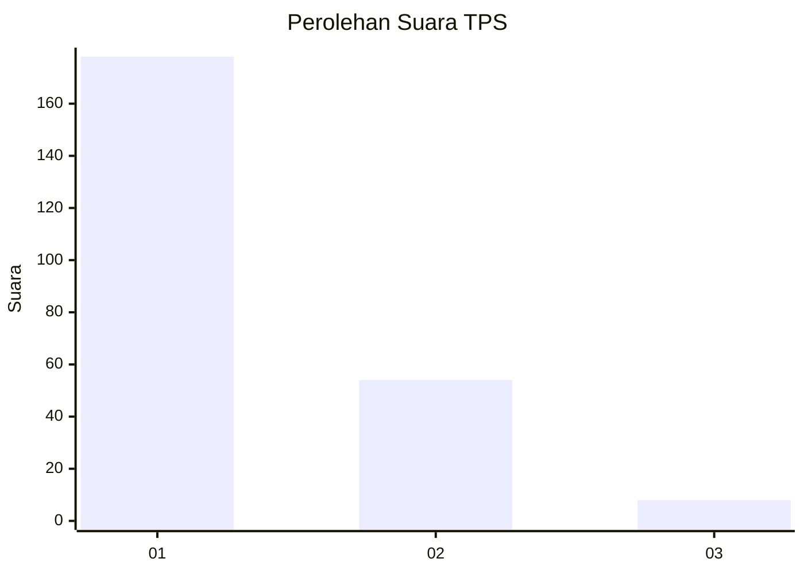
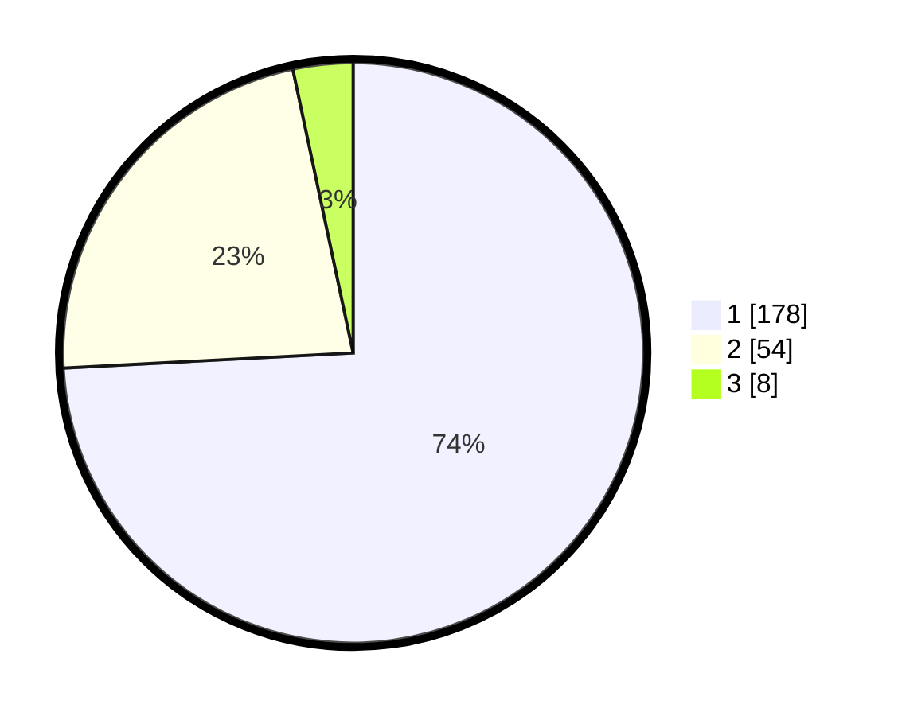

# Hasil

## Grafik

## Tabel

| No. | Nama Paslon    | Suara | Suara (raw) | Persentase |
|:--- |:-------------- | -----:| -----------:| ----------:|
| 1   | ANIES MUHAIMIN | 178   | [178][p-1]  | 74,17      |
| 2   | PRABOWO GIBRAN | 54    | [54][p-2]   | 22,50      |
| 3   | GANJAR MAHFUD  | 8     | [8][p-3]    | 3,33       |

[p-1]: https://github.com/gigit-pemilu/pemilu-2024/blob/main/pilpres/hitung-suara/sub/36-banten/sub/01-pandeglang/sub/34-majasari/sub/1005-cilaja/sub/017-tps/sub/paslon-1.txt
[p-2]: https://github.com/gigit-pemilu/pemilu-2024/blob/main/pilpres/hitung-suara/sub/36-banten/sub/01-pandeglang/sub/34-majasari/sub/1005-cilaja/sub/017-tps/sub/paslon-2.txt
[p-3]: https://github.com/gigit-pemilu/pemilu-2024/blob/main/pilpres/hitung-suara/sub/36-banten/sub/01-pandeglang/sub/34-majasari/sub/1005-cilaja/sub/017-tps/sub/paslon-3.txt

## Foto C Plano

https://sirekap-obj-formc.kpu.go.id/8be6/pemilu/ppwp/36/01/34/10/05/3601341005017-20240214-205141--e3200489-f9b9-44eb-ac43-80f8b1fc8410.jpg

https://sirekap-obj-formc.kpu.go.id/8be6/pemilu/ppwp/36/01/34/10/05/3601341005017-20240215-025235--0bc4b0b6-9b91-45d6-b594-160bd9748287.jpg

https://sirekap-obj-formc.kpu.go.id/8be6/pemilu/ppwp/36/01/34/10/05/3601341005017-20240215-025443--5c961907-9068-4563-bc79-098b34dbf249.jpg

## Metadata

| Key        | Value               |
| ---------- | ------------------- |
| Time Stamp | 2024-02-15 16:00:26 |

