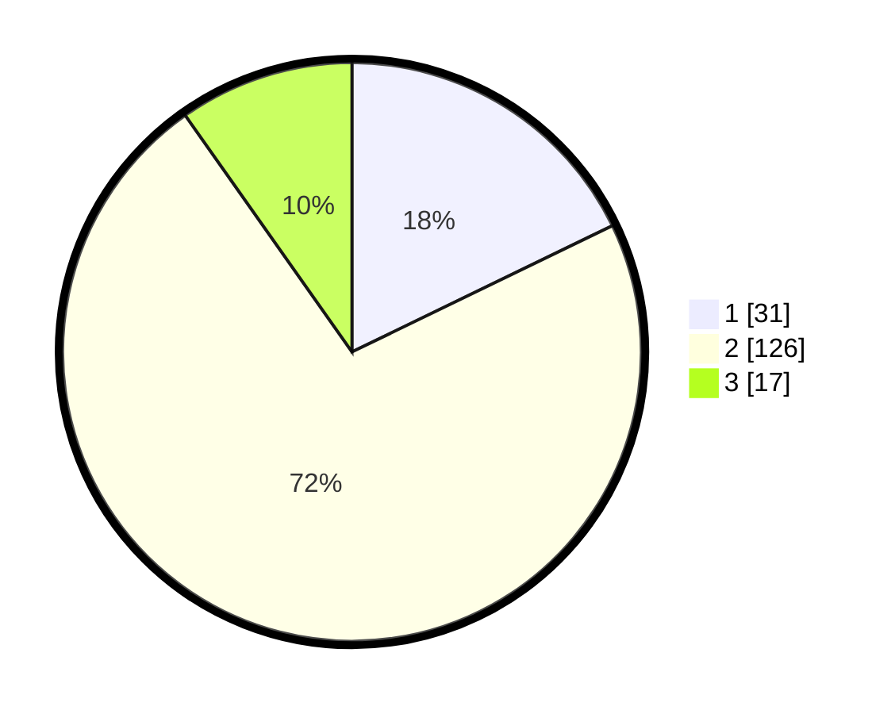

# Hasil

## Grafik

## Tabel

| No. | Nama Paslon    | Suara | Suara (raw) | Persentase |
|:--- |:-------------- | -----:| -----------:| ----------:|
| 1   | ANIES MUHAIMIN | 31    | [31][p-1]   | 17,82      |
| 2   | PRABOWO GIBRAN | 126   | [126][p-2]  | 72,41      |
| 3   | GANJAR MAHFUD  | 17    | [17][p-3]   | 9,77       |

[p-1]: https://github.com/gigit-pemilu/pemilu-2024/blob/main/pilpres/hitung-suara/sub/36-banten/sub/01-pandeglang/sub/35-sobang/sub/2001-cimanis/sub/007-tps/sub/paslon-1.txt
[p-2]: https://github.com/gigit-pemilu/pemilu-2024/blob/main/pilpres/hitung-suara/sub/36-banten/sub/01-pandeglang/sub/35-sobang/sub/2001-cimanis/sub/007-tps/sub/paslon-2.txt
[p-3]: https://github.com/gigit-pemilu/pemilu-2024/blob/main/pilpres/hitung-suara/sub/36-banten/sub/01-pandeglang/sub/35-sobang/sub/2001-cimanis/sub/007-tps/sub/paslon-3.txt

## Foto C Plano

https://sirekap-obj-formc.kpu.go.id/1a74/pemilu/ppwp/36/01/35/20/01/3601352001007-20240214-190209--52810d64-0869-4483-94d1-9fa1e0d89330.jpg

https://sirekap-obj-formc.kpu.go.id/1a74/pemilu/ppwp/36/01/35/20/01/3601352001007-20240214-185036--075c2a14-1dab-4a34-9436-e4552a579f51.jpg

https://sirekap-obj-formc.kpu.go.id/1a74/pemilu/ppwp/36/01/35/20/01/3601352001007-20240214-185048--155dafe3-bab3-4852-8f70-c632a882f7ee.jpg

## Metadata

| Key        | Value               |
| ---------- | ------------------- |
| Time Stamp | 2024-02-15 15:00:29 |

