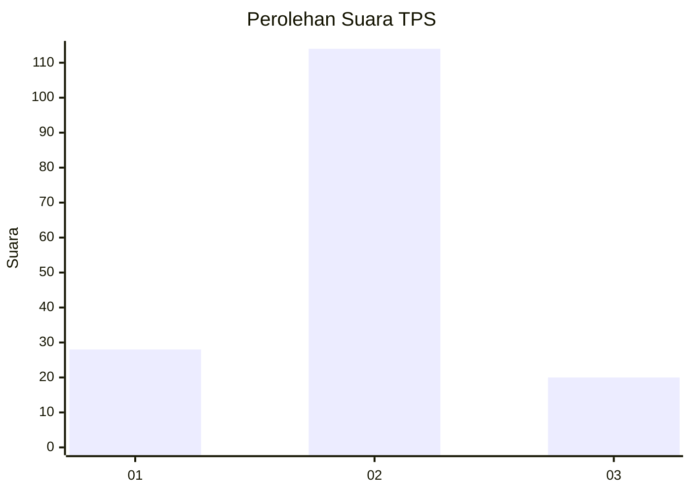
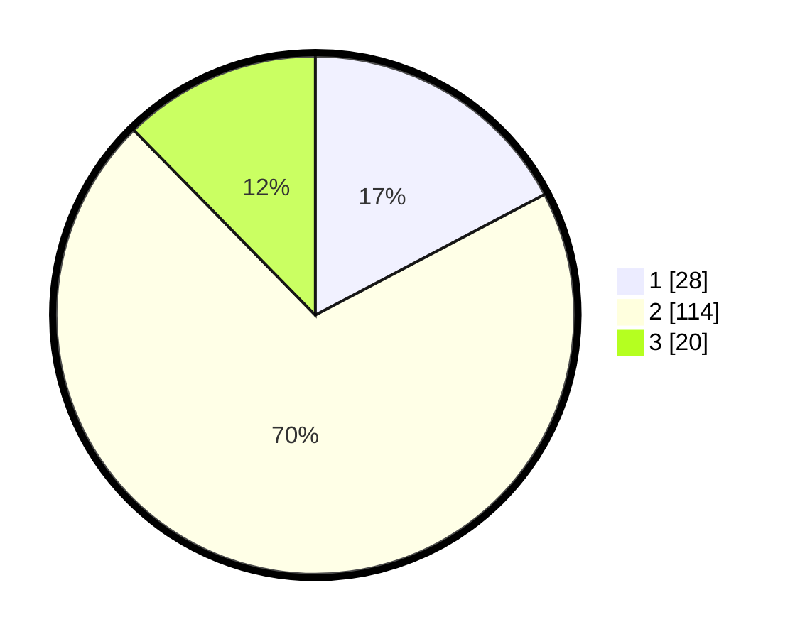

# Hasil

## Grafik

## Tabel

| No. | Nama Paslon    | Suara | Suara (raw) | Persentase |
|:--- |:-------------- | -----:| -----------:| ----------:|
| 1   | ANIES MUHAIMIN | 28    | [28][p-1]   | 17,28      |
| 2   | PRABOWO GIBRAN | 114   | [114][p-2]  | 70,37      |
| 3   | GANJAR MAHFUD  | 20    | [20][p-3]   | 12,35      |

[p-1]: https://github.com/gigit-pemilu/pemilu-2024/blob/main/pilpres/hitung-suara/sub/36-banten/sub/01-pandeglang/sub/35-sobang/sub/2001-cimanis/sub/010-tps/sub/paslon-1.txt
[p-2]: https://github.com/gigit-pemilu/pemilu-2024/blob/main/pilpres/hitung-suara/sub/36-banten/sub/01-pandeglang/sub/35-sobang/sub/2001-cimanis/sub/010-tps/sub/paslon-2.txt
[p-3]: https://github.com/gigit-pemilu/pemilu-2024/blob/main/pilpres/hitung-suara/sub/36-banten/sub/01-pandeglang/sub/35-sobang/sub/2001-cimanis/sub/010-tps/sub/paslon-3.txt

## Foto C Plano

https://sirekap-obj-formc.kpu.go.id/9ba3/pemilu/ppwp/36/01/35/20/01/3601352001010-20240215-002345--46f1ee4e-8d19-483a-8f78-a1d278216ce0.jpg

https://sirekap-obj-formc.kpu.go.id/9ba3/pemilu/ppwp/36/01/35/20/01/3601352001010-20240215-002506--6f059b59-fdd2-4392-b48e-bc37fc992761.jpg

https://sirekap-obj-formc.kpu.go.id/9ba3/pemilu/ppwp/36/01/35/20/01/3601352001010-20240215-002614--49fc49c7-53cf-494c-93ca-499007b0096c.jpg

## Metadata

| Key        | Value               |
| ---------- | ------------------- |
| Time Stamp | 2024-02-15 15:00:29 |

