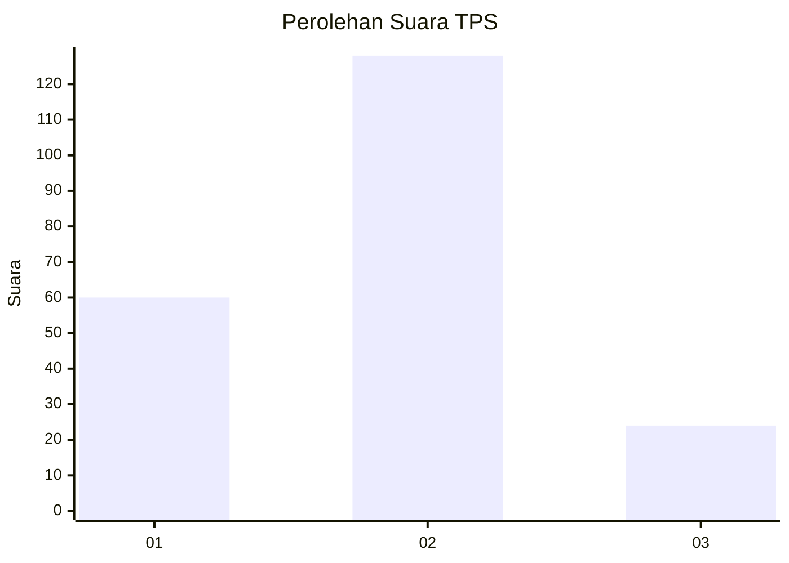
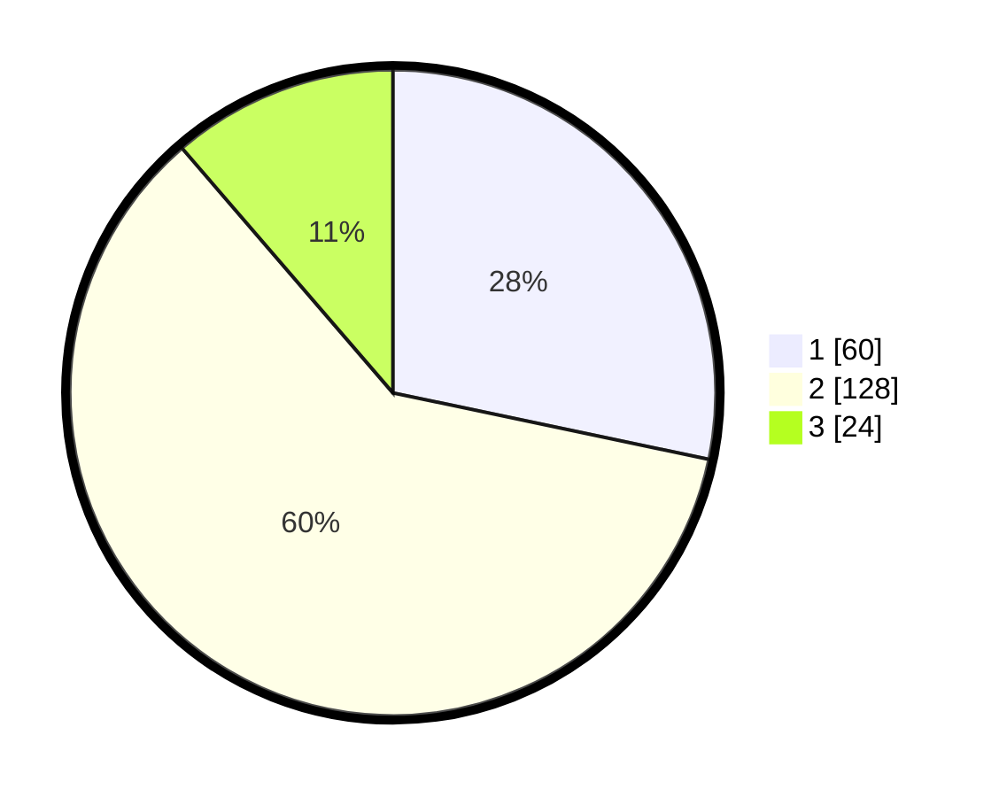

# Hasil

## Grafik

## Tabel

| No. | Nama Paslon    | Suara | Suara (raw) | Persentase |
|:--- |:-------------- | -----:| -----------:| ----------:|
| 1   | ANIES MUHAIMIN | 60    | [60][p-1]   | 28,30      |
| 2   | PRABOWO GIBRAN | 128   | [128][p-2]  | 60,38      |
| 3   | GANJAR MAHFUD  | 24    | [24][p-3]   | 11,32      |

[p-1]: https://github.com/gigit-pemilu/pemilu-2024/blob/main/pilpres/hitung-suara/sub/36-banten/sub/01-pandeglang/sub/35-sobang/sub/2001-cimanis/sub/014-tps/sub/paslon-1.txt
[p-2]: https://github.com/gigit-pemilu/pemilu-2024/blob/main/pilpres/hitung-suara/sub/36-banten/sub/01-pandeglang/sub/35-sobang/sub/2001-cimanis/sub/014-tps/sub/paslon-2.txt
[p-3]: https://github.com/gigit-pemilu/pemilu-2024/blob/main/pilpres/hitung-suara/sub/36-banten/sub/01-pandeglang/sub/35-sobang/sub/2001-cimanis/sub/014-tps/sub/paslon-3.txt

## Foto C Plano

https://sirekap-obj-formc.kpu.go.id/52c9/pemilu/ppwp/36/01/35/20/01/3601352001014-20240215-045433--f903a040-ebab-445a-82ef-75ddf745e9c2.jpg

https://sirekap-obj-formc.kpu.go.id/52c9/pemilu/ppwp/36/01/35/20/01/3601352001014-20240215-045750--fa9818c0-7d5c-4e14-bbe5-77fbfa401606.jpg

https://sirekap-obj-formc.kpu.go.id/52c9/pemilu/ppwp/36/01/35/20/01/3601352001014-20240215-050002--d2e51bdf-da09-42aa-9cf4-8e5cd993aecb.jpg

## Metadata

| Key        | Value               |
| ---------- | ------------------- |
| Time Stamp | 2024-02-16 12:51:22 |

