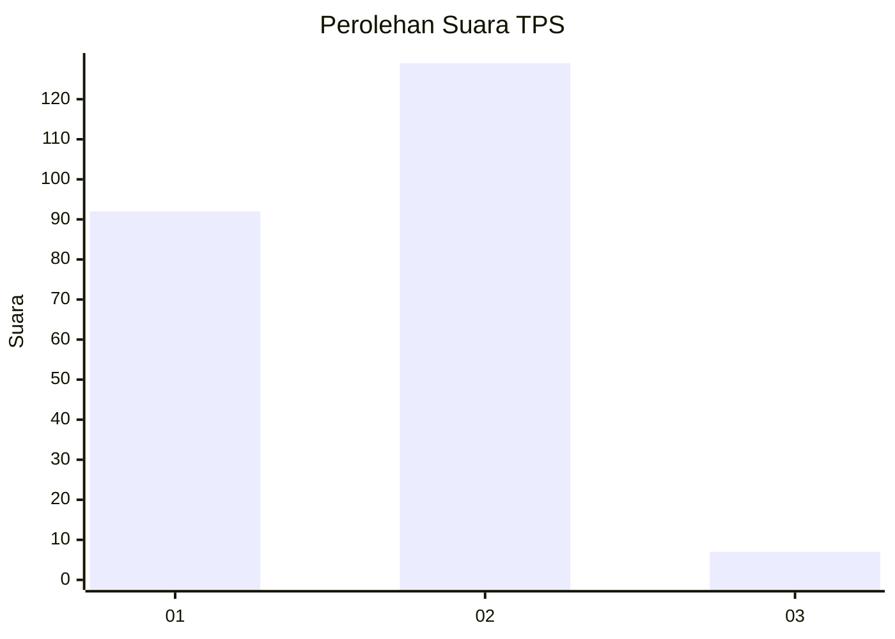
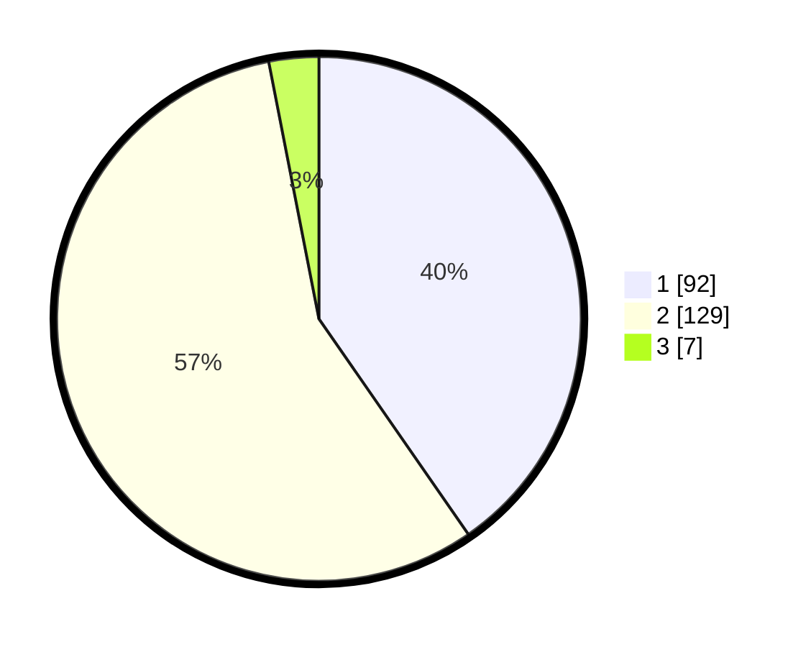

# Hasil

## Grafik

## Tabel

| No. | Nama Paslon    | Suara | Suara (raw) | Persentase |
|:--- |:-------------- | -----:| -----------:| ----------:|
| 1   | ANIES MUHAIMIN | 92    | [92][p-1]   | 40,35      |
| 2   | PRABOWO GIBRAN | 129   | [129][p-2]  | 56,58      |
| 3   | GANJAR MAHFUD  | 7     | [7][p-3]    | 3,07       |

[p-1]: https://github.com/gigit-pemilu/pemilu-2024-36-banten/blob/main/pilpres/hitung-suara/sub/36-banten/sub/02-lebak/sub/01-malingping/sub/2002-cilangkahan/sub/001-tps/sub/paslon-1.txt
[p-2]: https://github.com/gigit-pemilu/pemilu-2024-36-banten/blob/main/pilpres/hitung-suara/sub/36-banten/sub/02-lebak/sub/01-malingping/sub/2002-cilangkahan/sub/001-tps/sub/paslon-2.txt
[p-3]: https://github.com/gigit-pemilu/pemilu-2024-36-banten/blob/main/pilpres/hitung-suara/sub/36-banten/sub/02-lebak/sub/01-malingping/sub/2002-cilangkahan/sub/001-tps/sub/paslon-3.txt

## Foto C Plano

https://sirekap-obj-formc.kpu.go.id/c72e/pemilu/ppwp/36/02/01/20/02/3602012002001-20240215-120911--698517b0-e22e-4bde-ad03-f01935c58fae.jpg

https://sirekap-obj-formc.kpu.go.id/c72e/pemilu/ppwp/36/02/01/20/02/3602012002001-20240215-120801--35e7ba18-02d4-4fb4-b633-3ae8196a31cc.jpg

https://sirekap-obj-formc.kpu.go.id/c72e/pemilu/ppwp/36/02/01/20/02/3602012002001-20240215-120652--d13b5f83-0b5e-4952-befb-94158958b55a.jpg

## Metadata

| Key        | Value               |
| ---------- | ------------------- |
| Time Stamp | 2024-02-16 21:01:00 |

