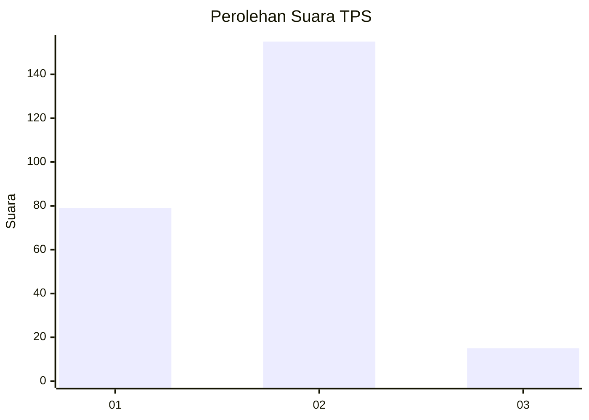
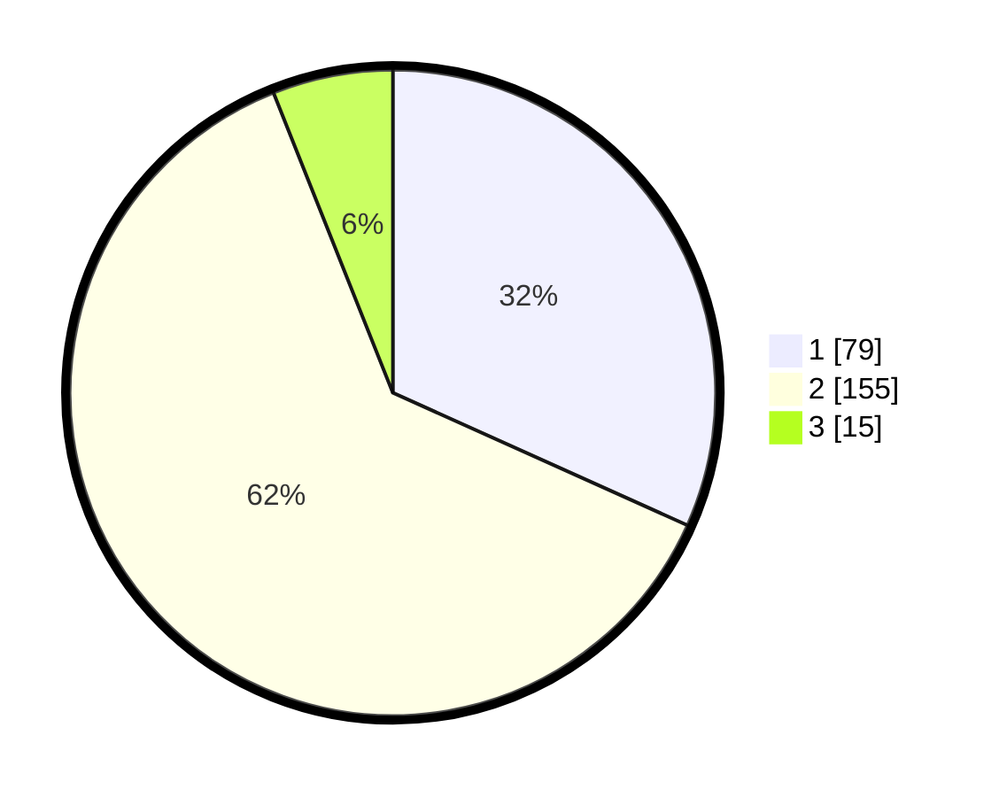

# Hasil

## Grafik

## Tabel

| No. | Nama Paslon    | Suara | Suara (raw) | Persentase |
|:--- |:-------------- | -----:| -----------:| ----------:|
| 1   | ANIES MUHAIMIN | 79    | [79][p-1]   | 31,73      |
| 2   | PRABOWO GIBRAN | 155   | [155][p-2]  | 62,25      |
| 3   | GANJAR MAHFUD  | 15    | [15][p-3]   | 6,02       |

[p-1]: https://github.com/gigit-pemilu/pemilu-2024/blob/main/pilpres/hitung-suara/sub/36-banten/sub/02-lebak/sub/01-malingping/sub/2002-cilangkahan/sub/002-tps/sub/paslon-1.txt
[p-2]: https://github.com/gigit-pemilu/pemilu-2024/blob/main/pilpres/hitung-suara/sub/36-banten/sub/02-lebak/sub/01-malingping/sub/2002-cilangkahan/sub/002-tps/sub/paslon-2.txt
[p-3]: https://github.com/gigit-pemilu/pemilu-2024/blob/main/pilpres/hitung-suara/sub/36-banten/sub/02-lebak/sub/01-malingping/sub/2002-cilangkahan/sub/002-tps/sub/paslon-3.txt

## Foto C Plano

https://sirekap-obj-formc.kpu.go.id/30d1/pemilu/ppwp/36/02/01/20/02/3602012002002-20240215-085515--5aeb3550-8f70-4374-9bdc-9f03e0af3b02.jpg

https://sirekap-obj-formc.kpu.go.id/30d1/pemilu/ppwp/36/02/01/20/02/3602012002002-20240215-090203--00638575-2cea-480a-a143-17dbefd2552b.jpg

https://sirekap-obj-formc.kpu.go.id/30d1/pemilu/ppwp/36/02/01/20/02/3602012002002-20240215-090520--9e089f38-6cdc-4fdf-a372-e58a7e38f1ce.jpg

## Metadata

| Key        | Value               |
| ---------- | ------------------- |
| Time Stamp | 2024-02-15 22:40:13 |

