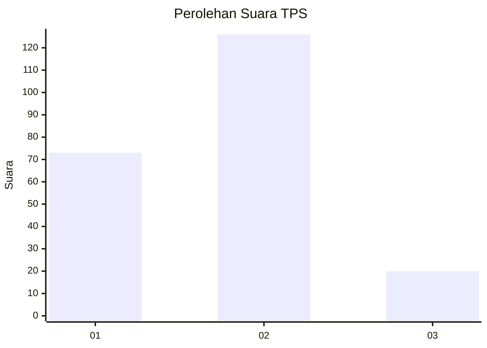
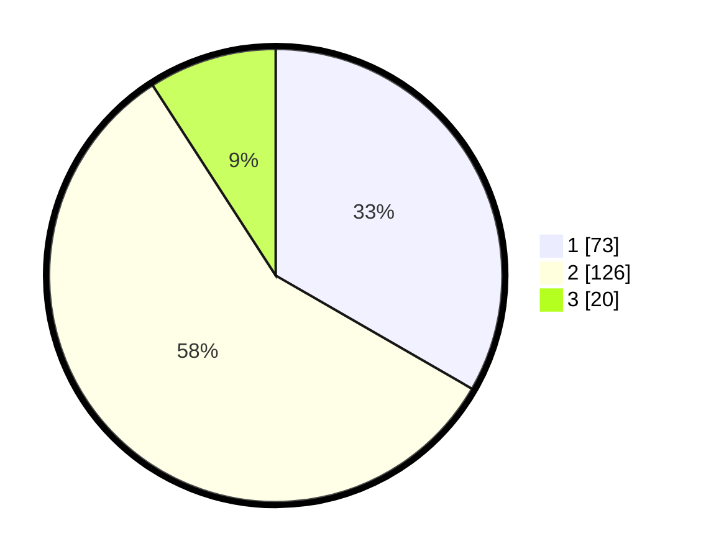

# Hasil

## Grafik

## Tabel

| No. | Nama Paslon    | Suara | Suara (raw) | Persentase |
|:--- |:-------------- | -----:| -----------:| ----------:|
| 1   | ANIES MUHAIMIN | 73    | [73][p-1]   | 33,33      |
| 2   | PRABOWO GIBRAN | 126   | [126][p-2]  | 57,53      |
| 3   | GANJAR MAHFUD  | 20    | [20][p-3]   | 9,13       |

[p-1]: https://github.com/gigit-pemilu/pemilu-2024/blob/main/pilpres/hitung-suara/sub/36-banten/sub/02-lebak/sub/01-malingping/sub/2013-rahong/sub/003-tps/sub/paslon-1.txt
[p-2]: https://github.com/gigit-pemilu/pemilu-2024/blob/main/pilpres/hitung-suara/sub/36-banten/sub/02-lebak/sub/01-malingping/sub/2013-rahong/sub/003-tps/sub/paslon-2.txt
[p-3]: https://github.com/gigit-pemilu/pemilu-2024/blob/main/pilpres/hitung-suara/sub/36-banten/sub/02-lebak/sub/01-malingping/sub/2013-rahong/sub/003-tps/sub/paslon-3.txt

## Foto C Plano

https://sirekap-obj-formc.kpu.go.id/efa9/pemilu/ppwp/36/02/01/20/13/3602012013003-20240215-090232--9b0be6f2-ce83-4bb6-8342-c2641ce38fa7.jpg

https://sirekap-obj-formc.kpu.go.id/efa9/pemilu/ppwp/36/02/01/20/13/3602012013003-20240215-090530--506d51cd-1244-46e6-89a6-77d5c0a246b6.jpg

https://sirekap-obj-formc.kpu.go.id/efa9/pemilu/ppwp/36/02/01/20/13/3602012013003-20240215-090707--e27a52d1-d459-4af4-94eb-74a4c048c5d0.jpg

## Metadata

| Key        | Value               |
| ---------- | ------------------- |
| Time Stamp | 2024-02-19 06:16:00 |

