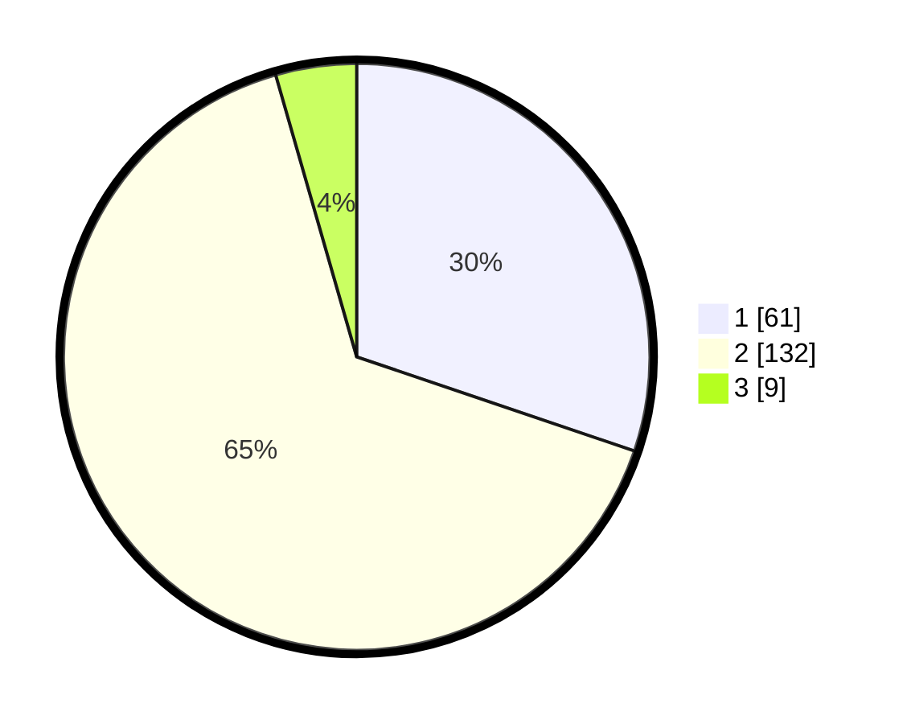

# Hasil

## Grafik

## Tabel

| No. | Nama Paslon    | Suara | Suara (raw) | Persentase |
|:--- |:-------------- | -----:| -----------:| ----------:|
| 1   | ANIES MUHAIMIN | 61    | [61][p-1]   | 30,20      |
| 2   | PRABOWO GIBRAN | 132   | [132][p-2]  | 65,35      |
| 3   | GANJAR MAHFUD  | 9     | [9][p-3]    | 4,46       |

[p-1]: https://github.com/gigit-pemilu/pemilu-2024/blob/main/pilpres/hitung-suara/sub/36-banten/sub/02-lebak/sub/01-malingping/sub/2019-sumberwaras/sub/001-tps/sub/paslon-1.txt
[p-2]: https://github.com/gigit-pemilu/pemilu-2024/blob/main/pilpres/hitung-suara/sub/36-banten/sub/02-lebak/sub/01-malingping/sub/2019-sumberwaras/sub/001-tps/sub/paslon-2.txt
[p-3]: https://github.com/gigit-pemilu/pemilu-2024/blob/main/pilpres/hitung-suara/sub/36-banten/sub/02-lebak/sub/01-malingping/sub/2019-sumberwaras/sub/001-tps/sub/paslon-3.txt

## Foto C Plano

https://sirekap-obj-formc.kpu.go.id/952b/pemilu/ppwp/36/02/01/20/19/3602012019001-20240215-094818--9aca0502-85dd-40cc-b66b-8bd50b9456aa.jpg

https://sirekap-obj-formc.kpu.go.id/952b/pemilu/ppwp/36/02/01/20/19/3602012019001-20240215-100719--5562cd49-ae89-472c-8a3f-6531657a68ed.jpg

https://sirekap-obj-formc.kpu.go.id/952b/pemilu/ppwp/36/02/01/20/19/3602012019001-20240215-100913--9222abc1-32f6-4a20-8ded-ca626ae03212.jpg

## Metadata

| Key        | Value               |
| ---------- | ------------------- |
| Time Stamp | 2024-02-16 21:01:00 |

