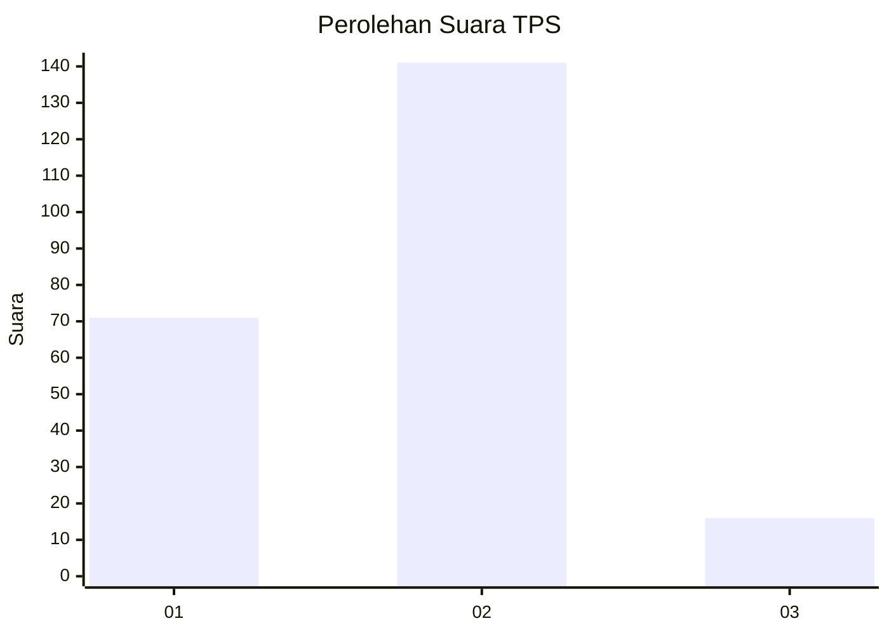
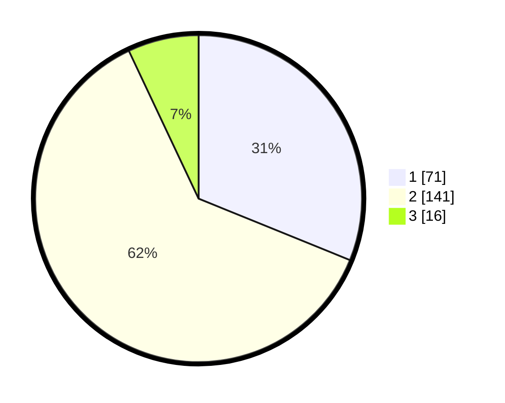

# Hasil

## Grafik

## Tabel

| No. | Nama Paslon    | Suara | Suara (raw) | Persentase |
|:--- |:-------------- | -----:| -----------:| ----------:|
| 1   | ANIES MUHAIMIN | 71    | [71][p-1]   | 31,14      |
| 2   | PRABOWO GIBRAN | 141   | [141][p-2]  | 61,84      |
| 3   | GANJAR MAHFUD  | 16    | [16][p-3]   | 7,02       |

[p-1]: https://github.com/gigit-pemilu/pemilu-2024/blob/main/pilpres/hitung-suara/sub/36-banten/sub/02-lebak/sub/03-bayah/sub/2001-bayah-barat/sub/005-tps/sub/paslon-1.txt
[p-2]: https://github.com/gigit-pemilu/pemilu-2024/blob/main/pilpres/hitung-suara/sub/36-banten/sub/02-lebak/sub/03-bayah/sub/2001-bayah-barat/sub/005-tps/sub/paslon-2.txt
[p-3]: https://github.com/gigit-pemilu/pemilu-2024/blob/main/pilpres/hitung-suara/sub/36-banten/sub/02-lebak/sub/03-bayah/sub/2001-bayah-barat/sub/005-tps/sub/paslon-3.txt

## Foto C Plano

https://sirekap-obj-formc.kpu.go.id/3a58/pemilu/ppwp/36/02/03/20/01/3602032001005-20240214-201510--d3d62671-5516-4f27-89cc-4c94dd634586.jpg

https://sirekap-obj-formc.kpu.go.id/3a58/pemilu/ppwp/36/02/03/20/01/3602032001005-20240214-202253--a4614e6a-4639-4650-905e-7d8adc94668a.jpg

https://sirekap-obj-formc.kpu.go.id/3a58/pemilu/ppwp/36/02/03/20/01/3602032001005-20240215-015027--2a5e0752-ab52-4d31-b087-9b930c73846f.jpg

## Metadata

| Key        | Value               |
| ---------- | ------------------- |
| Time Stamp | 2024-02-15 02:10:27 |

