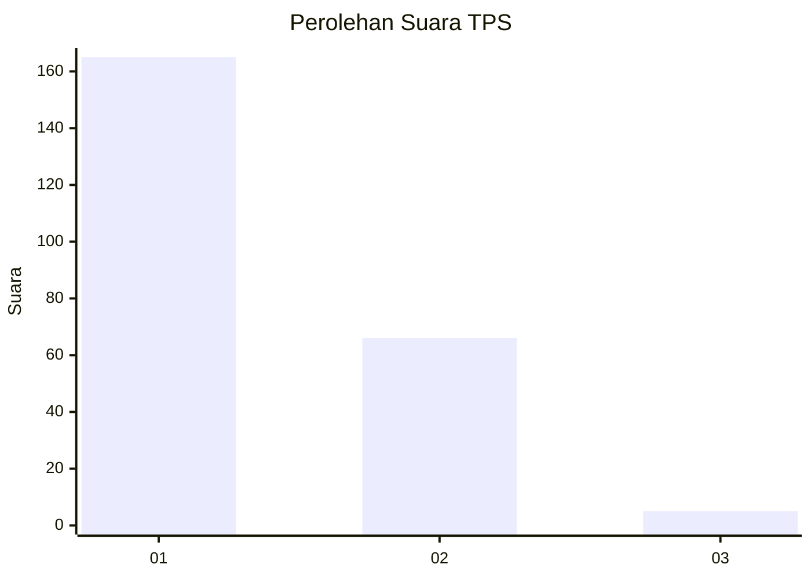
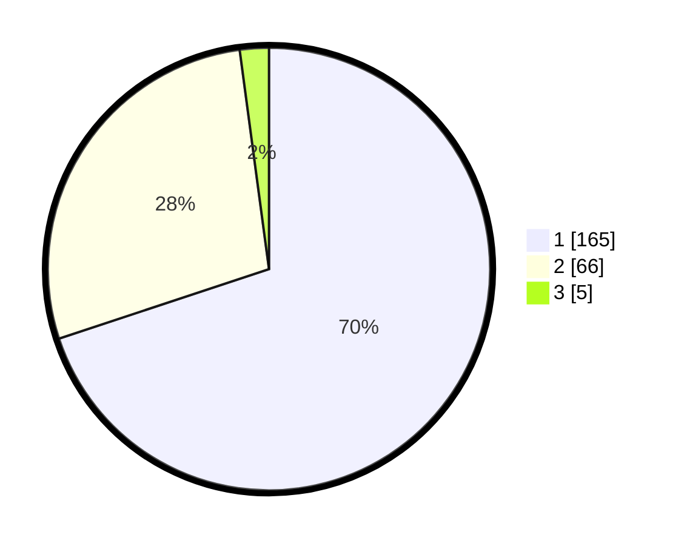

# Hasil

## Grafik

## Tabel

| No. | Nama Paslon    | Suara | Suara (raw) | Persentase |
|:--- |:-------------- | -----:| -----------:| ----------:|
| 1   | ANIES MUHAIMIN | 165   | [165][p-1]  | 69,92      |
| 2   | PRABOWO GIBRAN | 66    | [66][p-2]   | 27,97      |
| 3   | GANJAR MAHFUD  | 5     | [5][p-3]    | 2,12       |

[p-1]: https://github.com/gigit-pemilu/pemilu-2024-36-banten/blob/main/pilpres/hitung-suara/sub/36-banten/sub/02-lebak/sub/03-bayah/sub/2007-suwakan/sub/003-tps/sub/paslon-1.txt
[p-2]: https://github.com/gigit-pemilu/pemilu-2024-36-banten/blob/main/pilpres/hitung-suara/sub/36-banten/sub/02-lebak/sub/03-bayah/sub/2007-suwakan/sub/003-tps/sub/paslon-2.txt
[p-3]: https://github.com/gigit-pemilu/pemilu-2024-36-banten/blob/main/pilpres/hitung-suara/sub/36-banten/sub/02-lebak/sub/03-bayah/sub/2007-suwakan/sub/003-tps/sub/paslon-3.txt

## Foto C Plano

https://sirekap-obj-formc.kpu.go.id/1c8d/pemilu/ppwp/36/02/03/20/07/3602032007003-20240215-163957--7a260099-356a-4d50-968e-db1c2805b668.jpg

https://sirekap-obj-formc.kpu.go.id/1c8d/pemilu/ppwp/36/02/03/20/07/3602032007003-20240215-164700--a80369b9-96ed-4467-8356-60a54fcbf178.jpg

https://sirekap-obj-formc.kpu.go.id/1c8d/pemilu/ppwp/36/02/03/20/07/3602032007003-20240215-165639--4ae5489b-27dc-459a-a92d-fe0efb180f22.jpg

## Metadata

| Key        | Value               |
| ---------- | ------------------- |
| Time Stamp | 2024-02-19 06:16:00 |

