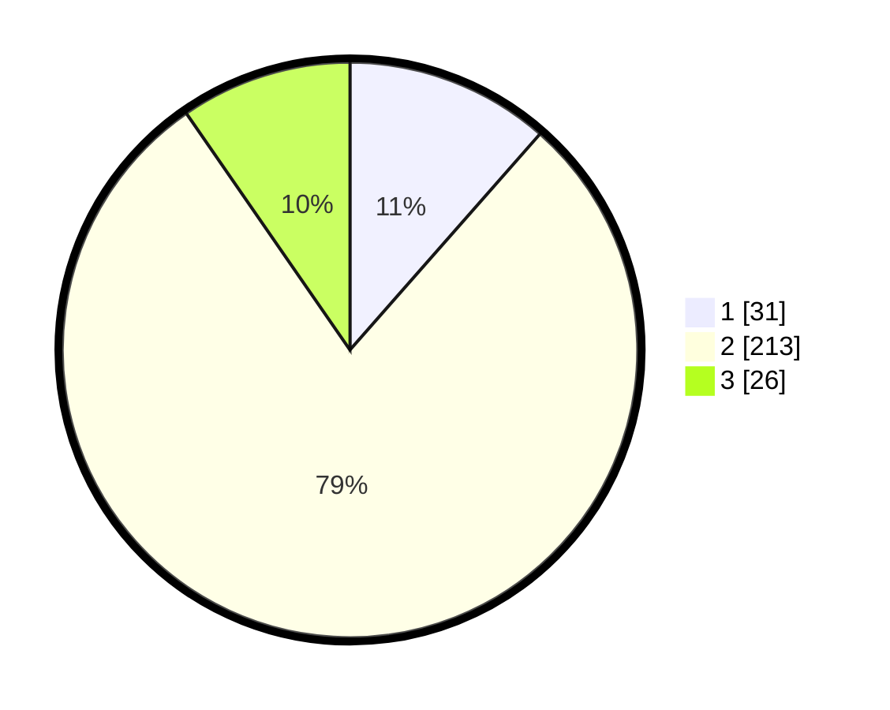

# Hasil

## Grafik

## Tabel

| No. | Nama Paslon    | Suara | Suara (raw) | Persentase |
|:--- |:-------------- | -----:| -----------:| ----------:|
| 1   | ANIES MUHAIMIN | 31    | [31][p-1]   | 11,48      |
| 2   | PRABOWO GIBRAN | 213   | [213][p-2]  | 78,89      |
| 3   | GANJAR MAHFUD  | 26    | [26][p-3]   | 9,63       |

[p-1]: https://github.com/gigit-pemilu/pemilu-2024-36-banten/blob/main/pilpres/hitung-suara/sub/36-banten/sub/02-lebak/sub/03-bayah/sub/2014-cisuren/sub/008-tps/sub/paslon-1.txt
[p-2]: https://github.com/gigit-pemilu/pemilu-2024-36-banten/blob/main/pilpres/hitung-suara/sub/36-banten/sub/02-lebak/sub/03-bayah/sub/2014-cisuren/sub/008-tps/sub/paslon-2.txt
[p-3]: https://github.com/gigit-pemilu/pemilu-2024-36-banten/blob/main/pilpres/hitung-suara/sub/36-banten/sub/02-lebak/sub/03-bayah/sub/2014-cisuren/sub/008-tps/sub/paslon-3.txt

## Foto C Plano

https://sirekap-obj-formc.kpu.go.id/7df6/pemilu/ppwp/36/02/03/20/14/3602032014008-20240214-232056--5a538b56-c535-42da-b8b6-ce83d70d7c73.jpg

https://sirekap-obj-formc.kpu.go.id/7df6/pemilu/ppwp/36/02/03/20/14/3602032014008-20240214-225814--3064cf93-bb68-4e37-bde7-2cce63ad54c5.jpg

https://sirekap-obj-formc.kpu.go.id/7df6/pemilu/ppwp/36/02/03/20/14/3602032014008-20240214-225706--6ac6aaaa-2d93-4eab-a6ac-2b74e74c778f.jpg

## Metadata

| Key        | Value               |
| ---------- | ------------------- |
| Time Stamp | 2024-02-17 16:36:25 |

