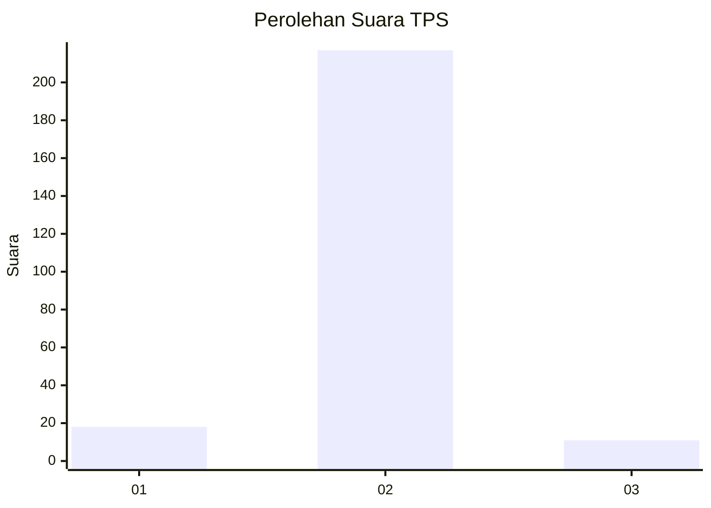
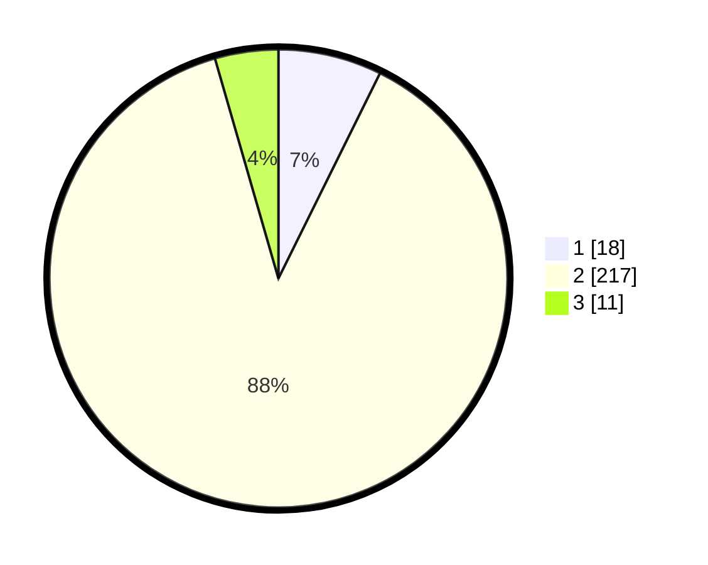

# Hasil

## Grafik

## Tabel

| No. | Nama Paslon    | Suara | Suara (raw) | Persentase |
|:--- |:-------------- | -----:| -----------:| ----------:|
| 1   | ANIES MUHAIMIN | 18    | [18][p-1]   | 7,32       |
| 2   | PRABOWO GIBRAN | 217   | [217][p-2]  | 88,21      |
| 3   | GANJAR MAHFUD  | 11    | [11][p-3]   | 4,47       |

[p-1]: https://github.com/gigit-pemilu/pemilu-2024/blob/main/pilpres/hitung-suara/sub/36-banten/sub/02-lebak/sub/03-bayah/sub/2018-pamubulan/sub/003-tps/sub/paslon-1.txt
[p-2]: https://github.com/gigit-pemilu/pemilu-2024/blob/main/pilpres/hitung-suara/sub/36-banten/sub/02-lebak/sub/03-bayah/sub/2018-pamubulan/sub/003-tps/sub/paslon-2.txt
[p-3]: https://github.com/gigit-pemilu/pemilu-2024/blob/main/pilpres/hitung-suara/sub/36-banten/sub/02-lebak/sub/03-bayah/sub/2018-pamubulan/sub/003-tps/sub/paslon-3.txt

## Foto C Plano

https://sirekap-obj-formc.kpu.go.id/c9ee/pemilu/ppwp/36/02/03/20/18/3602032018003-20240214-211425--3f30bd70-07a8-40bf-9978-5584a592a8ba.jpg

https://sirekap-obj-formc.kpu.go.id/c9ee/pemilu/ppwp/36/02/03/20/18/3602032018003-20240214-211443--e2fab53c-1795-46ab-bac2-fac52ae0effc.jpg

https://sirekap-obj-formc.kpu.go.id/c9ee/pemilu/ppwp/36/02/03/20/18/3602032018003-20240214-211459--899a6da5-9907-43dd-bcd7-068582a302b8.jpg

## Metadata

| Key        | Value               |
| ---------- | ------------------- |
| Time Stamp | 2024-02-19 06:16:00 |

