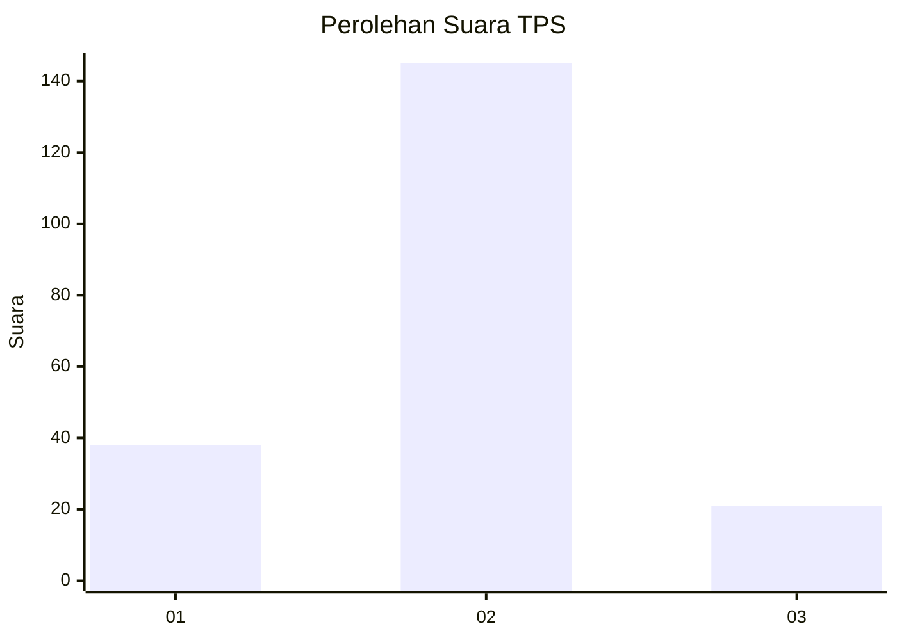
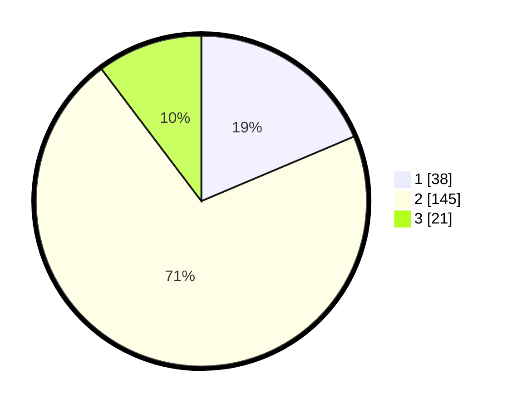

# Hasil

## Grafik

## Tabel

| No. | Nama Paslon    | Suara | Suara (raw) | Persentase |
|:--- |:-------------- | -----:| -----------:| ----------:|
| 1   | ANIES MUHAIMIN | 38    | [38][p-1]   | 18,63      |
| 2   | PRABOWO GIBRAN | 145   | [145][p-2]  | 71,08      |
| 3   | GANJAR MAHFUD  | 21    | [21][p-3]   | 10,29      |

[p-1]: https://github.com/gigit-pemilu/pemilu-2024/blob/main/pilpres/hitung-suara/sub/36-banten/sub/02-lebak/sub/04-cipanas/sub/2016-pasirhaur/sub/004-tps/sub/paslon-1.txt
[p-2]: https://github.com/gigit-pemilu/pemilu-2024/blob/main/pilpres/hitung-suara/sub/36-banten/sub/02-lebak/sub/04-cipanas/sub/2016-pasirhaur/sub/004-tps/sub/paslon-2.txt
[p-3]: https://github.com/gigit-pemilu/pemilu-2024/blob/main/pilpres/hitung-suara/sub/36-banten/sub/02-lebak/sub/04-cipanas/sub/2016-pasirhaur/sub/004-tps/sub/paslon-3.txt

## Foto C Plano

https://sirekap-obj-formc.kpu.go.id/233f/pemilu/ppwp/36/02/04/20/16/3602042016004-20240215-045937--32cbb8c3-cba0-4ef4-b9e5-c873c94319ee.jpg

https://sirekap-obj-formc.kpu.go.id/233f/pemilu/ppwp/36/02/04/20/16/3602042016004-20240215-045959--37063794-3000-4b21-b4b3-58970ab2dea5.jpg

https://sirekap-obj-formc.kpu.go.id/233f/pemilu/ppwp/36/02/04/20/16/3602042016004-20240215-050022--f3ad98d7-a49a-4839-bbc0-9a433222413b.jpg

## Metadata

| Key        | Value               |
| ---------- | ------------------- |
| Time Stamp | 2024-02-19 06:16:00 |

