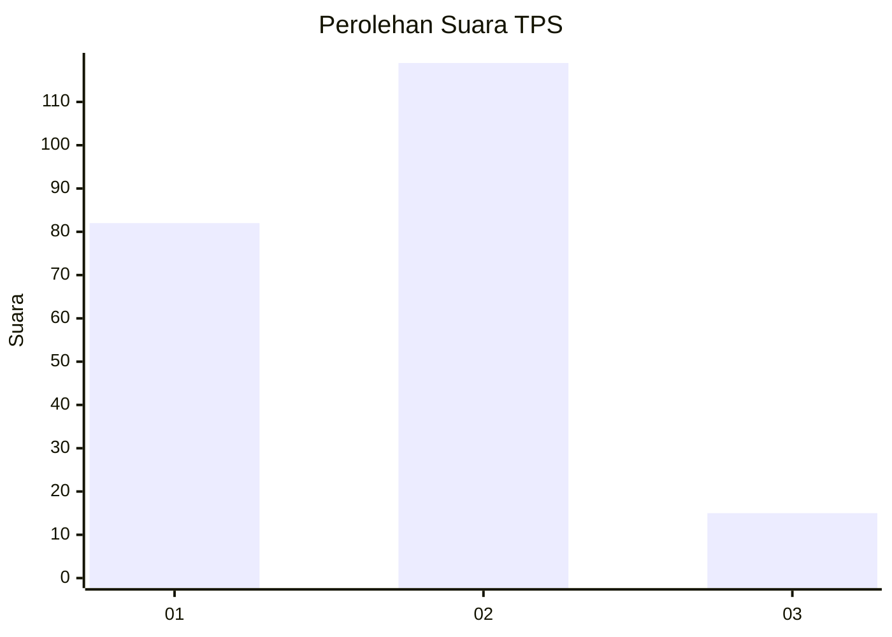
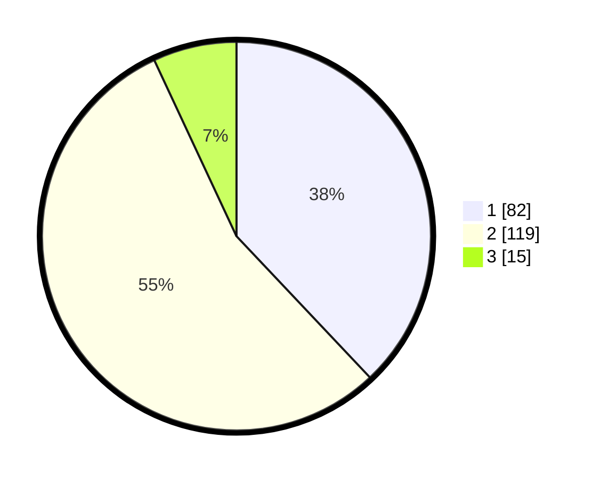

# Hasil

## Grafik

## Tabel

| No. | Nama Paslon    | Suara | Suara (raw) | Persentase |
|:--- |:-------------- | -----:| -----------:| ----------:|
| 1   | ANIES MUHAIMIN | 82    | [82][p-1]   | 37,96      |
| 2   | PRABOWO GIBRAN | 119   | [119][p-2]  | 55,09      |
| 3   | GANJAR MAHFUD  | 15    | [15][p-3]   | 6,94       |

[p-1]: https://github.com/gigit-pemilu/pemilu-2024/blob/main/pilpres/hitung-suara/sub/36-banten/sub/02-lebak/sub/05-muncang/sub/2006-leuwicoo/sub/005-tps/sub/paslon-1.txt
[p-2]: https://github.com/gigit-pemilu/pemilu-2024/blob/main/pilpres/hitung-suara/sub/36-banten/sub/02-lebak/sub/05-muncang/sub/2006-leuwicoo/sub/005-tps/sub/paslon-2.txt
[p-3]: https://github.com/gigit-pemilu/pemilu-2024/blob/main/pilpres/hitung-suara/sub/36-banten/sub/02-lebak/sub/05-muncang/sub/2006-leuwicoo/sub/005-tps/sub/paslon-3.txt

## Foto C Plano

https://sirekap-obj-formc.kpu.go.id/1855/pemilu/ppwp/36/02/05/20/06/3602052006005-20240216-005339--08c7840f-e00c-45e5-99bb-2ca41c89c6e4.jpg

https://sirekap-obj-formc.kpu.go.id/1855/pemilu/ppwp/36/02/05/20/06/3602052006005-20240220-195623--4e80072c-f297-4ca8-9eb8-848f7abc6a5b.jpg

https://sirekap-obj-formc.kpu.go.id/1855/pemilu/ppwp/36/02/05/20/06/3602052006005-20240214-213105--fd8fe9ee-f2f1-4a90-9be7-c8dd7d6cc471.jpg

## Metadata

| Key        | Value               |
| ---------- | ------------------- |
| Time Stamp | 2024-02-21 19:00:00 |

