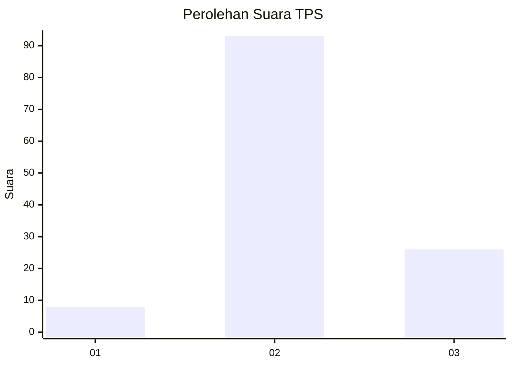

# Hasil

## Grafik

## Tabel

| No. | Nama Paslon    | Suara | Suara (raw) | Persentase |
|:--- |:-------------- | -----:| -----------:| ----------:|
| 1   | ANIES MUHAIMIN | 8     | [8][p-1]    | 6,30       |
| 2   | PRABOWO GIBRAN | 93    | [93][p-2]   | 73,23      |
| 3   | GANJAR MAHFUD  | 26    | [26][p-3]   | 20,47      |

[p-1]: https://github.com/gigit-pemilu/pemilu-2024/blob/main/pilpres/hitung-suara/sub/36-banten/sub/02-lebak/sub/06-leuwidamar/sub/2001-kanekes/sub/001-tps/sub/paslon-1.txt
[p-2]: https://github.com/gigit-pemilu/pemilu-2024/blob/main/pilpres/hitung-suara/sub/36-banten/sub/02-lebak/sub/06-leuwidamar/sub/2001-kanekes/sub/001-tps/sub/paslon-2.txt
[p-3]: https://github.com/gigit-pemilu/pemilu-2024/blob/main/pilpres/hitung-suara/sub/36-banten/sub/02-lebak/sub/06-leuwidamar/sub/2001-kanekes/sub/001-tps/sub/paslon-3.txt

## Foto C Plano

https://sirekap-obj-formc.kpu.go.id/9aa2/pemilu/ppwp/36/02/06/20/01/3602062001001-20240222-100942--acc585e2-4aaf-41f4-a891-595aa06dff5a.jpg

https://sirekap-obj-formc.kpu.go.id/9aa2/pemilu/ppwp/36/02/06/20/01/3602062001001-20240222-101040--79a8c2f6-ad59-4998-af26-9d26465351a7.jpg

https://sirekap-obj-formc.kpu.go.id/9aa2/pemilu/ppwp/36/02/06/20/01/3602062001001-20240216-085852--bcd830d4-f0a2-4d02-a521-2ba30aed989f.jpg

## Metadata

| Key        | Value               |
| ---------- | ------------------- |
| Time Stamp | 2024-02-24 22:31:28 |

