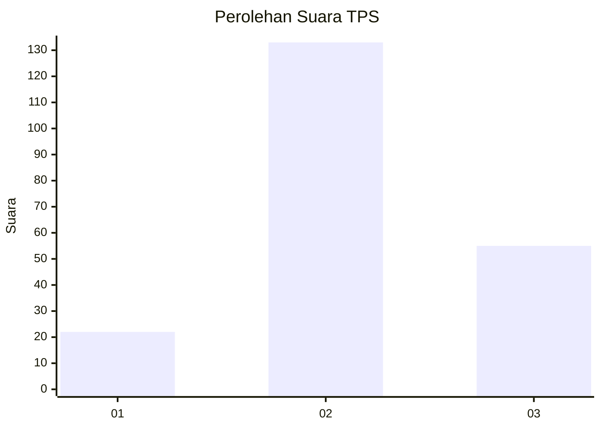
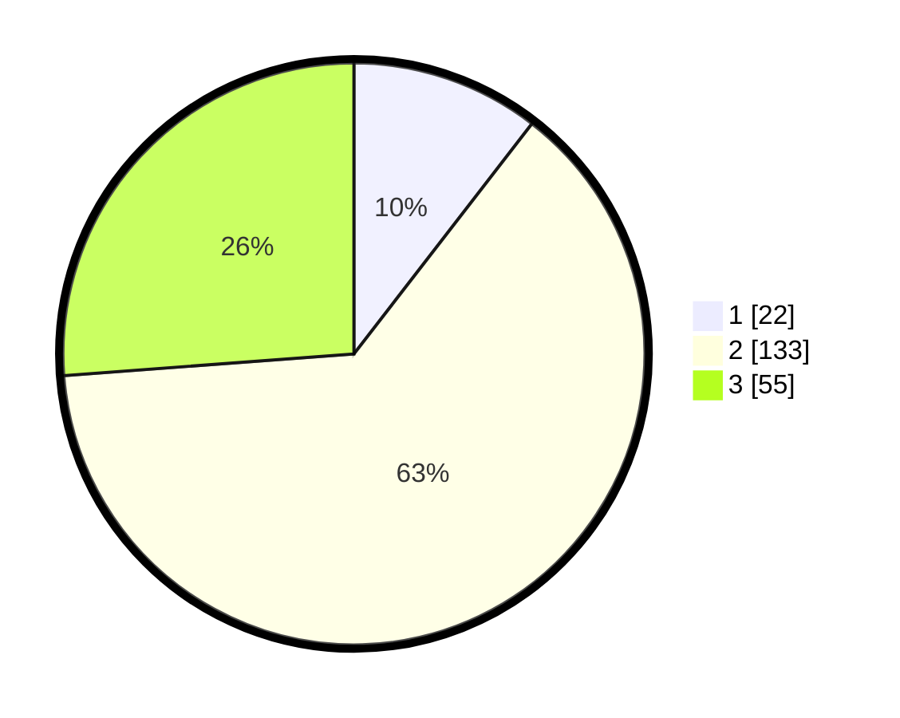

# Hasil

## Grafik

## Tabel

| No. | Nama Paslon    | Suara | Suara (raw) | Persentase |
|:--- |:-------------- | -----:| -----------:| ----------:|
| 1   | ANIES MUHAIMIN | 22    | [22][p-1]   | 10,48      |
| 2   | PRABOWO GIBRAN | 133   | [133][p-2]  | 63,33      |
| 3   | GANJAR MAHFUD  | 55    | [55][p-3]   | 26,19      |

[p-1]: https://github.com/gigit-pemilu/pemilu-2024/blob/main/pilpres/hitung-suara/sub/36-banten/sub/02-lebak/sub/06-leuwidamar/sub/2001-kanekes/sub/005-tps/sub/paslon-1.txt
[p-2]: https://github.com/gigit-pemilu/pemilu-2024/blob/main/pilpres/hitung-suara/sub/36-banten/sub/02-lebak/sub/06-leuwidamar/sub/2001-kanekes/sub/005-tps/sub/paslon-2.txt
[p-3]: https://github.com/gigit-pemilu/pemilu-2024/blob/main/pilpres/hitung-suara/sub/36-banten/sub/02-lebak/sub/06-leuwidamar/sub/2001-kanekes/sub/005-tps/sub/paslon-3.txt

## Foto C Plano

https://sirekap-obj-formc.kpu.go.id/3510/pemilu/ppwp/36/02/06/20/01/3602062001005-20240215-120701--641c0fc0-3727-43b9-b0d7-108e3e769cc7.jpg

https://sirekap-obj-formc.kpu.go.id/3510/pemilu/ppwp/36/02/06/20/01/3602062001005-20240215-135911--a4f65d1e-899a-4435-9666-ef252d46ffaf.jpg

https://sirekap-obj-formc.kpu.go.id/3510/pemilu/ppwp/36/02/06/20/01/3602062001005-20240215-140037--78eff3c4-c9df-4344-9b96-684a77a2128f.jpg

## Metadata

| Key        | Value               |
| ---------- | ------------------- |
| Time Stamp | 2024-02-17 16:00:02 |

