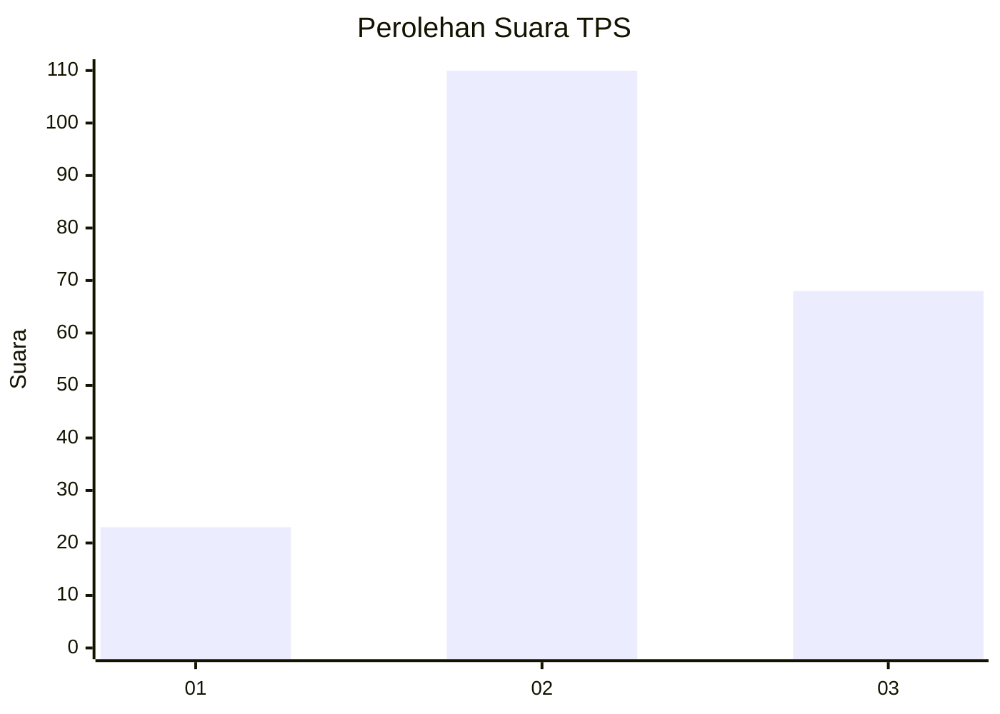
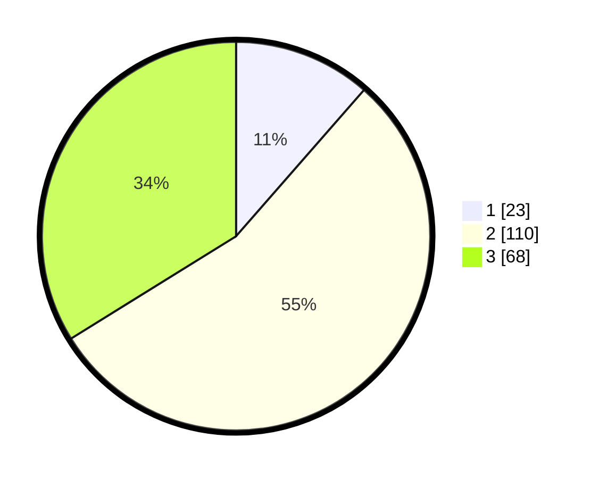

# Hasil

## Grafik

## Tabel

| No. | Nama Paslon    | Suara | Suara (raw) | Persentase |
|:--- |:-------------- | -----:| -----------:| ----------:|
| 1   | ANIES MUHAIMIN | 23    | [23][p-1]   | 11,44      |
| 2   | PRABOWO GIBRAN | 110   | [110][p-2]  | 54,73      |
| 3   | GANJAR MAHFUD  | 68    | [68][p-3]   | 33,83      |

[p-1]: https://github.com/gigit-pemilu/pemilu-2024-36-banten/blob/main/pilpres/hitung-suara/sub/36-banten/sub/02-lebak/sub/06-leuwidamar/sub/2001-kanekes/sub/007-tps/sub/paslon-1.txt
[p-2]: https://github.com/gigit-pemilu/pemilu-2024-36-banten/blob/main/pilpres/hitung-suara/sub/36-banten/sub/02-lebak/sub/06-leuwidamar/sub/2001-kanekes/sub/007-tps/sub/paslon-2.txt
[p-3]: https://github.com/gigit-pemilu/pemilu-2024-36-banten/blob/main/pilpres/hitung-suara/sub/36-banten/sub/02-lebak/sub/06-leuwidamar/sub/2001-kanekes/sub/007-tps/sub/paslon-3.txt

## Foto C Plano

https://sirekap-obj-formc.kpu.go.id/3535/pemilu/ppwp/36/02/06/20/01/3602062001007-20240215-170404--083e16bb-6ae6-4d5a-be05-95e43e8f9a06.jpg

https://sirekap-obj-formc.kpu.go.id/3535/pemilu/ppwp/36/02/06/20/01/3602062001007-20240215-170516--30647dbf-3a2f-4c64-b7a5-65ea8368dfd2.jpg

https://sirekap-obj-formc.kpu.go.id/3535/pemilu/ppwp/36/02/06/20/01/3602062001007-20240215-170644--177c19a1-1c40-4acb-9fdc-3ffc12765e59.jpg

## Metadata

| Key        | Value               |
| ---------- | ------------------- |
| Time Stamp | 2024-02-17 16:00:02 |

