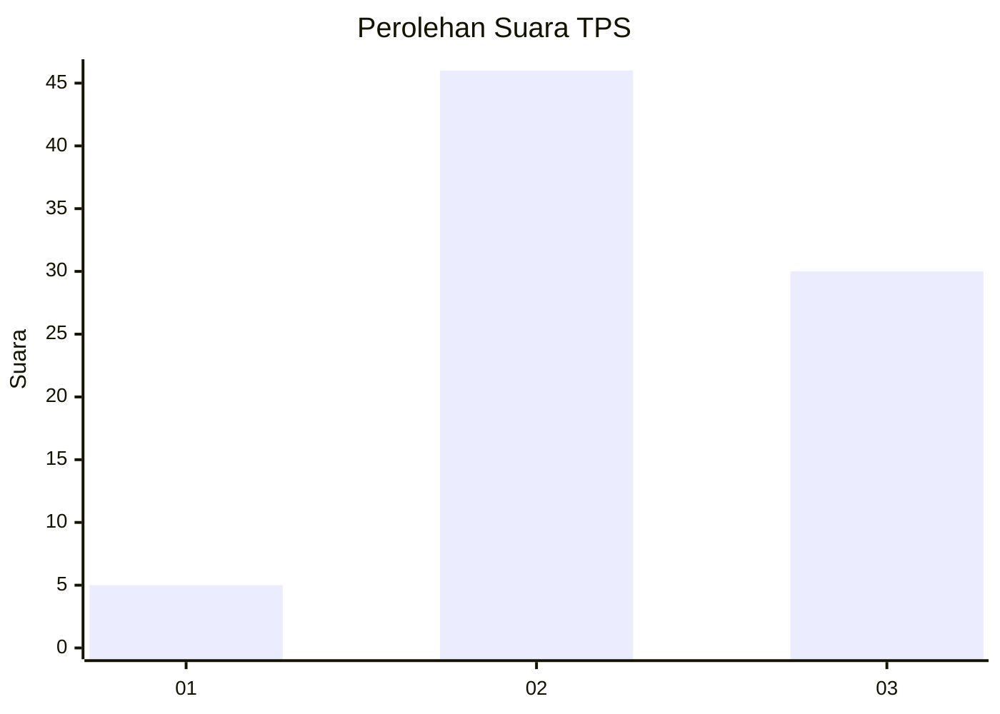
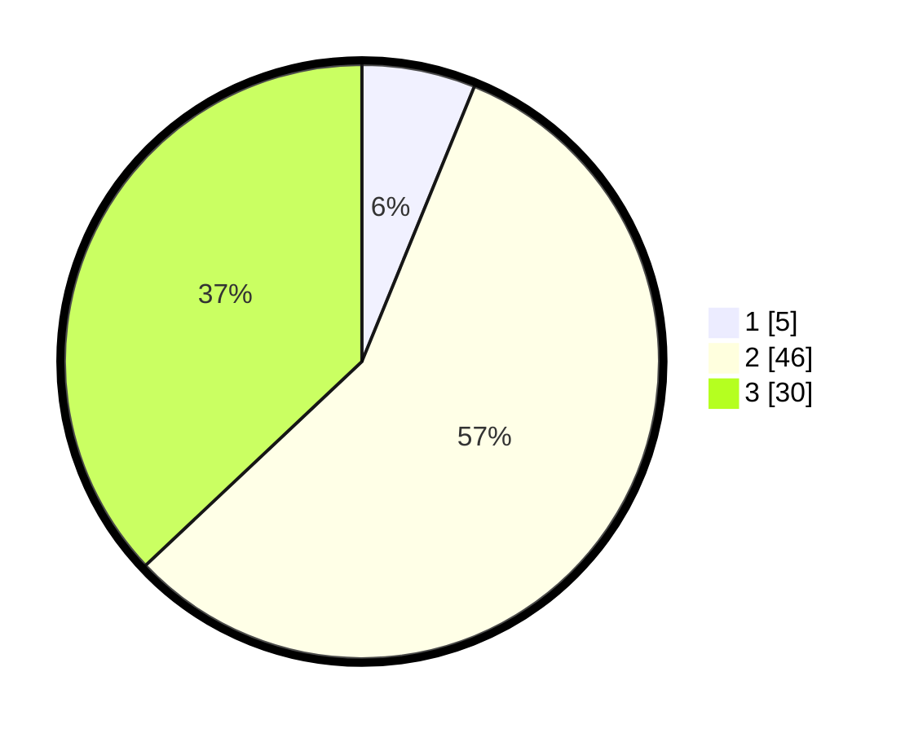

# Hasil

## Grafik

## Tabel

| No. | Nama Paslon    | Suara | Suara (raw) | Persentase |
|:--- |:-------------- | -----:| -----------:| ----------:|
| 1   | ANIES MUHAIMIN | 5     | [5][p-1]    | 6,17       |
| 2   | PRABOWO GIBRAN | 46    | [46][p-2]   | 56,79      |
| 3   | GANJAR MAHFUD  | 30    | [30][p-3]   | 37,04      |

[p-1]: https://github.com/gigit-pemilu/pemilu-2024/blob/main/pilpres/hitung-suara/sub/36-banten/sub/02-lebak/sub/06-leuwidamar/sub/2001-kanekes/sub/015-tps/sub/paslon-1.txt
[p-2]: https://github.com/gigit-pemilu/pemilu-2024/blob/main/pilpres/hitung-suara/sub/36-banten/sub/02-lebak/sub/06-leuwidamar/sub/2001-kanekes/sub/015-tps/sub/paslon-2.txt
[p-3]: https://github.com/gigit-pemilu/pemilu-2024/blob/main/pilpres/hitung-suara/sub/36-banten/sub/02-lebak/sub/06-leuwidamar/sub/2001-kanekes/sub/015-tps/sub/paslon-3.txt

## Foto C Plano

https://sirekap-obj-formc.kpu.go.id/1775/pemilu/ppwp/36/02/06/20/01/3602062001015-20240216-073556--17ba3ec3-f91c-46cc-a521-5f14e12870fb.jpg

https://sirekap-obj-formc.kpu.go.id/1775/pemilu/ppwp/36/02/06/20/01/3602062001015-20240216-071640--48b53871-3d25-497a-8308-8e3b17ff975f.jpg

https://sirekap-obj-formc.kpu.go.id/1775/pemilu/ppwp/36/02/06/20/01/3602062001015-20240216-071611--552e9b1e-e5e8-4ef9-9edd-f56e865107ac.jpg

## Metadata

| Key        | Value               |
| ---------- | ------------------- |
| Time Stamp | 2024-02-19 06:16:00 |

