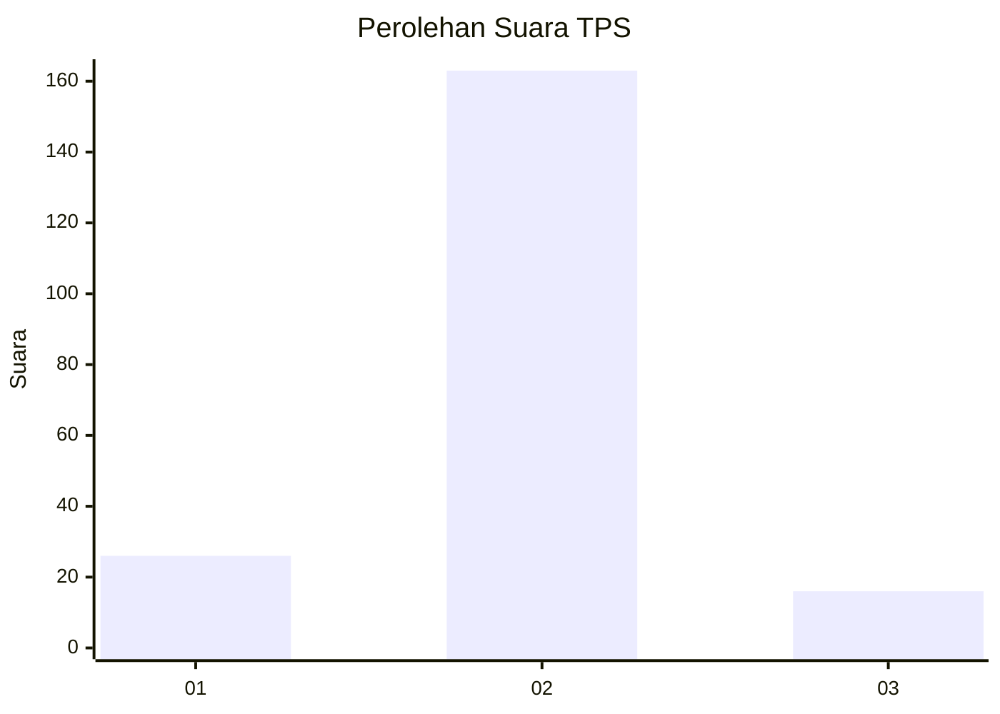
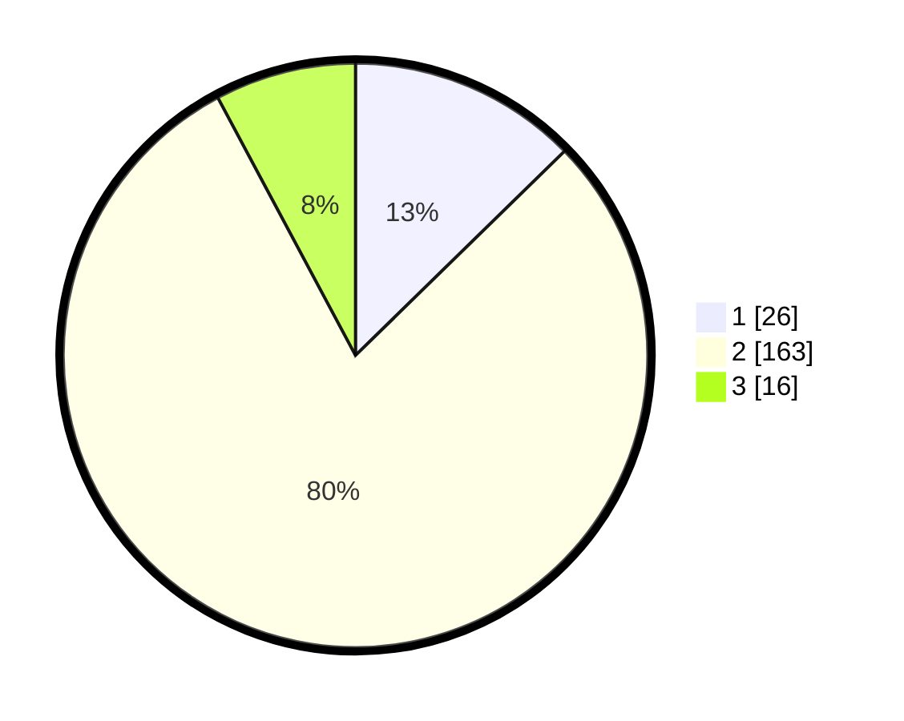

# Hasil

## Grafik

## Tabel

| No. | Nama Paslon    | Suara | Suara (raw) | Persentase |
|:--- |:-------------- | -----:| -----------:| ----------:|
| 1   | ANIES MUHAIMIN | 26    | [26][p-1]   | 12,68      |
| 2   | PRABOWO GIBRAN | 163   | [163][p-2]  | 79,51      |
| 3   | GANJAR MAHFUD  | 16    | [16][p-3]   | 7,80       |

[p-1]: https://github.com/gigit-pemilu/pemilu-2024/blob/main/pilpres/hitung-suara/sub/36-banten/sub/02-lebak/sub/07-bojongmanik/sub/2004-bojongmanik/sub/005-tps/sub/paslon-1.txt
[p-2]: https://github.com/gigit-pemilu/pemilu-2024/blob/main/pilpres/hitung-suara/sub/36-banten/sub/02-lebak/sub/07-bojongmanik/sub/2004-bojongmanik/sub/005-tps/sub/paslon-2.txt
[p-3]: https://github.com/gigit-pemilu/pemilu-2024/blob/main/pilpres/hitung-suara/sub/36-banten/sub/02-lebak/sub/07-bojongmanik/sub/2004-bojongmanik/sub/005-tps/sub/paslon-3.txt

## Foto C Plano

https://sirekap-obj-formc.kpu.go.id/6ff5/pemilu/ppwp/36/02/07/20/04/3602072004005-20240215-081452--27e52e99-d16f-457c-b358-df17a4c74a94.jpg

https://sirekap-obj-formc.kpu.go.id/6ff5/pemilu/ppwp/36/02/07/20/04/3602072004005-20240215-081154--e9779a6d-2a86-4244-9b23-075ded53bb03.jpg

https://sirekap-obj-formc.kpu.go.id/6ff5/pemilu/ppwp/36/02/07/20/04/3602072004005-20240215-081535--3a7fdaa8-3372-4906-8768-1df2b9f9daf4.jpg

## Metadata

| Key        | Value               |
| ---------- | ------------------- |
| Time Stamp | 2024-02-17 16:00:02 |

