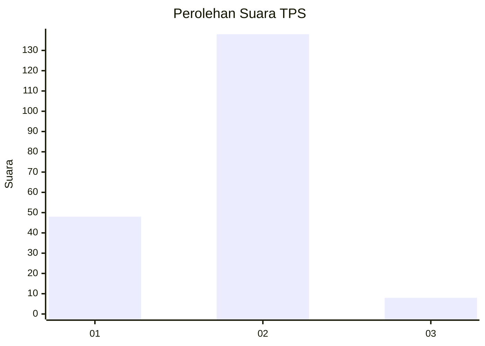
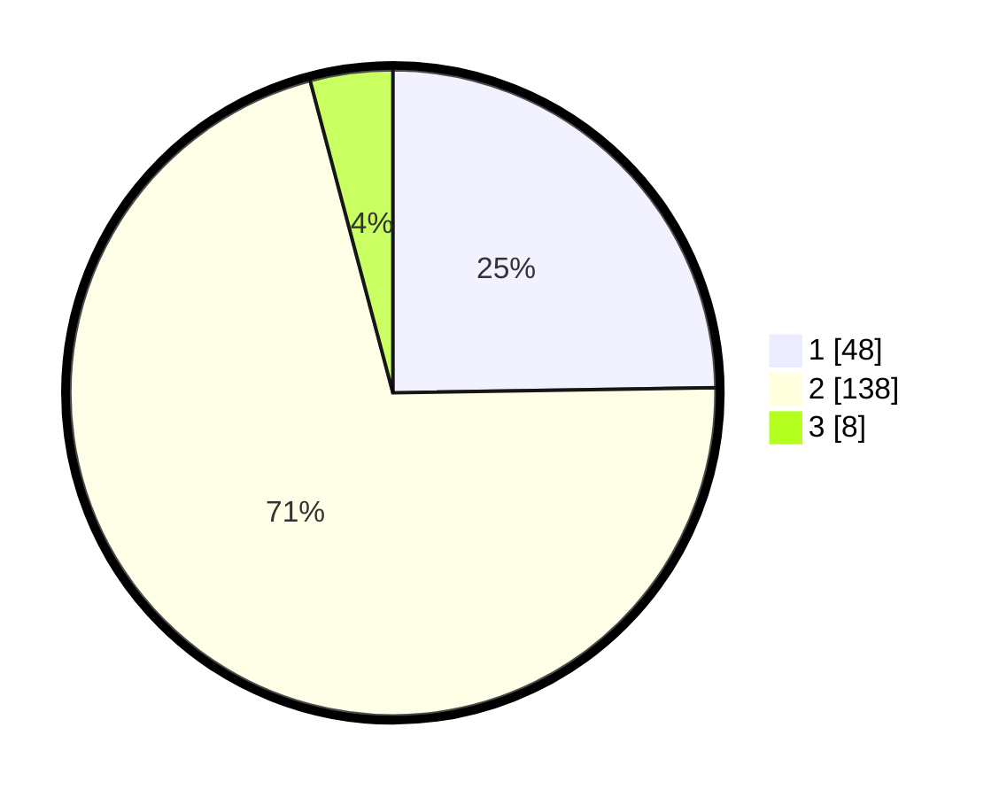

# Hasil

## Grafik

## Tabel

| No. | Nama Paslon    | Suara | Suara (raw) | Persentase |
|:--- |:-------------- | -----:| -----------:| ----------:|
| 1   | ANIES MUHAIMIN | 48    | [48][p-1]   | 24,74      |
| 2   | PRABOWO GIBRAN | 138   | [138][p-2]  | 71,13      |
| 3   | GANJAR MAHFUD  | 8     | [8][p-3]    | 4,12       |

[p-1]: https://github.com/gigit-pemilu/pemilu-2024-36-banten/blob/main/pilpres/hitung-suara/sub/36-banten/sub/02-lebak/sub/08-gunungkencana/sub/2001-gunungkencana/sub/001-tps/sub/paslon-1.txt
[p-2]: https://github.com/gigit-pemilu/pemilu-2024-36-banten/blob/main/pilpres/hitung-suara/sub/36-banten/sub/02-lebak/sub/08-gunungkencana/sub/2001-gunungkencana/sub/001-tps/sub/paslon-2.txt
[p-3]: https://github.com/gigit-pemilu/pemilu-2024-36-banten/blob/main/pilpres/hitung-suara/sub/36-banten/sub/02-lebak/sub/08-gunungkencana/sub/2001-gunungkencana/sub/001-tps/sub/paslon-3.txt

## Foto C Plano

https://sirekap-obj-formc.kpu.go.id/3005/pemilu/ppwp/36/02/08/20/01/3602082001001-20240216-202708--974bbc79-4b47-4596-8622-27ae371aca15.jpg

https://sirekap-obj-formc.kpu.go.id/3005/pemilu/ppwp/36/02/08/20/01/3602082001001-20240216-212109--f29fdc20-c4a0-4dc7-a442-25574b4a66b7.jpg

https://sirekap-obj-formc.kpu.go.id/3005/pemilu/ppwp/36/02/08/20/01/3602082001001-20240214-222235--a4d98d9d-e8d2-4500-9b78-5b1145f543a2.jpg

## Metadata

| Key        | Value               |
| ---------- | ------------------- |
| Time Stamp | 2024-02-17 16:00:02 |

