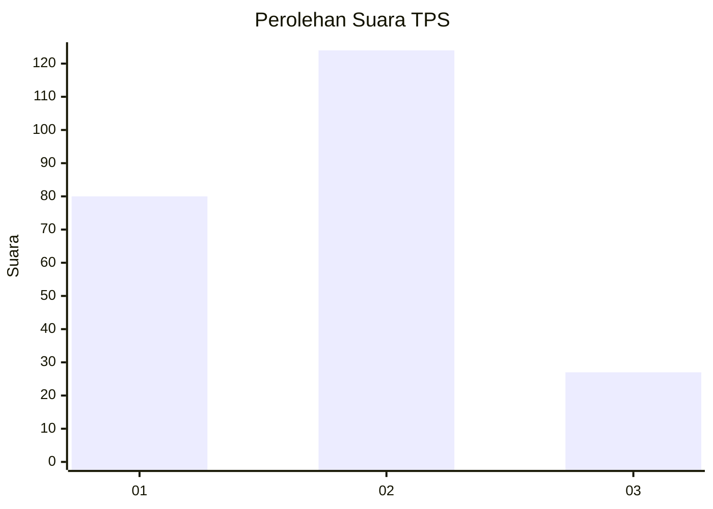
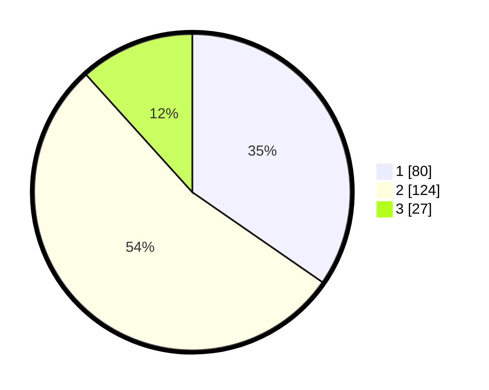

# Hasil

## Grafik

## Tabel

| No. | Nama Paslon    | Suara | Suara (raw) | Persentase |
|:--- |:-------------- | -----:| -----------:| ----------:|
| 1   | ANIES MUHAIMIN | 80    | [80][p-1]   | 34,63      |
| 2   | PRABOWO GIBRAN | 124   | [124][p-2]  | 53,68      |
| 3   | GANJAR MAHFUD  | 27    | [27][p-3]   | 11,69      |

[p-1]: https://github.com/gigit-pemilu/pemilu-2024/blob/main/pilpres/hitung-suara/sub/36-banten/sub/02-lebak/sub/08-gunungkencana/sub/2001-gunungkencana/sub/004-tps/sub/paslon-1.txt
[p-2]: https://github.com/gigit-pemilu/pemilu-2024/blob/main/pilpres/hitung-suara/sub/36-banten/sub/02-lebak/sub/08-gunungkencana/sub/2001-gunungkencana/sub/004-tps/sub/paslon-2.txt
[p-3]: https://github.com/gigit-pemilu/pemilu-2024/blob/main/pilpres/hitung-suara/sub/36-banten/sub/02-lebak/sub/08-gunungkencana/sub/2001-gunungkencana/sub/004-tps/sub/paslon-3.txt

## Foto C Plano

https://sirekap-obj-formc.kpu.go.id/f58f/pemilu/ppwp/36/02/08/20/01/3602082001004-20240216-232242--7fc30881-915a-4828-a20a-aaa4ff6d31b1.jpg

https://sirekap-obj-formc.kpu.go.id/f58f/pemilu/ppwp/36/02/08/20/01/3602082001004-20240215-090954--0a0f0087-947b-4280-ad60-2b9333364b87.jpg

https://sirekap-obj-formc.kpu.go.id/f58f/pemilu/ppwp/36/02/08/20/01/3602082001004-20240216-203643--315c19b5-612a-4caa-bcb2-9fd54a8cf5b9.jpg

## Metadata

| Key        | Value               |
| ---------- | ------------------- |
| Time Stamp | 2024-02-16 23:30:00 |

