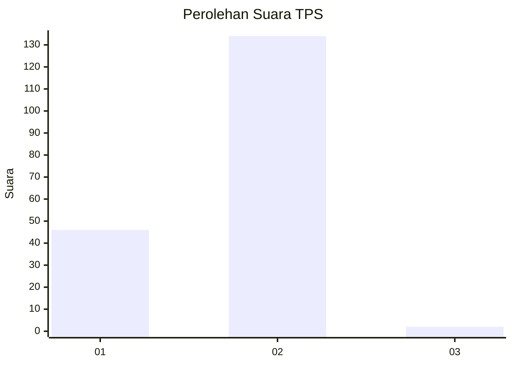
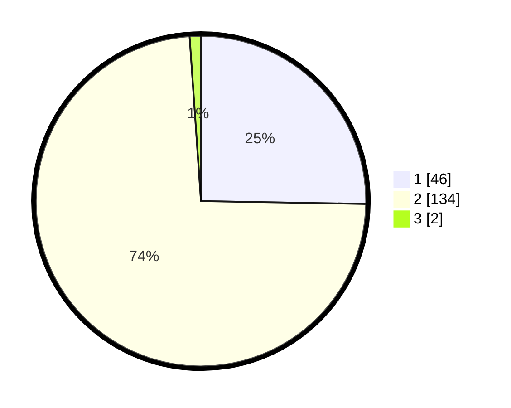

# Hasil

## Grafik

## Tabel

| No. | Nama Paslon    | Suara | Suara (raw) | Persentase |
|:--- |:-------------- | -----:| -----------:| ----------:|
| 1   | ANIES MUHAIMIN | 46    | [46][p-1]   | 25,27      |
| 2   | PRABOWO GIBRAN | 134   | [134][p-2]  | 73,63      |
| 3   | GANJAR MAHFUD  | 2     | [2][p-3]    | 1,10       |

[p-1]: https://github.com/gigit-pemilu/pemilu-2024/blob/main/pilpres/hitung-suara/sub/36-banten/sub/02-lebak/sub/08-gunungkencana/sub/2007-cicaringin/sub/005-tps/sub/paslon-1.txt
[p-2]: https://github.com/gigit-pemilu/pemilu-2024/blob/main/pilpres/hitung-suara/sub/36-banten/sub/02-lebak/sub/08-gunungkencana/sub/2007-cicaringin/sub/005-tps/sub/paslon-2.txt
[p-3]: https://github.com/gigit-pemilu/pemilu-2024/blob/main/pilpres/hitung-suara/sub/36-banten/sub/02-lebak/sub/08-gunungkencana/sub/2007-cicaringin/sub/005-tps/sub/paslon-3.txt

## Foto C Plano

https://sirekap-obj-formc.kpu.go.id/f223/pemilu/ppwp/36/02/08/20/07/3602082007005-20240215-095852--8a72daf0-ebd5-4bee-b05a-31ea16e82e02.jpg

https://sirekap-obj-formc.kpu.go.id/f223/pemilu/ppwp/36/02/08/20/07/3602082007005-20240215-100012--72aed133-c8cb-4eaa-805b-3e8ae71b4b0a.jpg

https://sirekap-obj-formc.kpu.go.id/f223/pemilu/ppwp/36/02/08/20/07/3602082007005-20240215-100117--f555f31d-fff7-47b1-b56b-b527367429de.jpg

## Metadata

| Key        | Value               |
| ---------- | ------------------- |
| Time Stamp | 2024-02-19 06:16:00 |

## DATA PEMILIH TETAP

Jumlah pemilih dalam DPT: **380**.
 * L: **42**.
 * P: **132**.

## DATA PENGGUNA HAK PILIH

Jumlah pengguna hak pilih dalam DPT: **872**.
 * L: **852**.
 * P: **489**.

Jumlah pengguna hak pilih dalam DPTb: **776**.
 * L: **878**.
 * P: **835**.

Jumlah pengguna hak pilih dalam DPK: **88**.
 * L: **482**.
 * P: **20**.

Jumlah pengguna hak pilih: **188**.
 * L: **82**.
 * P: **491**.

## JUMLAH SUARA SAH DAN TIDAK SAH

JUMLAH SELURUH SUARA SAH: **182**.

JUMLAH SUARA TIDAK SAH: **6**.

JUMLAH SELURUH SUARA SAH DAN SUARA TIDAK SAH: **188**.

