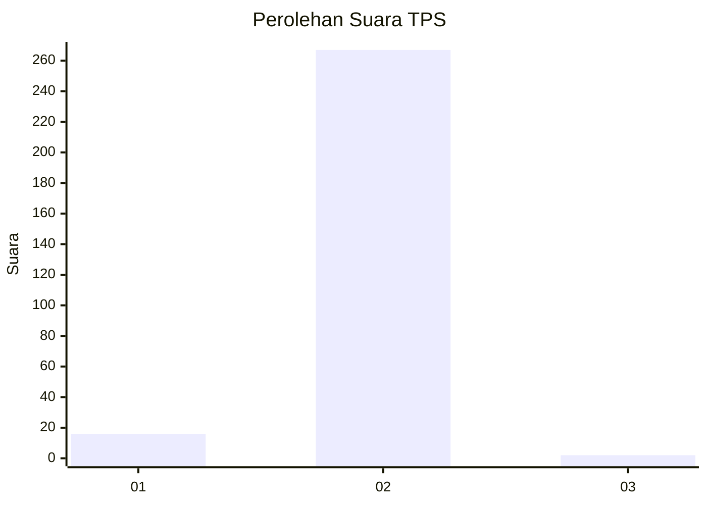
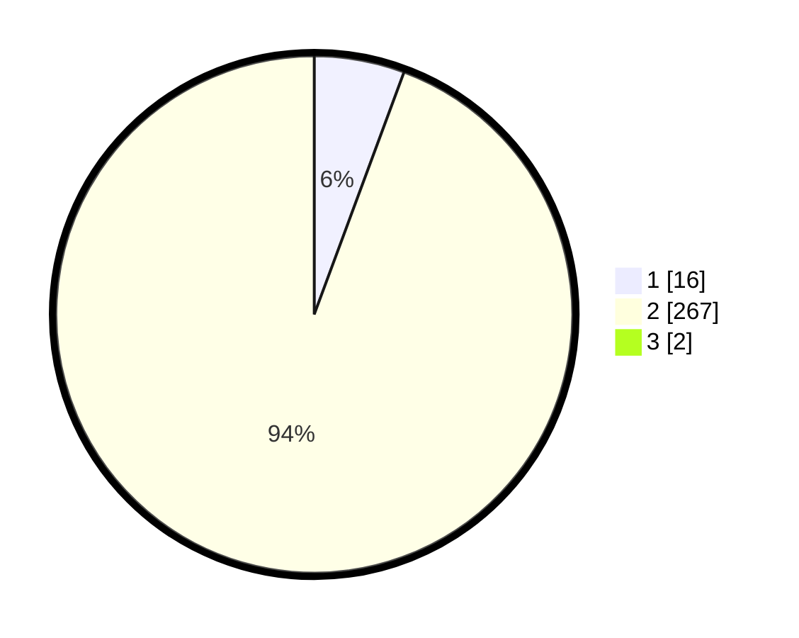

# Hasil

## Grafik

## Tabel

| No. | Nama Paslon    | Suara | Suara (raw) | Persentase |
|:--- |:-------------- | -----:| -----------:| ----------:|
| 1   | ANIES MUHAIMIN | 16    | [16][p-1]   | 5,61       |
| 2   | PRABOWO GIBRAN | 267   | [267][p-2]  | 93,68      |
| 3   | GANJAR MAHFUD  | 2     | [2][p-3]    | 0,70       |

[p-1]: https://github.com/gigit-pemilu/pemilu-2024-36-banten/blob/main/pilpres/hitung-suara/sub/36-banten/sub/02-lebak/sub/08-gunungkencana/sub/2008-bulakan/sub/008-tps/sub/paslon-1.txt
[p-2]: https://github.com/gigit-pemilu/pemilu-2024-36-banten/blob/main/pilpres/hitung-suara/sub/36-banten/sub/02-lebak/sub/08-gunungkencana/sub/2008-bulakan/sub/008-tps/sub/paslon-2.txt
[p-3]: https://github.com/gigit-pemilu/pemilu-2024-36-banten/blob/main/pilpres/hitung-suara/sub/36-banten/sub/02-lebak/sub/08-gunungkencana/sub/2008-bulakan/sub/008-tps/sub/paslon-3.txt

## Foto C Plano

https://sirekap-obj-formc.kpu.go.id/045a/pemilu/ppwp/36/02/08/20/08/3602082008008-20240216-153528--f5483109-37ce-40f7-857f-667de1dd0776.jpg

https://sirekap-obj-formc.kpu.go.id/045a/pemilu/ppwp/36/02/08/20/08/3602082008008-20240216-141040--e5c72fec-af30-498d-ae1f-71cb99a20616.jpg

https://sirekap-obj-formc.kpu.go.id/045a/pemilu/ppwp/36/02/08/20/08/3602082008008-20240216-155021--6384e09c-a5b7-47dd-95b7-923f399cdb2f.jpg

## Metadata

| Key        | Value               |
| ---------- | ------------------- |
| Time Stamp | 2024-02-16 16:25:10 |

