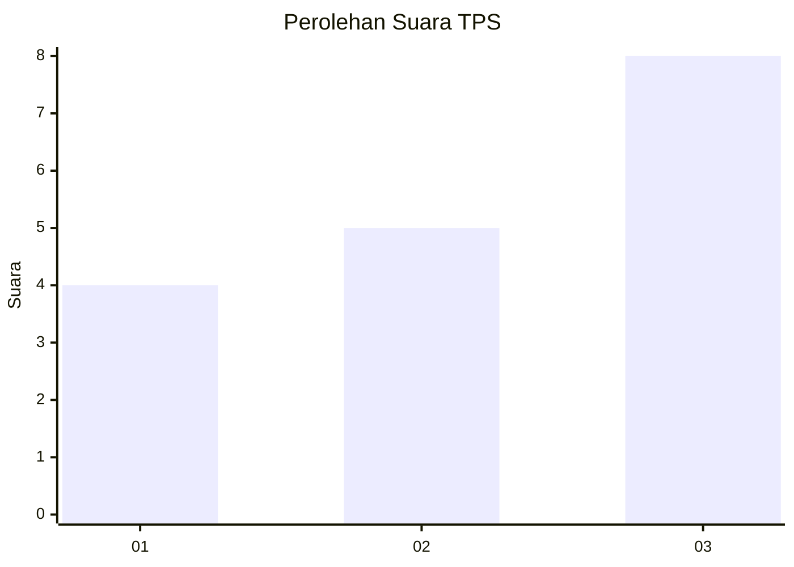
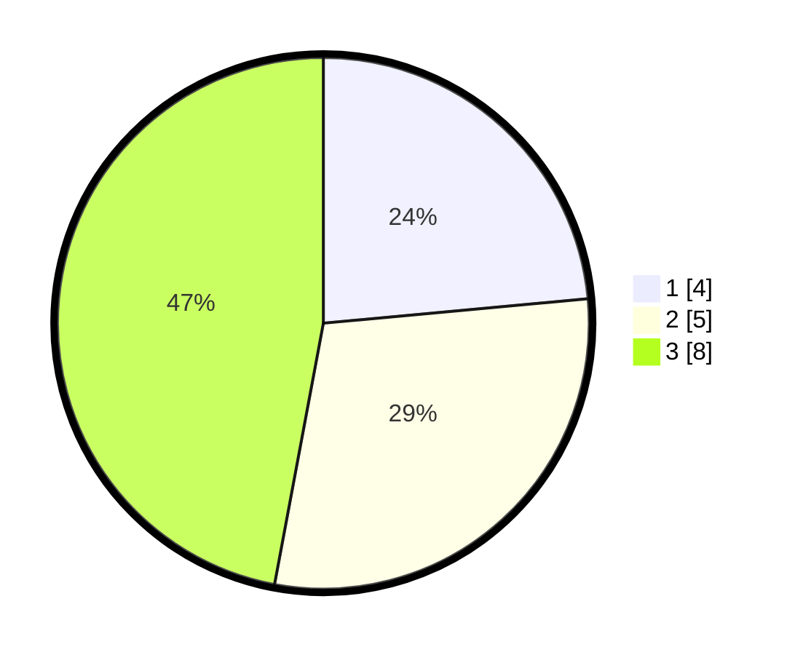

# Hasil

## Grafik

## Tabel

| No. | Nama Paslon    | Suara | Suara (raw) | Persentase |
|:--- |:-------------- | -----:| -----------:| ----------:|
| 1   | ANIES MUHAIMIN | 4     | [4][p-1]    | 23,53      |
| 2   | PRABOWO GIBRAN | 5     | [5][p-2]    | 29,41      |
| 3   | GANJAR MAHFUD  | 8     | [8][p-3]    | 47,06      |

[p-1]: https://github.com/gigit-pemilu/pemilu-2024-36-banten/blob/main/pilpres/hitung-suara/sub/36-banten/sub/02-lebak/sub/09-banjarsari/sub/2007-cibaturkeusik/sub/005-tps/sub/paslon-1.txt
[p-2]: https://github.com/gigit-pemilu/pemilu-2024-36-banten/blob/main/pilpres/hitung-suara/sub/36-banten/sub/02-lebak/sub/09-banjarsari/sub/2007-cibaturkeusik/sub/005-tps/sub/paslon-2.txt
[p-3]: https://github.com/gigit-pemilu/pemilu-2024-36-banten/blob/main/pilpres/hitung-suara/sub/36-banten/sub/02-lebak/sub/09-banjarsari/sub/2007-cibaturkeusik/sub/005-tps/sub/paslon-3.txt

## Foto C Plano

https://sirekap-obj-formc.kpu.go.id/7369/pemilu/ppwp/36/02/09/20/07/3602092007005-20240223-212126--46280caa-eede-4608-bd2d-1ddfefaec784.jpg

https://sirekap-obj-formc.kpu.go.id/7369/pemilu/ppwp/36/02/09/20/07/3602092007005-20240223-212606--25fda544-0346-4f4a-a809-792c57b7f1ef.jpg

https://sirekap-obj-formc.kpu.go.id/7369/pemilu/ppwp/36/02/09/20/07/3602092007005-20240223-212653--7bf27b6d-0e1f-4112-8123-bf190c8d6eb2.jpg

## Metadata

| Key        | Value               |
| ---------- | ------------------- |
| Time Stamp | 2024-02-24 22:31:28 |

## DATA PEMILIH TETAP

Jumlah pemilih dalam DPT: **277**.
 * L: **443**.
 * P: **434**.

## DATA PENGGUNA HAK PILIH

Jumlah pengguna hak pilih dalam DPT: **203**.
 * L: **57**.
 * P: **406**.

Jumlah pengguna hak pilih dalam DPTb: **7**.
 * L: **87**.
 * P: **80**.

Jumlah pengguna hak pilih dalam DPK: **5**.
 * L: **4**.
 * P: **0**.

Jumlah pengguna hak pilih: **205**.
 * L: **39**.
 * P: **606**.

## JUMLAH SUARA SAH DAN TIDAK SAH

JUMLAH SELURUH SUARA SAH: **898**.

JUMLAH SUARA TIDAK SAH: **3**.

JUMLAH SELURUH SUARA SAH DAN SUARA TIDAK SAH: **293**.

