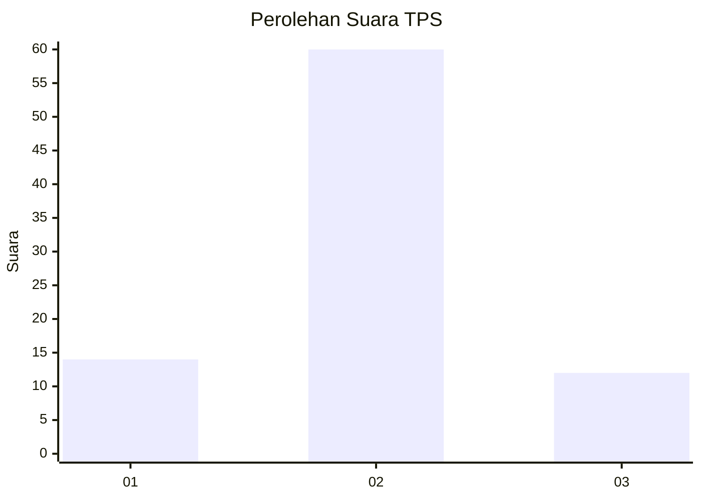
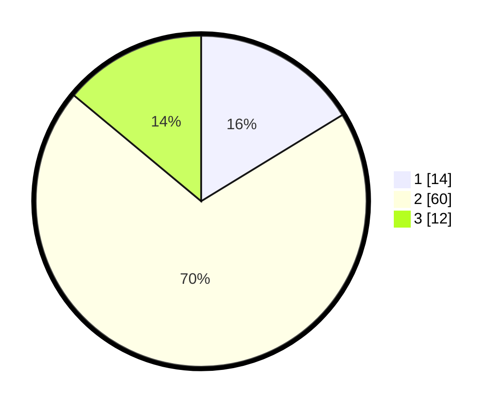

# Hasil

## Grafik

## Tabel

| No. | Nama Paslon    | Suara | Suara (raw) | Persentase |
|:--- |:-------------- | -----:| -----------:| ----------:|
| 1   | ANIES MUHAIMIN | 14    | [14][p-1]   | 16,28      |
| 2   | PRABOWO GIBRAN | 60    | [60][p-2]   | 69,77      |
| 3   | GANJAR MAHFUD  | 12    | [12][p-3]   | 13,95      |

[p-1]: https://github.com/gigit-pemilu/pemilu-2024-36-banten/blob/main/pilpres/hitung-suara/sub/36-banten/sub/02-lebak/sub/09-banjarsari/sub/2014-gunungsari/sub/011-tps/sub/paslon-1.txt
[p-2]: https://github.com/gigit-pemilu/pemilu-2024-36-banten/blob/main/pilpres/hitung-suara/sub/36-banten/sub/02-lebak/sub/09-banjarsari/sub/2014-gunungsari/sub/011-tps/sub/paslon-2.txt
[p-3]: https://github.com/gigit-pemilu/pemilu-2024-36-banten/blob/main/pilpres/hitung-suara/sub/36-banten/sub/02-lebak/sub/09-banjarsari/sub/2014-gunungsari/sub/011-tps/sub/paslon-3.txt

## Foto C Plano

https://sirekap-obj-formc.kpu.go.id/ec3b/pemilu/ppwp/36/02/09/20/14/3602092014011-20240215-110305--9b8bf8fd-776e-41f8-b675-7e1feca2a7fa.jpg

https://sirekap-obj-formc.kpu.go.id/ec3b/pemilu/ppwp/36/02/09/20/14/3602092014011-20240215-142542--a2aa0e5a-6b85-4d5b-97f0-33569215c5f1.jpg

https://sirekap-obj-formc.kpu.go.id/ec3b/pemilu/ppwp/36/02/09/20/14/3602092014011-20240215-142622--0583b4f8-255c-42fc-9619-c6e5f9a0bb85.jpg

## Metadata

| Key        | Value               |
| ---------- | ------------------- |
| Time Stamp | 2024-02-19 06:16:00 |

