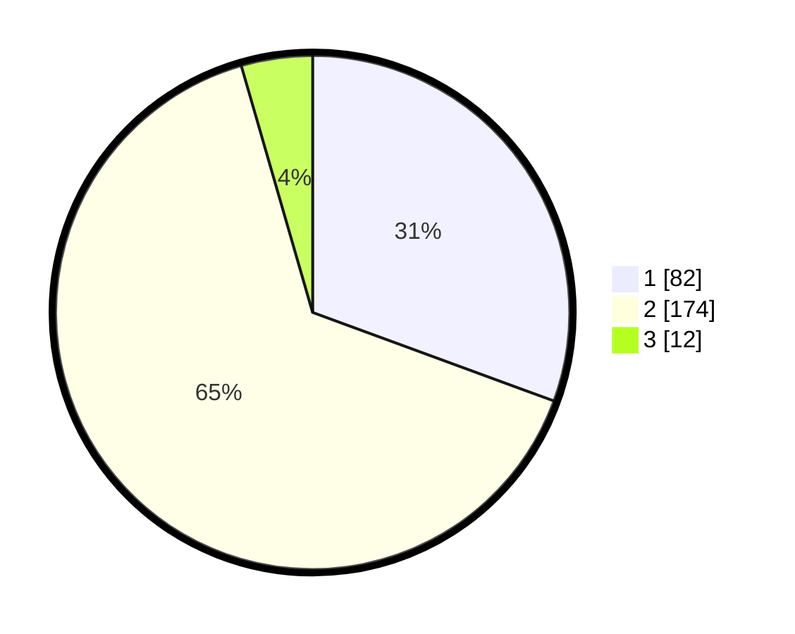

# Hasil

## Grafik

## Tabel

| No. | Nama Paslon    | Suara | Suara (raw) | Persentase |
|:--- |:-------------- | -----:| -----------:| ----------:|
| 1   | ANIES MUHAIMIN | 82    | [82][p-1]   | 30,60      |
| 2   | PRABOWO GIBRAN | 174   | [174][p-2]  | 64,93      |
| 3   | GANJAR MAHFUD  | 12    | [12][p-3]   | 4,48       |

[p-1]: https://github.com/gigit-pemilu/pemilu-2024-36-banten/blob/main/pilpres/hitung-suara/sub/36-banten/sub/02-lebak/sub/11-cimarga/sub/2006-karyajaya/sub/005-tps/sub/paslon-1.txt
[p-2]: https://github.com/gigit-pemilu/pemilu-2024-36-banten/blob/main/pilpres/hitung-suara/sub/36-banten/sub/02-lebak/sub/11-cimarga/sub/2006-karyajaya/sub/005-tps/sub/paslon-2.txt
[p-3]: https://github.com/gigit-pemilu/pemilu-2024-36-banten/blob/main/pilpres/hitung-suara/sub/36-banten/sub/02-lebak/sub/11-cimarga/sub/2006-karyajaya/sub/005-tps/sub/paslon-3.txt

## Foto C Plano

https://sirekap-obj-formc.kpu.go.id/f4bf/pemilu/ppwp/36/02/11/20/06/3602112006005-20240217-155115--6e5b163a-dc71-43d7-a4f0-23d5c28c8b90.jpg

https://sirekap-obj-formc.kpu.go.id/f4bf/pemilu/ppwp/36/02/11/20/06/3602112006005-20240214-222654--7aa2054a-ee0b-402d-b9d4-0404a44c60b2.jpg

https://sirekap-obj-formc.kpu.go.id/f4bf/pemilu/ppwp/36/02/11/20/06/3602112006005-20240214-222631--df170a29-b9c5-4b81-9054-33d2643c22f5.jpg

## Metadata

| Key        | Value               |
| ---------- | ------------------- |
| Time Stamp | 2024-02-17 16:00:02 |

