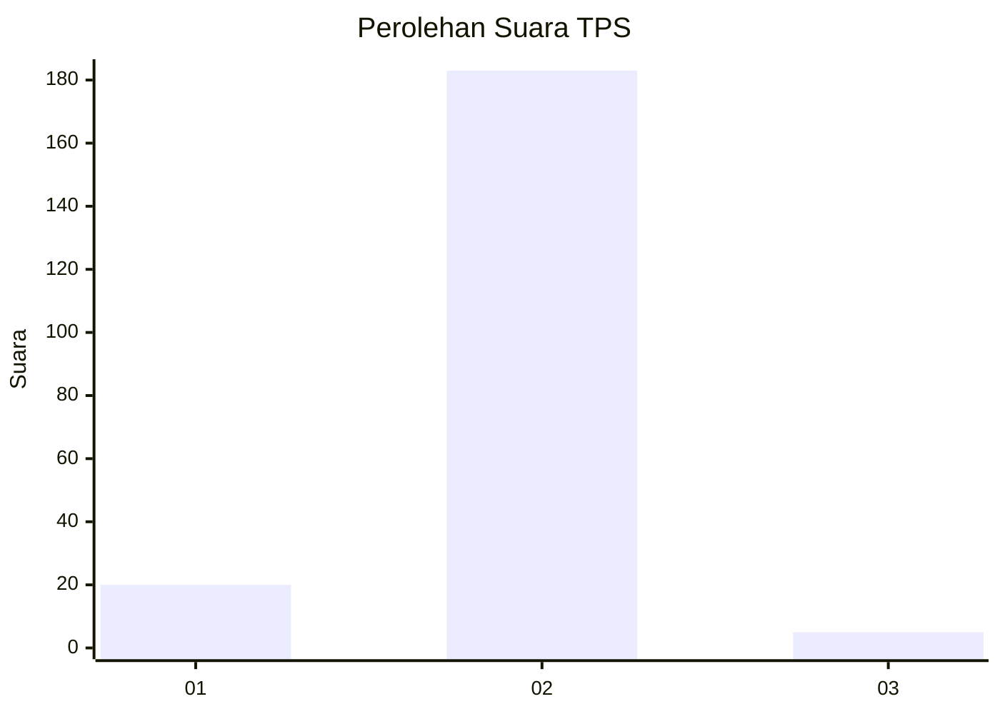
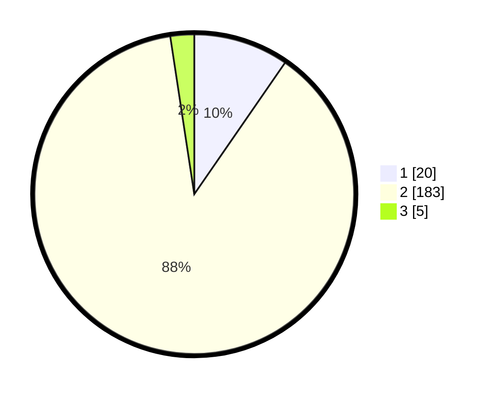

# Hasil

## Grafik

## Tabel

| No. | Nama Paslon    | Suara | Suara (raw) | Persentase |
|:--- |:-------------- | -----:| -----------:| ----------:|
| 1   | ANIES MUHAIMIN | 20    | [20][p-1]   | 9,62       |
| 2   | PRABOWO GIBRAN | 183   | [183][p-2]  | 87,98      |
| 3   | GANJAR MAHFUD  | 5     | [5][p-3]    | 2,40       |

[p-1]: https://github.com/gigit-pemilu/pemilu-2024/blob/main/pilpres/hitung-suara/sub/36-banten/sub/02-lebak/sub/11-cimarga/sub/2012-mekarjaya/sub/012-tps/sub/paslon-1.txt
[p-2]: https://github.com/gigit-pemilu/pemilu-2024/blob/main/pilpres/hitung-suara/sub/36-banten/sub/02-lebak/sub/11-cimarga/sub/2012-mekarjaya/sub/012-tps/sub/paslon-2.txt
[p-3]: https://github.com/gigit-pemilu/pemilu-2024/blob/main/pilpres/hitung-suara/sub/36-banten/sub/02-lebak/sub/11-cimarga/sub/2012-mekarjaya/sub/012-tps/sub/paslon-3.txt

## Foto C Plano

https://sirekap-obj-formc.kpu.go.id/7507/pemilu/ppwp/36/02/11/20/12/3602112012012-20240214-195817--fa4ac933-0bb5-460b-aec5-ca0f48cfff56.jpg

https://sirekap-obj-formc.kpu.go.id/7507/pemilu/ppwp/36/02/11/20/12/3602112012012-20240214-155025--6273ac3c-50b2-49b6-aa06-57bcbf018084.jpg

https://sirekap-obj-formc.kpu.go.id/7507/pemilu/ppwp/36/02/11/20/12/3602112012012-20240214-155210--386f940e-2b2d-4d98-ad68-22f883f3b57b.jpg

## Metadata

| Key        | Value               |
| ---------- | ------------------- |
| Time Stamp | 2024-02-16 00:00:26 |

## DATA PEMILIH TETAP

Jumlah pemilih dalam DPT: **0**.
 * L: **0**.
 * P: **0**.

## DATA PENGGUNA HAK PILIH

Jumlah pengguna hak pilih dalam DPT: **707**.
 * L: **0**.
 * P: **0**.

Jumlah pengguna hak pilih dalam DPTb: **8**.
 * L: **0**.
 * P: **7**.

Jumlah pengguna hak pilih dalam DPK: **778**.
 * L: **7**.
 * P: **777**.

Jumlah pengguna hak pilih: **527**.
 * L: **7**.
 * P: **773**.

## JUMLAH SUARA SAH DAN TIDAK SAH

JUMLAH SELURUH SUARA SAH: **208**.

JUMLAH SUARA TIDAK SAH: **7**.

JUMLAH SELURUH SUARA SAH DAN SUARA TIDAK SAH: **215**.

