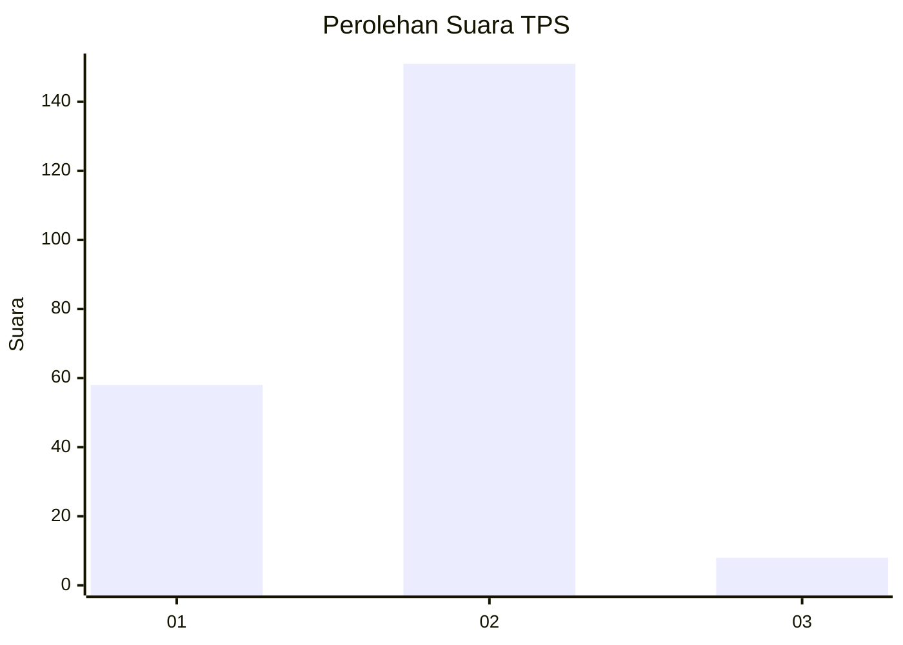
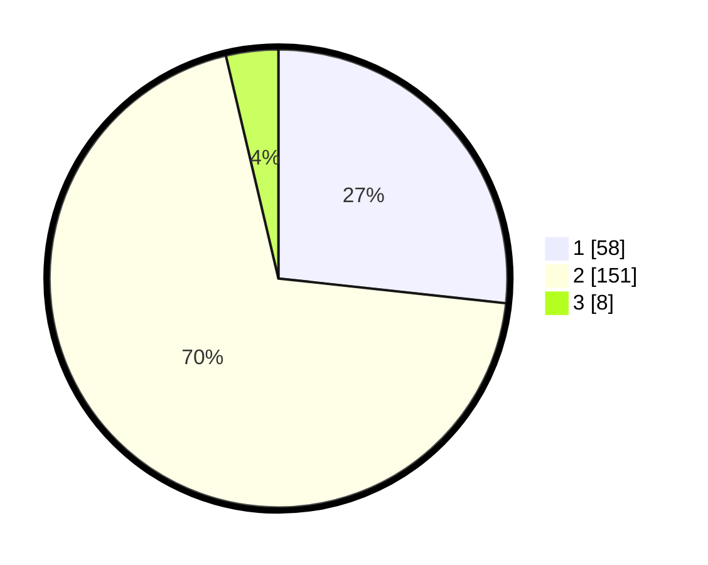

# Hasil

## Grafik

## Tabel

| No. | Nama Paslon    | Suara | Suara (raw) | Persentase |
|:--- |:-------------- | -----:| -----------:| ----------:|
| 1   | ANIES MUHAIMIN | 58    | [58][p-1]   | 26,73      |
| 2   | PRABOWO GIBRAN | 151   | [151][p-2]  | 69,59      |
| 3   | GANJAR MAHFUD  | 8     | [8][p-3]    | 3,69       |

[p-1]: https://github.com/gigit-pemilu/pemilu-2024-36-banten/blob/main/pilpres/hitung-suara/sub/36-banten/sub/02-lebak/sub/12-sajira/sub/2001-maraya/sub/002-tps/sub/paslon-1.txt
[p-2]: https://github.com/gigit-pemilu/pemilu-2024-36-banten/blob/main/pilpres/hitung-suara/sub/36-banten/sub/02-lebak/sub/12-sajira/sub/2001-maraya/sub/002-tps/sub/paslon-2.txt
[p-3]: https://github.com/gigit-pemilu/pemilu-2024-36-banten/blob/main/pilpres/hitung-suara/sub/36-banten/sub/02-lebak/sub/12-sajira/sub/2001-maraya/sub/002-tps/sub/paslon-3.txt

## Foto C Plano

https://sirekap-obj-formc.kpu.go.id/8a8b/pemilu/ppwp/36/02/12/20/01/3602122001002-20240215-091644--70f8d68a-46f0-44a9-9ecf-98f78acea567.jpg

https://sirekap-obj-formc.kpu.go.id/8a8b/pemilu/ppwp/36/02/12/20/01/3602122001002-20240215-091704--6c156e3a-31c6-4663-bab8-fe1ba4dd33a4.jpg

https://sirekap-obj-formc.kpu.go.id/8a8b/pemilu/ppwp/36/02/12/20/01/3602122001002-20240215-092413--442239c3-d339-4bf5-82d8-4da590d7c8b7.jpg

## Metadata

| Key        | Value               |
| ---------- | ------------------- |
| Time Stamp | 2024-02-17 14:56:33 |

