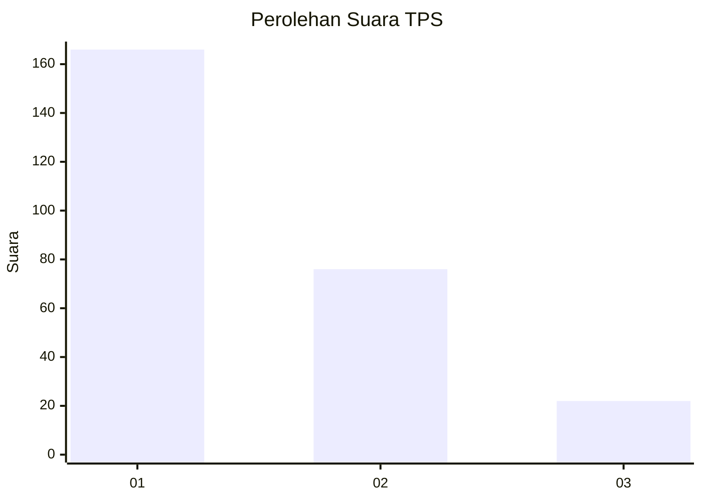
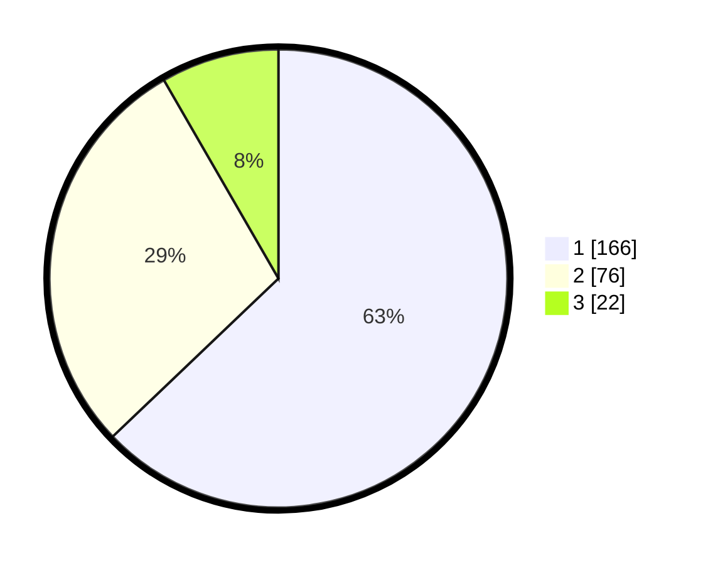

# Hasil

## Grafik

## Tabel

| No. | Nama Paslon    | Suara | Suara (raw) | Persentase |
|:--- |:-------------- | -----:| -----------:| ----------:|
| 1   | ANIES MUHAIMIN | 166   | [166][p-1]  | 62,88      |
| 2   | PRABOWO GIBRAN | 76    | [76][p-2]   | 28,79      |
| 3   | GANJAR MAHFUD  | 22    | [22][p-3]   | 8,33       |

[p-1]: https://github.com/gigit-pemilu/pemilu-2024-36-banten/blob/main/pilpres/hitung-suara/sub/36-banten/sub/02-lebak/sub/13-maja/sub/2012-padasuka/sub/014-tps/sub/paslon-1.txt
[p-2]: https://github.com/gigit-pemilu/pemilu-2024-36-banten/blob/main/pilpres/hitung-suara/sub/36-banten/sub/02-lebak/sub/13-maja/sub/2012-padasuka/sub/014-tps/sub/paslon-2.txt
[p-3]: https://github.com/gigit-pemilu/pemilu-2024-36-banten/blob/main/pilpres/hitung-suara/sub/36-banten/sub/02-lebak/sub/13-maja/sub/2012-padasuka/sub/014-tps/sub/paslon-3.txt

## Foto C Plano

https://sirekap-obj-formc.kpu.go.id/41f6/pemilu/ppwp/36/02/13/20/12/3602132012014-20240215-102302--0e33a1bf-4dcd-4a94-ae40-ebafa252b7fd.jpg

https://sirekap-obj-formc.kpu.go.id/41f6/pemilu/ppwp/36/02/13/20/12/3602132012014-20240215-102421--56c67689-350e-49ed-b1b1-9205c8ecaf47.jpg

https://sirekap-obj-formc.kpu.go.id/41f6/pemilu/ppwp/36/02/13/20/12/3602132012014-20240215-102516--37370fea-2072-4ff8-a169-386abf3b7397.jpg

## Metadata

| Key        | Value               |
| ---------- | ------------------- |
| Time Stamp | 2024-02-19 06:16:00 |

