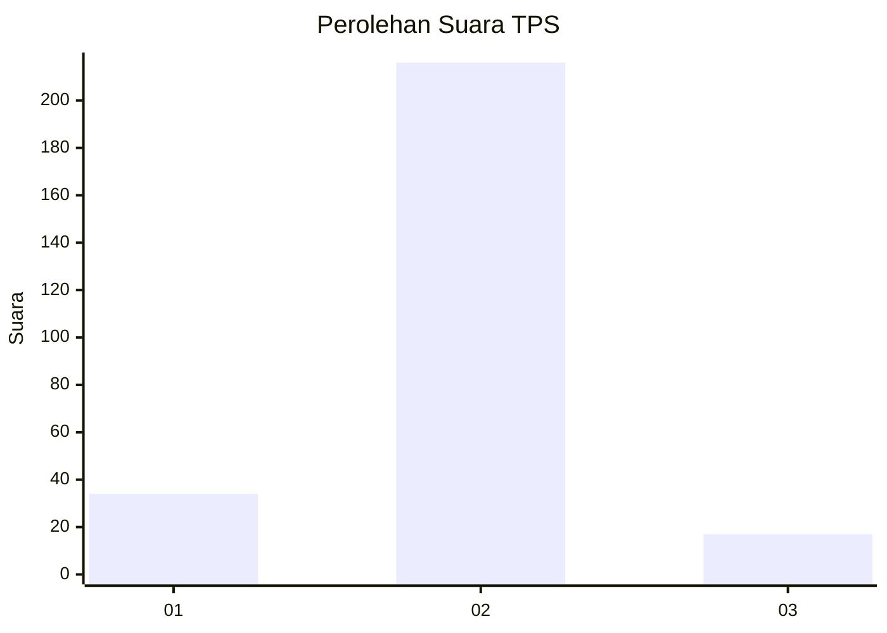
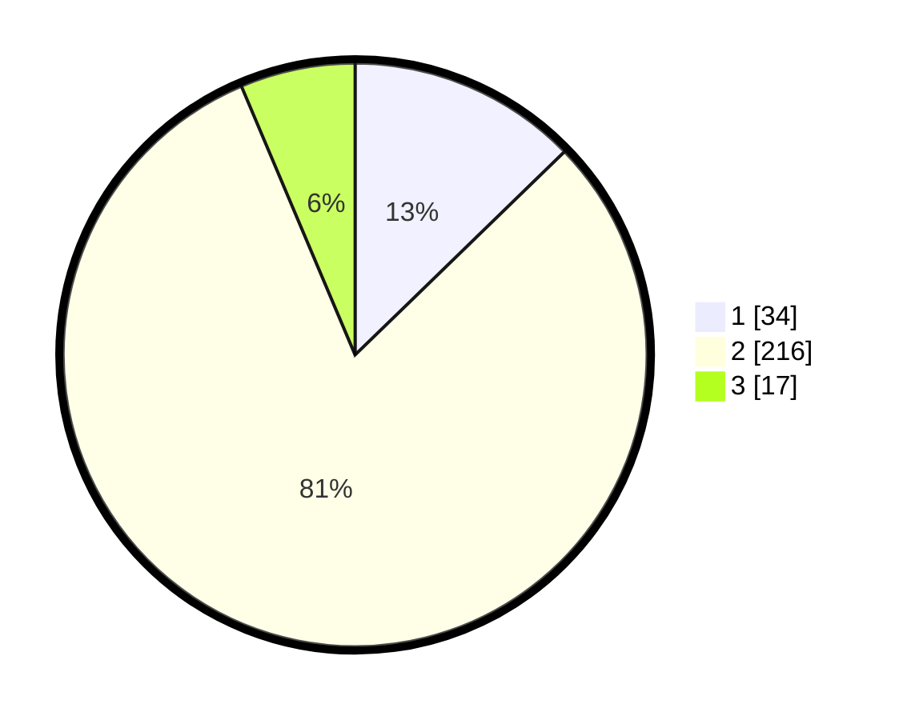

# Hasil

## Grafik

## Tabel

| No. | Nama Paslon    | Suara | Suara (raw) | Persentase |
|:--- |:-------------- | -----:| -----------:| ----------:|
| 1   | ANIES MUHAIMIN | 34    | [34][p-1]   | 12,73      |
| 2   | PRABOWO GIBRAN | 216   | [216][p-2]  | 80,90      |
| 3   | GANJAR MAHFUD  | 17    | [17][p-3]   | 6,37       |

[p-1]: https://github.com/gigit-pemilu/pemilu-2024-36-banten/blob/main/pilpres/hitung-suara/sub/36-banten/sub/02-lebak/sub/13-maja/sub/2015-curugbadak/sub/009-tps/sub/paslon-1.txt
[p-2]: https://github.com/gigit-pemilu/pemilu-2024-36-banten/blob/main/pilpres/hitung-suara/sub/36-banten/sub/02-lebak/sub/13-maja/sub/2015-curugbadak/sub/009-tps/sub/paslon-2.txt
[p-3]: https://github.com/gigit-pemilu/pemilu-2024-36-banten/blob/main/pilpres/hitung-suara/sub/36-banten/sub/02-lebak/sub/13-maja/sub/2015-curugbadak/sub/009-tps/sub/paslon-3.txt

## Foto C Plano

https://sirekap-obj-formc.kpu.go.id/b2b6/pemilu/ppwp/36/02/13/20/15/3602132015009-20240215-005712--23237265-657c-472c-98c9-23f7900eb84b.jpg

https://sirekap-obj-formc.kpu.go.id/b2b6/pemilu/ppwp/36/02/13/20/15/3602132015009-20240215-005802--817b55ea-2985-415c-a611-8cc0bd7c64bf.jpg

https://sirekap-obj-formc.kpu.go.id/b2b6/pemilu/ppwp/36/02/13/20/15/3602132015009-20240215-005832--bde81d1d-79e5-40c1-9bd9-3246390bde4b.jpg

## Metadata

| Key        | Value               |
| ---------- | ------------------- |
| Time Stamp | 2024-02-17 14:56:33 |

