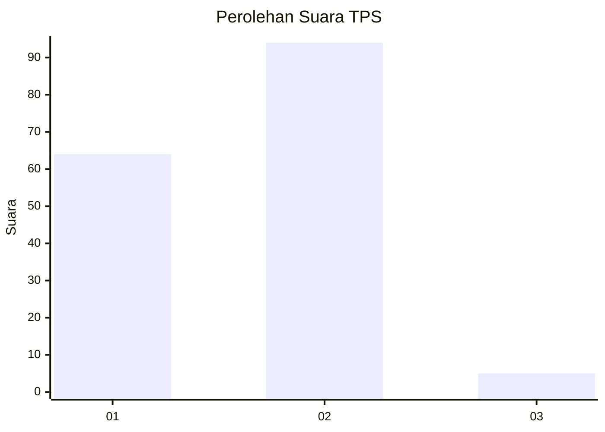
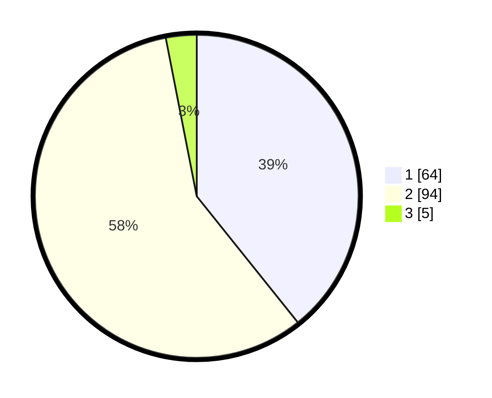

# Hasil

## Grafik

## Tabel

| No. | Nama Paslon    | Suara | Suara (raw) | Persentase |
|:--- |:-------------- | -----:| -----------:| ----------:|
| 1   | ANIES MUHAIMIN | 64    | [64][p-1]   | 39,26      |
| 2   | PRABOWO GIBRAN | 94    | [94][p-2]   | 57,67      |
| 3   | GANJAR MAHFUD  | 5     | [5][p-3]    | 3,07       |

[p-1]: https://github.com/gigit-pemilu/pemilu-2024/blob/main/pilpres/hitung-suara/sub/36-banten/sub/02-lebak/sub/14-rangkasbitung/sub/1002-rangkasbitung-barat/sub/005-tps/sub/paslon-1.txt
[p-2]: https://github.com/gigit-pemilu/pemilu-2024/blob/main/pilpres/hitung-suara/sub/36-banten/sub/02-lebak/sub/14-rangkasbitung/sub/1002-rangkasbitung-barat/sub/005-tps/sub/paslon-2.txt
[p-3]: https://github.com/gigit-pemilu/pemilu-2024/blob/main/pilpres/hitung-suara/sub/36-banten/sub/02-lebak/sub/14-rangkasbitung/sub/1002-rangkasbitung-barat/sub/005-tps/sub/paslon-3.txt

## Foto C Plano

https://sirekap-obj-formc.kpu.go.id/a336/pemilu/ppwp/36/02/14/10/02/3602141002005-20240215-012944--bb366b81-ca7a-4693-8753-f4c3d81cbcb3.jpg

https://sirekap-obj-formc.kpu.go.id/a336/pemilu/ppwp/36/02/14/10/02/3602141002005-20240215-013131--a0bfd265-ff82-4d4f-b129-cde0b1b8c7cf.jpg

https://sirekap-obj-formc.kpu.go.id/a336/pemilu/ppwp/36/02/14/10/02/3602141002005-20240215-013313--79558582-305e-4bce-80f2-19a4ac547dcf.jpg

## Metadata

| Key        | Value               |
| ---------- | ------------------- |
| Time Stamp | 2024-02-16 00:30:27 |

