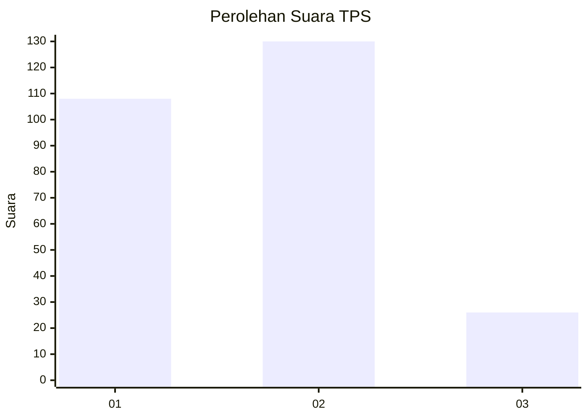
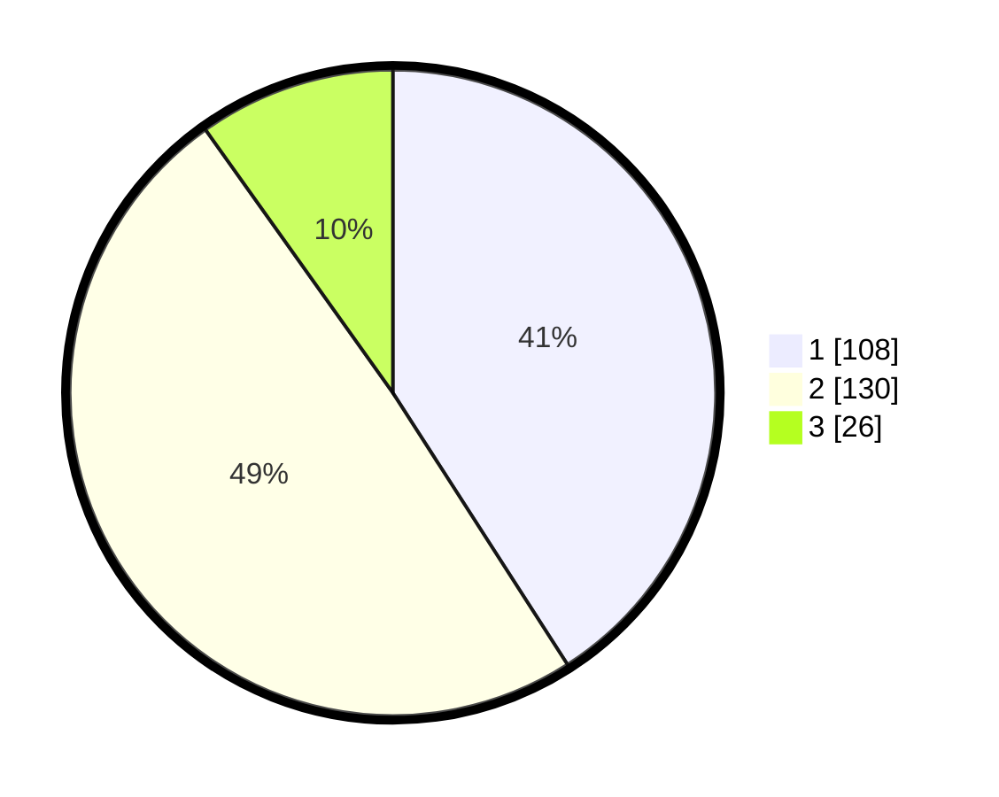

# Hasil

## Grafik

## Tabel

| No. | Nama Paslon    | Suara | Suara (raw) | Persentase |
|:--- |:-------------- | -----:| -----------:| ----------:|
| 1   | ANIES MUHAIMIN | 108   | [108][p-1]  | 40,91      |
| 2   | PRABOWO GIBRAN | 130   | [130][p-2]  | 49,24      |
| 3   | GANJAR MAHFUD  | 26    | [26][p-3]   | 9,85       |

[p-1]: https://github.com/gigit-pemilu/pemilu-2024-36-banten/blob/main/pilpres/hitung-suara/sub/36-banten/sub/02-lebak/sub/14-rangkasbitung/sub/1002-rangkasbitung-barat/sub/009-tps/sub/paslon-1.txt
[p-2]: https://github.com/gigit-pemilu/pemilu-2024-36-banten/blob/main/pilpres/hitung-suara/sub/36-banten/sub/02-lebak/sub/14-rangkasbitung/sub/1002-rangkasbitung-barat/sub/009-tps/sub/paslon-2.txt
[p-3]: https://github.com/gigit-pemilu/pemilu-2024-36-banten/blob/main/pilpres/hitung-suara/sub/36-banten/sub/02-lebak/sub/14-rangkasbitung/sub/1002-rangkasbitung-barat/sub/009-tps/sub/paslon-3.txt

## Foto C Plano

https://sirekap-obj-formc.kpu.go.id/3fbb/pemilu/ppwp/36/02/14/10/02/3602141002009-20240215-073448--39d9454e-594d-47eb-b211-806f5e4db5e0.jpg

https://sirekap-obj-formc.kpu.go.id/3fbb/pemilu/ppwp/36/02/14/10/02/3602141002009-20240215-073628--8d017fa5-9259-4e23-81ad-def09c2b9437.jpg

https://sirekap-obj-formc.kpu.go.id/3fbb/pemilu/ppwp/36/02/14/10/02/3602141002009-20240215-073735--649ba29f-a039-4273-b98c-aa1fd283f6de.jpg

## Metadata

| Key        | Value               |
| ---------- | ------------------- |
| Time Stamp | 2024-02-19 06:16:00 |

