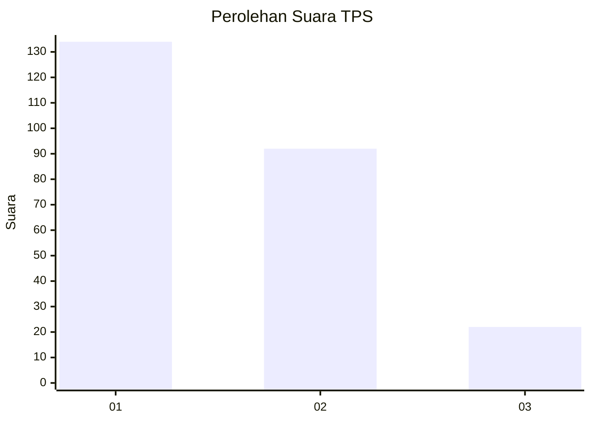
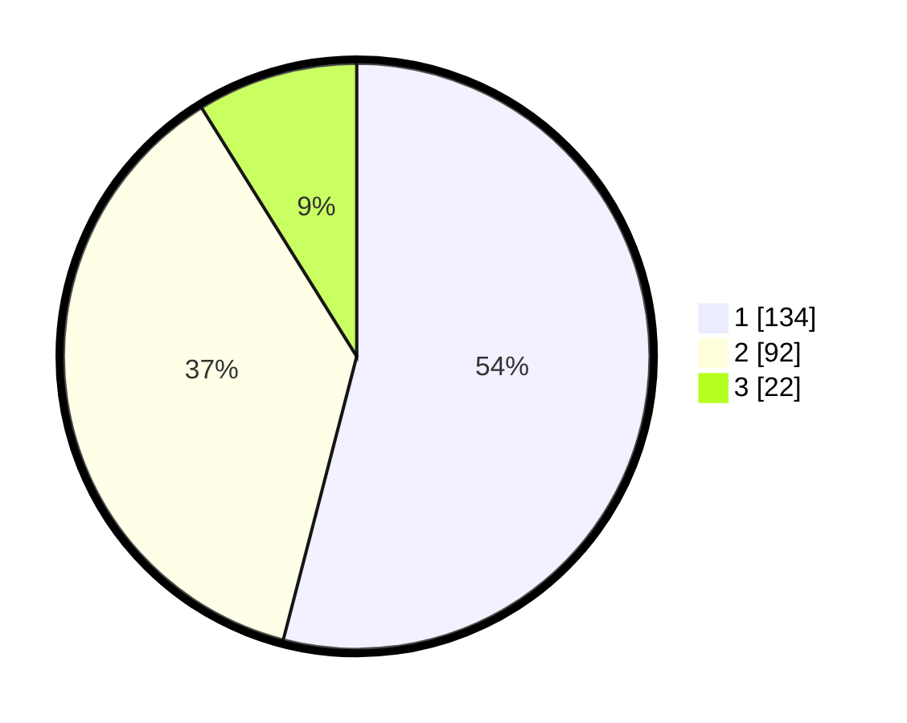

# Hasil

## Grafik

## Tabel

| No. | Nama Paslon    | Suara | Suara (raw) | Persentase |
|:--- |:-------------- | -----:| -----------:| ----------:|
| 1   | ANIES MUHAIMIN | 134   | [134][p-1]  | 54,03      |
| 2   | PRABOWO GIBRAN | 92    | [92][p-2]   | 37,10      |
| 3   | GANJAR MAHFUD  | 22    | [22][p-3]   | 8,87       |

[p-1]: https://github.com/gigit-pemilu/pemilu-2024-36-banten/blob/main/pilpres/hitung-suara/sub/36-banten/sub/02-lebak/sub/14-rangkasbitung/sub/1008-cijoro-pasir/sub/002-tps/sub/paslon-1.txt
[p-2]: https://github.com/gigit-pemilu/pemilu-2024-36-banten/blob/main/pilpres/hitung-suara/sub/36-banten/sub/02-lebak/sub/14-rangkasbitung/sub/1008-cijoro-pasir/sub/002-tps/sub/paslon-2.txt
[p-3]: https://github.com/gigit-pemilu/pemilu-2024-36-banten/blob/main/pilpres/hitung-suara/sub/36-banten/sub/02-lebak/sub/14-rangkasbitung/sub/1008-cijoro-pasir/sub/002-tps/sub/paslon-3.txt

## Foto C Plano

https://sirekap-obj-formc.kpu.go.id/269e/pemilu/ppwp/36/02/14/10/08/3602141008002-20240214-162239--db30e2ec-dac2-46be-a6b5-88e01ff9c442.jpg

https://sirekap-obj-formc.kpu.go.id/269e/pemilu/ppwp/36/02/14/10/08/3602141008002-20240214-185255--ca6b071b-080c-46c9-80b2-131d824f10c6.jpg

https://sirekap-obj-formc.kpu.go.id/269e/pemilu/ppwp/36/02/14/10/08/3602141008002-20240214-185312--df08cd96-3fcc-48ce-a62d-084a3443dfad.jpg

## Metadata

| Key        | Value               |
| ---------- | ------------------- |
| Time Stamp | 2024-02-16 13:30:32 |

