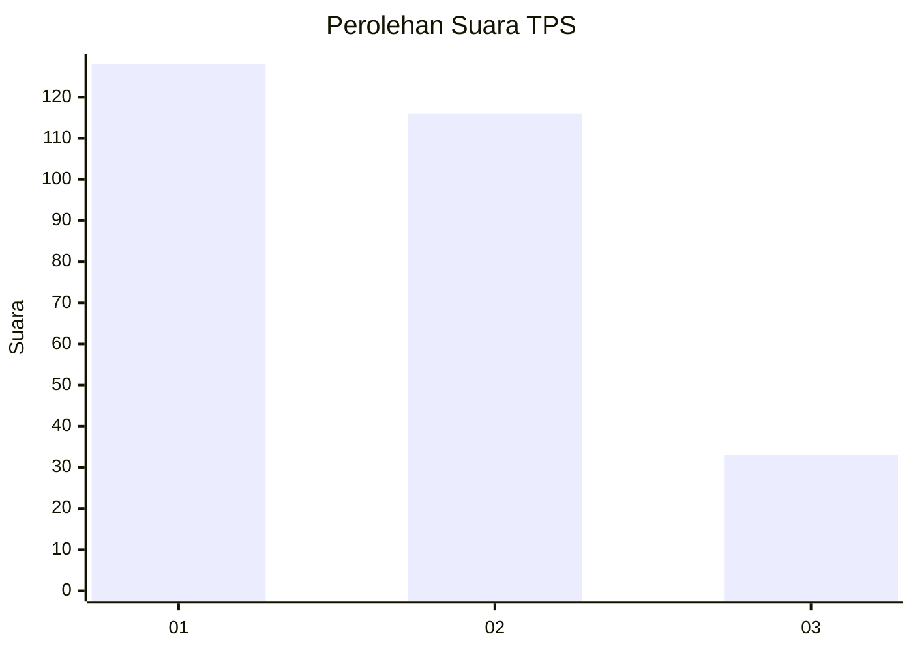
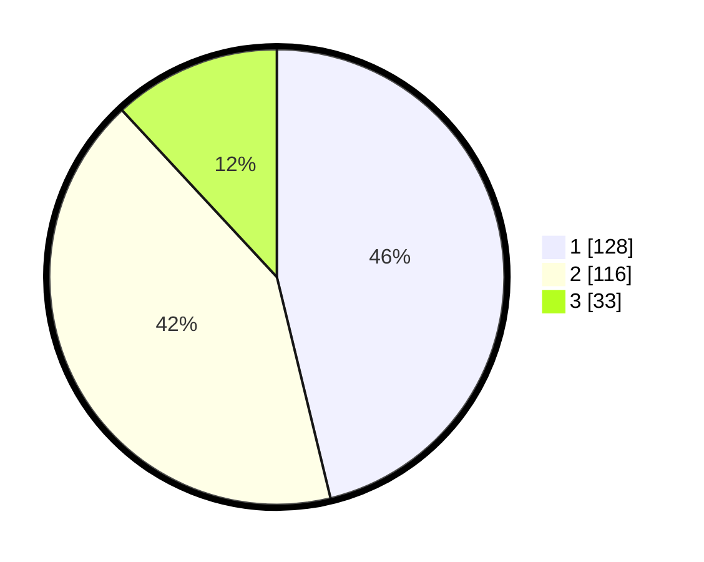

# Hasil

## Grafik

## Tabel

| No. | Nama Paslon    | Suara | Suara (raw) | Persentase |
|:--- |:-------------- | -----:| -----------:| ----------:|
| 1   | ANIES MUHAIMIN | 128   | [128][p-1]  | 46,21      |
| 2   | PRABOWO GIBRAN | 116   | [116][p-2]  | 41,88      |
| 3   | GANJAR MAHFUD  | 33    | [33][p-3]   | 11,91      |

[p-1]: https://github.com/gigit-pemilu/pemilu-2024-36-banten/blob/main/pilpres/hitung-suara/sub/36-banten/sub/02-lebak/sub/14-rangkasbitung/sub/2013-jatimulya/sub/019-tps/sub/paslon-1.txt
[p-2]: https://github.com/gigit-pemilu/pemilu-2024-36-banten/blob/main/pilpres/hitung-suara/sub/36-banten/sub/02-lebak/sub/14-rangkasbitung/sub/2013-jatimulya/sub/019-tps/sub/paslon-2.txt
[p-3]: https://github.com/gigit-pemilu/pemilu-2024-36-banten/blob/main/pilpres/hitung-suara/sub/36-banten/sub/02-lebak/sub/14-rangkasbitung/sub/2013-jatimulya/sub/019-tps/sub/paslon-3.txt

## Foto C Plano

https://sirekap-obj-formc.kpu.go.id/f489/pemilu/ppwp/36/02/14/20/13/3602142013019-20240215-032957--14911c54-9863-4a5e-bad7-ae9f1c6acb33.jpg

https://sirekap-obj-formc.kpu.go.id/f489/pemilu/ppwp/36/02/14/20/13/3602142013019-20240215-033224--5706d221-c8ba-451c-872a-f1752baf494d.jpg

https://sirekap-obj-formc.kpu.go.id/f489/pemilu/ppwp/36/02/14/20/13/3602142013019-20240215-034044--1ffc8890-cd80-4973-9423-4896119cef5c.jpg

## Metadata

| Key        | Value               |
| ---------- | ------------------- |
| Time Stamp | 2024-02-19 06:16:00 |

