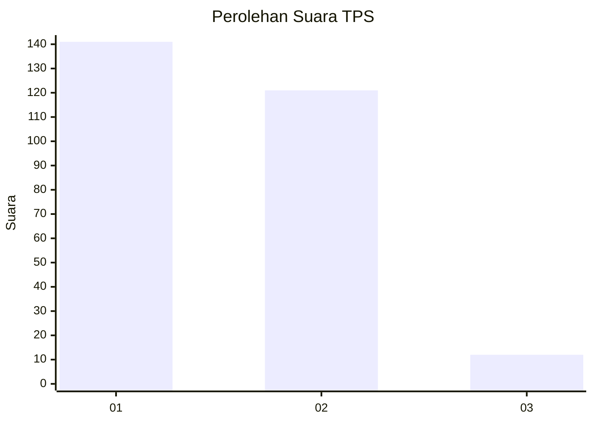
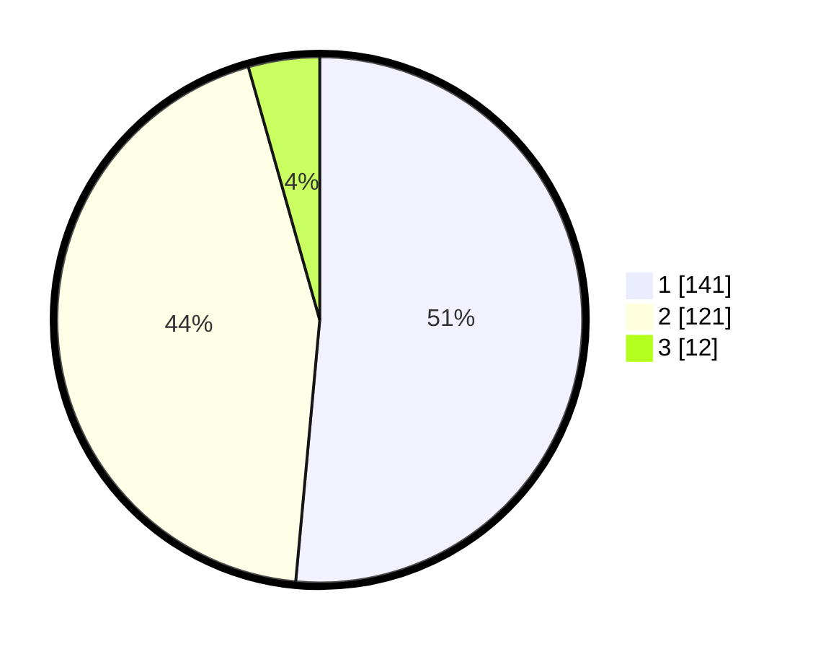

# Hasil

## Grafik

## Tabel

| No. | Nama Paslon    | Suara | Suara (raw) | Persentase |
|:--- |:-------------- | -----:| -----------:| ----------:|
| 1   | ANIES MUHAIMIN | 141   | [141][p-1]  | 51,46      |
| 2   | PRABOWO GIBRAN | 121   | [121][p-2]  | 44,16      |
| 3   | GANJAR MAHFUD  | 12    | [12][p-3]   | 4,38       |

[p-1]: https://github.com/gigit-pemilu/pemilu-2024/blob/main/pilpres/hitung-suara/sub/36-banten/sub/02-lebak/sub/14-rangkasbitung/sub/2017-rangkasbitung-timur/sub/018-tps/sub/paslon-1.txt
[p-2]: https://github.com/gigit-pemilu/pemilu-2024/blob/main/pilpres/hitung-suara/sub/36-banten/sub/02-lebak/sub/14-rangkasbitung/sub/2017-rangkasbitung-timur/sub/018-tps/sub/paslon-2.txt
[p-3]: https://github.com/gigit-pemilu/pemilu-2024/blob/main/pilpres/hitung-suara/sub/36-banten/sub/02-lebak/sub/14-rangkasbitung/sub/2017-rangkasbitung-timur/sub/018-tps/sub/paslon-3.txt

## Foto C Plano

https://sirekap-obj-formc.kpu.go.id/7b71/pemilu/ppwp/36/02/14/20/17/3602142017018-20240214-194127--6de47c3f-5abd-4c9f-b7e1-64c34f37bda8.jpg

https://sirekap-obj-formc.kpu.go.id/7b71/pemilu/ppwp/36/02/14/20/17/3602142017018-20240214-195834--b622f020-becb-47e4-8227-d9b59c97fb59.jpg

https://sirekap-obj-formc.kpu.go.id/7b71/pemilu/ppwp/36/02/14/20/17/3602142017018-20240214-195955--47c937e9-e702-4956-9b46-87ada1029ab3.jpg

## Metadata

| Key        | Value               |
| ---------- | ------------------- |
| Time Stamp | 2024-02-17 14:45:18 |

