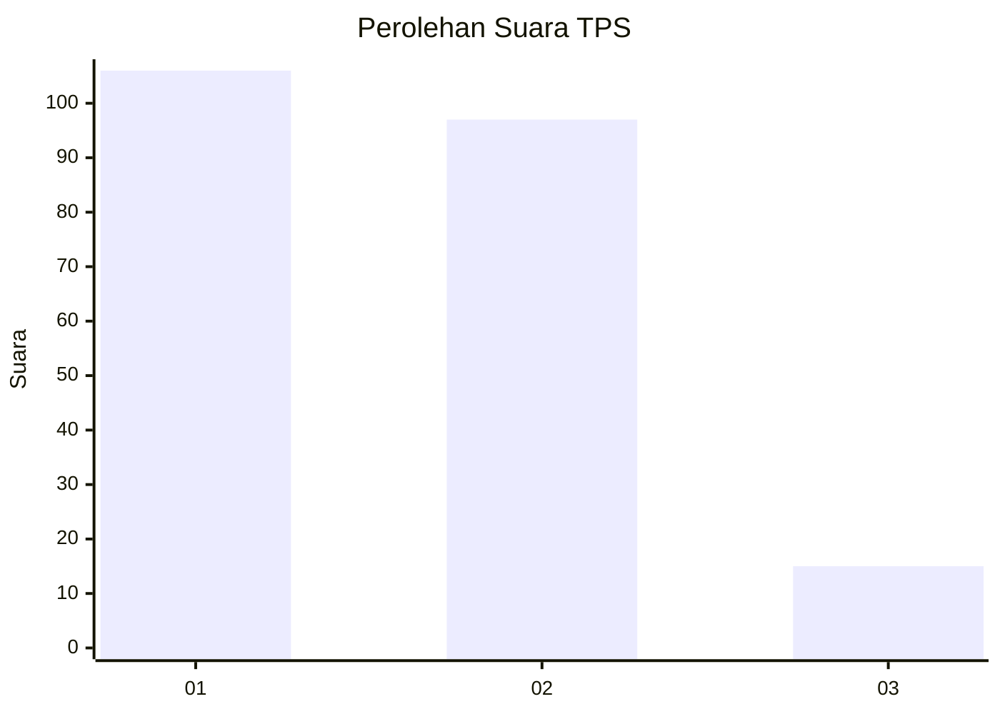
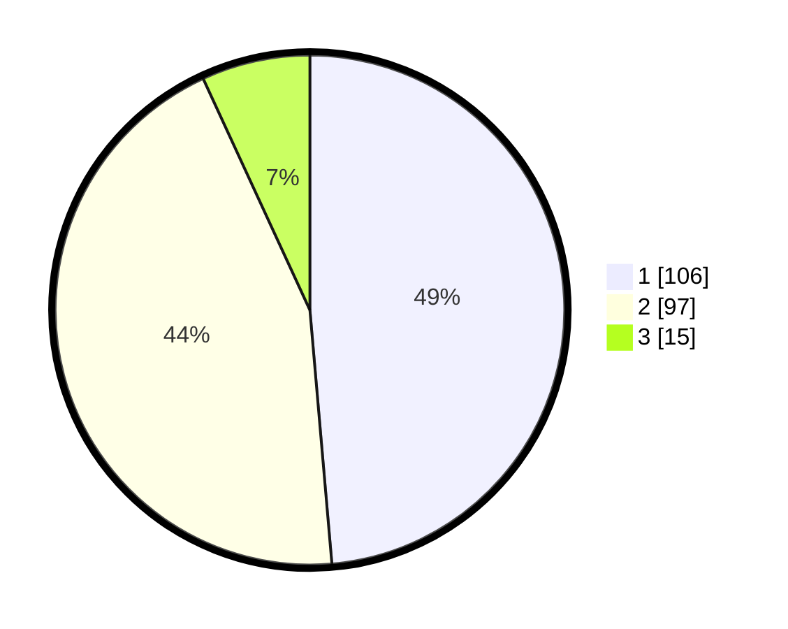

# Hasil

## Grafik

## Tabel

| No. | Nama Paslon    | Suara | Suara (raw) | Persentase |
|:--- |:-------------- | -----:| -----------:| ----------:|
| 1   | ANIES MUHAIMIN | 106   | [106][p-1]  | 48,62      |
| 2   | PRABOWO GIBRAN | 97    | [97][p-2]   | 44,50      |
| 3   | GANJAR MAHFUD  | 15    | [15][p-3]   | 6,88       |

[p-1]: https://github.com/gigit-pemilu/pemilu-2024/blob/main/pilpres/hitung-suara/sub/36-banten/sub/02-lebak/sub/15-warunggunung/sub/2001-sukarendah/sub/004-tps/sub/paslon-1.txt
[p-2]: https://github.com/gigit-pemilu/pemilu-2024/blob/main/pilpres/hitung-suara/sub/36-banten/sub/02-lebak/sub/15-warunggunung/sub/2001-sukarendah/sub/004-tps/sub/paslon-2.txt
[p-3]: https://github.com/gigit-pemilu/pemilu-2024/blob/main/pilpres/hitung-suara/sub/36-banten/sub/02-lebak/sub/15-warunggunung/sub/2001-sukarendah/sub/004-tps/sub/paslon-3.txt

## Foto C Plano

https://sirekap-obj-formc.kpu.go.id/a1ac/pemilu/ppwp/36/02/15/20/01/3602152001004-20240214-213753--561ab7e9-84e8-4d9f-a123-26243d238372.jpg

https://sirekap-obj-formc.kpu.go.id/a1ac/pemilu/ppwp/36/02/15/20/01/3602152001004-20240214-184700--761a1995-f8c4-4cb7-b8c9-de09104a6c83.jpg

https://sirekap-obj-formc.kpu.go.id/a1ac/pemilu/ppwp/36/02/15/20/01/3602152001004-20240214-214119--80813709-d07f-41c6-9051-fdd8addaa8b7.jpg

## Metadata

| Key        | Value               |
| ---------- | ------------------- |
| Time Stamp | 2024-02-17 14:45:18 |

