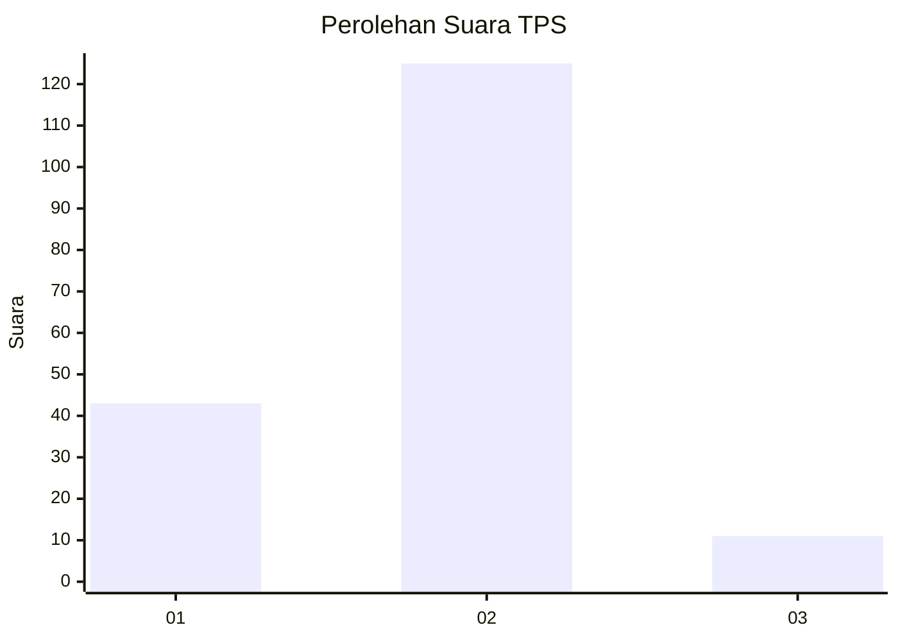

# Hasil

## Grafik

## Tabel

| No. | Nama Paslon    | Suara | Suara (raw) | Persentase |
|:--- |:-------------- | -----:| -----------:| ----------:|
| 1   | ANIES MUHAIMIN | 43    | [43][p-1]   | 24,02      |
| 2   | PRABOWO GIBRAN | 125   | [125][p-2]  | 69,83      |
| 3   | GANJAR MAHFUD  | 11    | [11][p-3]   | 6,15       |

[p-1]: https://github.com/gigit-pemilu/pemilu-2024/blob/main/pilpres/hitung-suara/sub/36-banten/sub/02-lebak/sub/17-cikulur/sub/2001-anggalan/sub/001-tps/sub/paslon-1.txt
[p-2]: https://github.com/gigit-pemilu/pemilu-2024/blob/main/pilpres/hitung-suara/sub/36-banten/sub/02-lebak/sub/17-cikulur/sub/2001-anggalan/sub/001-tps/sub/paslon-2.txt
[p-3]: https://github.com/gigit-pemilu/pemilu-2024/blob/main/pilpres/hitung-suara/sub/36-banten/sub/02-lebak/sub/17-cikulur/sub/2001-anggalan/sub/001-tps/sub/paslon-3.txt

## Foto C Plano

https://sirekap-obj-formc.kpu.go.id/2098/pemilu/ppwp/36/02/17/20/01/3602172001001-20240214-210433--fe616219-5bbc-4bd5-9eb9-22ab118b8b54.jpg

https://sirekap-obj-formc.kpu.go.id/2098/pemilu/ppwp/36/02/17/20/01/3602172001001-20240214-141850--c64f9c6c-5d30-46a4-8b4e-b55f6f5d4241.jpg

https://sirekap-obj-formc.kpu.go.id/2098/pemilu/ppwp/36/02/17/20/01/3602172001001-20240214-203602--28bbf92c-cc9f-4727-8647-dbac3d07effc.jpg

## Metadata

| Key        | Value               |
| ---------- | ------------------- |
| Time Stamp | 2024-02-17 13:37:34 |

