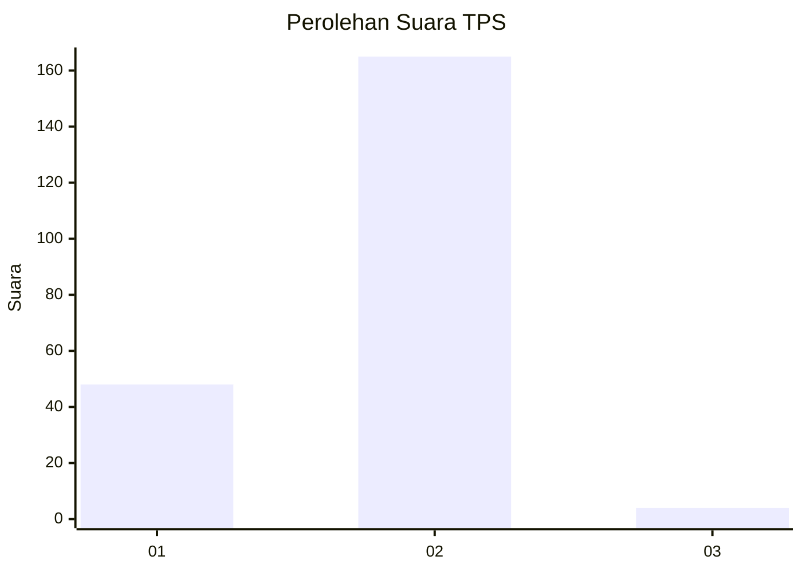
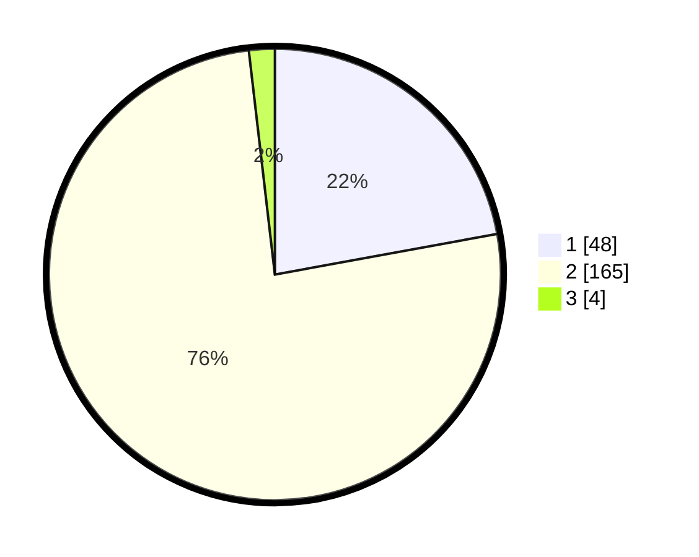

# Hasil

## Grafik

## Tabel

| No. | Nama Paslon    | Suara | Suara (raw) | Persentase |
|:--- |:-------------- | -----:| -----------:| ----------:|
| 1   | ANIES MUHAIMIN | 48    | [48][p-1]   | 22,12      |
| 2   | PRABOWO GIBRAN | 165   | [165][p-2]  | 76,04      |
| 3   | GANJAR MAHFUD  | 4     | [4][p-3]    | 1,84       |

[p-1]: https://github.com/gigit-pemilu/pemilu-2024/blob/main/pilpres/hitung-suara/sub/36-banten/sub/02-lebak/sub/17-cikulur/sub/2001-anggalan/sub/004-tps/sub/paslon-1.txt
[p-2]: https://github.com/gigit-pemilu/pemilu-2024/blob/main/pilpres/hitung-suara/sub/36-banten/sub/02-lebak/sub/17-cikulur/sub/2001-anggalan/sub/004-tps/sub/paslon-2.txt
[p-3]: https://github.com/gigit-pemilu/pemilu-2024/blob/main/pilpres/hitung-suara/sub/36-banten/sub/02-lebak/sub/17-cikulur/sub/2001-anggalan/sub/004-tps/sub/paslon-3.txt

## Foto C Plano

https://sirekap-obj-formc.kpu.go.id/ac83/pemilu/ppwp/36/02/17/20/01/3602172001004-20240214-194112--d17651e7-68c5-4251-88f4-c1bedd332cd6.jpg

https://sirekap-obj-formc.kpu.go.id/ac83/pemilu/ppwp/36/02/17/20/01/3602172001004-20240214-194128--26deba83-00d8-4e37-a87a-6c9cb0847351.jpg

https://sirekap-obj-formc.kpu.go.id/ac83/pemilu/ppwp/36/02/17/20/01/3602172001004-20240214-194143--47dca109-c7dc-4b99-9ccf-80ed610b6308.jpg

## Metadata

| Key        | Value               |
| ---------- | ------------------- |
| Time Stamp | 2024-02-19 06:16:00 |

