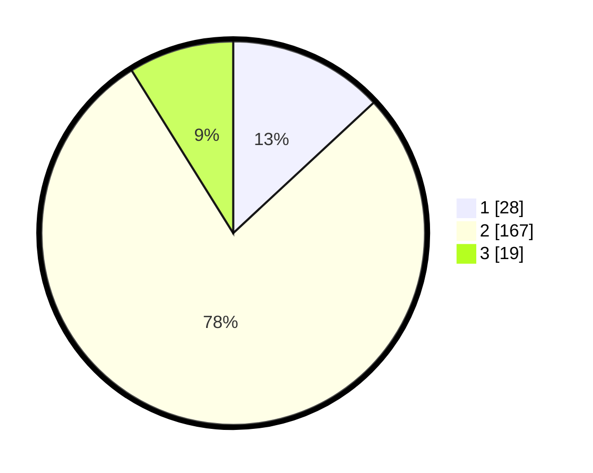

# Hasil

## Grafik

## Tabel

| No. | Nama Paslon    | Suara | Suara (raw) | Persentase |
|:--- |:-------------- | -----:| -----------:| ----------:|
| 1   | ANIES MUHAIMIN | 28    | [28][p-1]   | 13,08      |
| 2   | PRABOWO GIBRAN | 167   | [167][p-2]  | 78,04      |
| 3   | GANJAR MAHFUD  | 19    | [19][p-3]   | 8,88       |

[p-1]: https://github.com/gigit-pemilu/pemilu-2024/blob/main/pilpres/hitung-suara/sub/36-banten/sub/02-lebak/sub/17-cikulur/sub/2001-anggalan/sub/006-tps/sub/paslon-1.txt
[p-2]: https://github.com/gigit-pemilu/pemilu-2024/blob/main/pilpres/hitung-suara/sub/36-banten/sub/02-lebak/sub/17-cikulur/sub/2001-anggalan/sub/006-tps/sub/paslon-2.txt
[p-3]: https://github.com/gigit-pemilu/pemilu-2024/blob/main/pilpres/hitung-suara/sub/36-banten/sub/02-lebak/sub/17-cikulur/sub/2001-anggalan/sub/006-tps/sub/paslon-3.txt

## Foto C Plano

https://sirekap-obj-formc.kpu.go.id/71f3/pemilu/ppwp/36/02/17/20/01/3602172001006-20240215-100240--fac9b5ae-bd24-424d-9100-2101f6144f45.jpg

https://sirekap-obj-formc.kpu.go.id/71f3/pemilu/ppwp/36/02/17/20/01/3602172001006-20240215-100402--7397e492-0cb8-4c02-b1ca-e0fc703b83d4.jpg

https://sirekap-obj-formc.kpu.go.id/71f3/pemilu/ppwp/36/02/17/20/01/3602172001006-20240215-100524--70960ede-8045-4e7d-ac72-2f6c9ee962ff.jpg

## Metadata

| Key        | Value               |
| ---------- | ------------------- |
| Time Stamp | 2024-02-19 06:16:00 |

