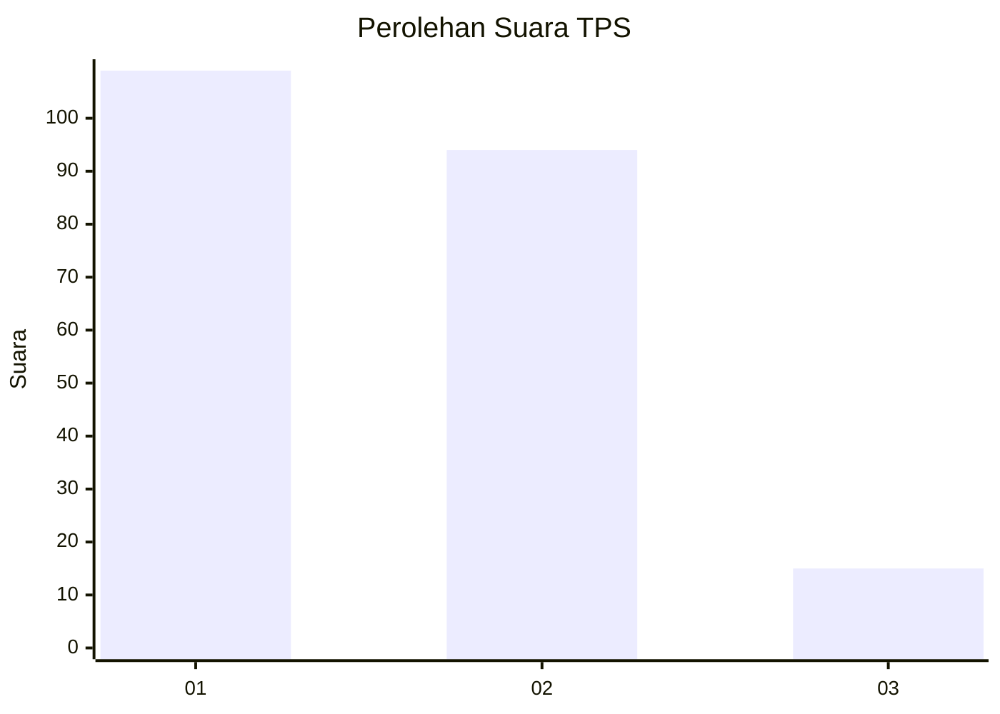
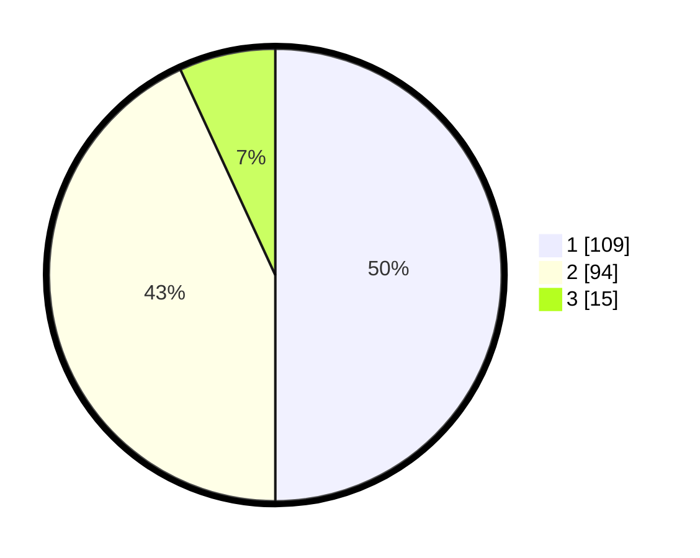

# Hasil

## Grafik

## Tabel

| No. | Nama Paslon    | Suara | Suara (raw) | Persentase |
|:--- |:-------------- | -----:| -----------:| ----------:|
| 1   | ANIES MUHAIMIN | 109   | [109][p-1]  | 50,00      |
| 2   | PRABOWO GIBRAN | 94    | [94][p-2]   | 43,12      |
| 3   | GANJAR MAHFUD  | 15    | [15][p-3]   | 6,88       |

[p-1]: https://github.com/gigit-pemilu/pemilu-2024/blob/main/pilpres/hitung-suara/sub/36-banten/sub/02-lebak/sub/17-cikulur/sub/2006-muaradua/sub/003-tps/sub/paslon-1.txt
[p-2]: https://github.com/gigit-pemilu/pemilu-2024/blob/main/pilpres/hitung-suara/sub/36-banten/sub/02-lebak/sub/17-cikulur/sub/2006-muaradua/sub/003-tps/sub/paslon-2.txt
[p-3]: https://github.com/gigit-pemilu/pemilu-2024/blob/main/pilpres/hitung-suara/sub/36-banten/sub/02-lebak/sub/17-cikulur/sub/2006-muaradua/sub/003-tps/sub/paslon-3.txt

## Foto C Plano

https://sirekap-obj-formc.kpu.go.id/e9da/pemilu/ppwp/36/02/17/20/06/3602172006003-20240215-020036--c0f3df1d-6462-418f-bccd-20a2639a8c64.jpg

https://sirekap-obj-formc.kpu.go.id/e9da/pemilu/ppwp/36/02/17/20/06/3602172006003-20240215-020203--50fe98a0-d7f7-459a-bfd8-df8b3ab3f402.jpg

https://sirekap-obj-formc.kpu.go.id/e9da/pemilu/ppwp/36/02/17/20/06/3602172006003-20240215-055647--341c9cbf-8cf9-4374-afd6-db6285e479b4.jpg

## Metadata

| Key        | Value               |
| ---------- | ------------------- |
| Time Stamp | 2024-02-22 11:00:00 |

