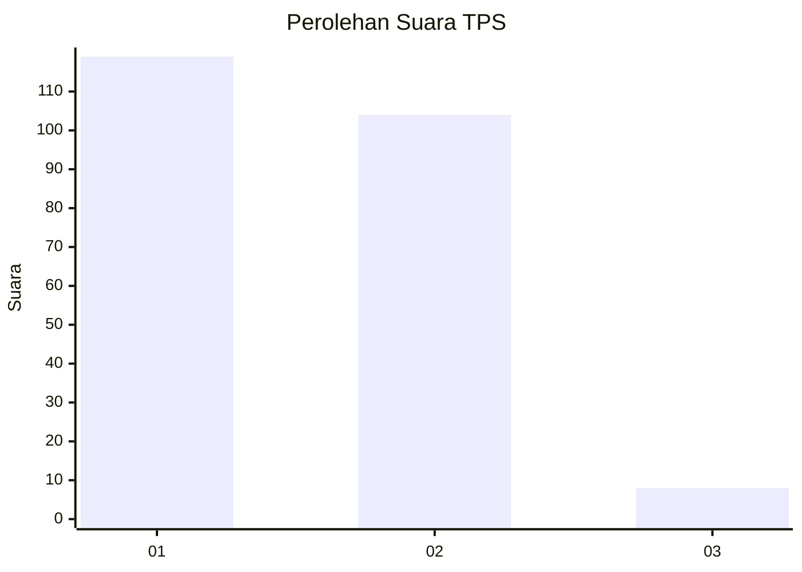
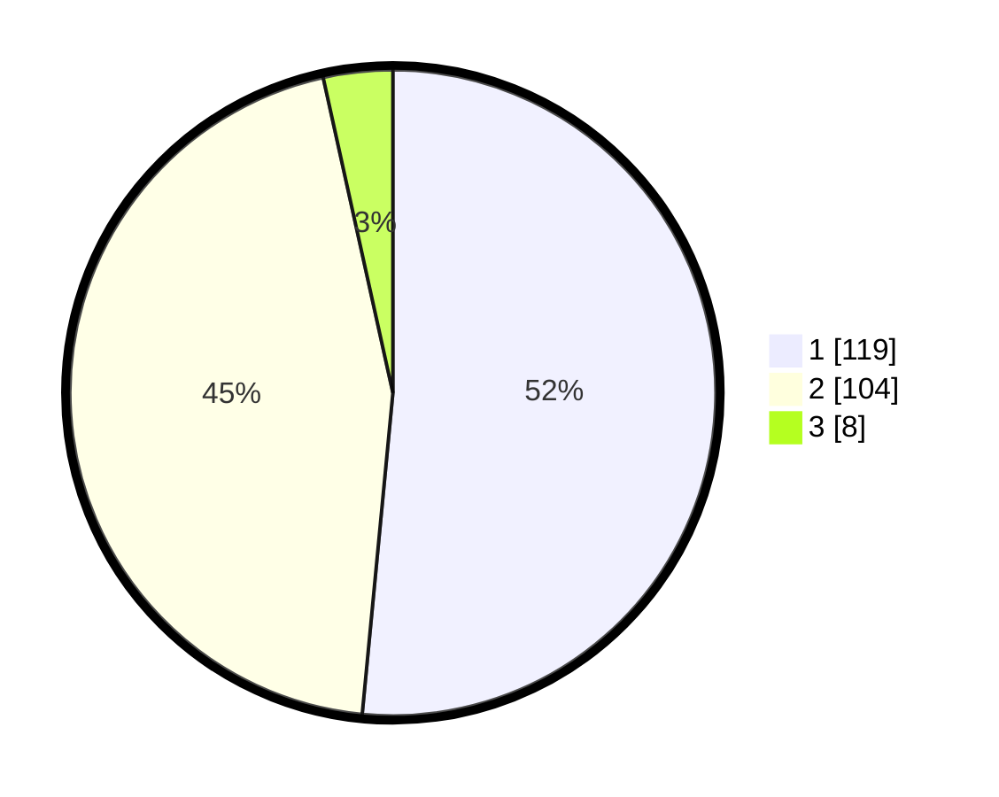

# Hasil

## Grafik

## Tabel

| No. | Nama Paslon    | Suara | Suara (raw) | Persentase |
|:--- |:-------------- | -----:| -----------:| ----------:|
| 1   | ANIES MUHAIMIN | 119   | [119][p-1]  | 51,52      |
| 2   | PRABOWO GIBRAN | 104   | [104][p-2]  | 45,02      |
| 3   | GANJAR MAHFUD  | 8     | [8][p-3]    | 3,46       |

[p-1]: https://github.com/gigit-pemilu/pemilu-2024/blob/main/pilpres/hitung-suara/sub/36-banten/sub/02-lebak/sub/17-cikulur/sub/2007-cikulur/sub/001-tps/sub/paslon-1.txt
[p-2]: https://github.com/gigit-pemilu/pemilu-2024/blob/main/pilpres/hitung-suara/sub/36-banten/sub/02-lebak/sub/17-cikulur/sub/2007-cikulur/sub/001-tps/sub/paslon-2.txt
[p-3]: https://github.com/gigit-pemilu/pemilu-2024/blob/main/pilpres/hitung-suara/sub/36-banten/sub/02-lebak/sub/17-cikulur/sub/2007-cikulur/sub/001-tps/sub/paslon-3.txt

## Foto C Plano

https://sirekap-obj-formc.kpu.go.id/2588/pemilu/ppwp/36/02/17/20/07/3602172007001-20240215-153805--03943836-54eb-494f-b7d2-c7332f5176ef.jpg

https://sirekap-obj-formc.kpu.go.id/2588/pemilu/ppwp/36/02/17/20/07/3602172007001-20240215-153903--b5c892fe-df7a-4694-b4e1-3d1f55db0015.jpg

https://sirekap-obj-formc.kpu.go.id/2588/pemilu/ppwp/36/02/17/20/07/3602172007001-20240215-154024--054ac0c1-2f2e-4b8a-9a2e-59c1ff3f35ba.jpg

## Metadata

| Key        | Value               |
| ---------- | ------------------- |
| Time Stamp | 2024-02-15 16:30:25 |

