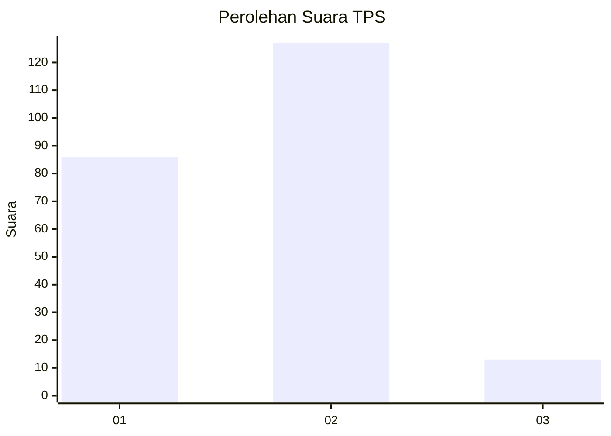
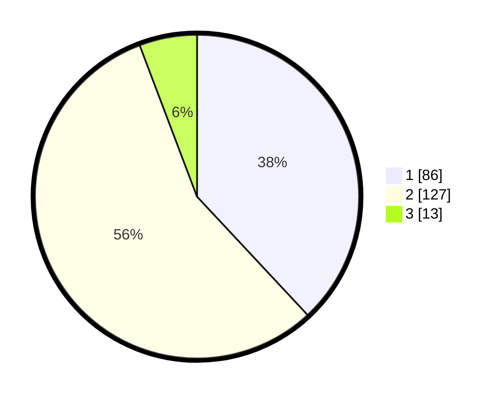

# Hasil

## Grafik

## Tabel

| No. | Nama Paslon    | Suara | Suara (raw) | Persentase |
|:--- |:-------------- | -----:| -----------:| ----------:|
| 1   | ANIES MUHAIMIN | 86    | [86][p-1]   | 38,05      |
| 2   | PRABOWO GIBRAN | 127   | [127][p-2]  | 56,19      |
| 3   | GANJAR MAHFUD  | 13    | [13][p-3]   | 5,75       |

[p-1]: https://github.com/gigit-pemilu/pemilu-2024/blob/main/pilpres/hitung-suara/sub/36-banten/sub/02-lebak/sub/19-cibeber/sub/2001-cibeber/sub/001-tps/sub/paslon-1.txt
[p-2]: https://github.com/gigit-pemilu/pemilu-2024/blob/main/pilpres/hitung-suara/sub/36-banten/sub/02-lebak/sub/19-cibeber/sub/2001-cibeber/sub/001-tps/sub/paslon-2.txt
[p-3]: https://github.com/gigit-pemilu/pemilu-2024/blob/main/pilpres/hitung-suara/sub/36-banten/sub/02-lebak/sub/19-cibeber/sub/2001-cibeber/sub/001-tps/sub/paslon-3.txt

## Foto C Plano

https://sirekap-obj-formc.kpu.go.id/05f8/pemilu/ppwp/36/02/19/20/01/3602192001001-20240221-113816--2be4bfaf-41f4-4ab4-a3b5-8bb2faa85aed.jpg

https://sirekap-obj-formc.kpu.go.id/05f8/pemilu/ppwp/36/02/19/20/01/3602192001001-20240215-162205--7c209b29-39a8-4d47-9ce7-38bb18fcff18.jpg

https://sirekap-obj-formc.kpu.go.id/05f8/pemilu/ppwp/36/02/19/20/01/3602192001001-20240215-140911--09a456f1-c8b1-4acf-b7fc-75eaf816d408.jpg

## Metadata

| Key        | Value               |
| ---------- | ------------------- |
| Time Stamp | 2024-02-21 12:00:00 |

