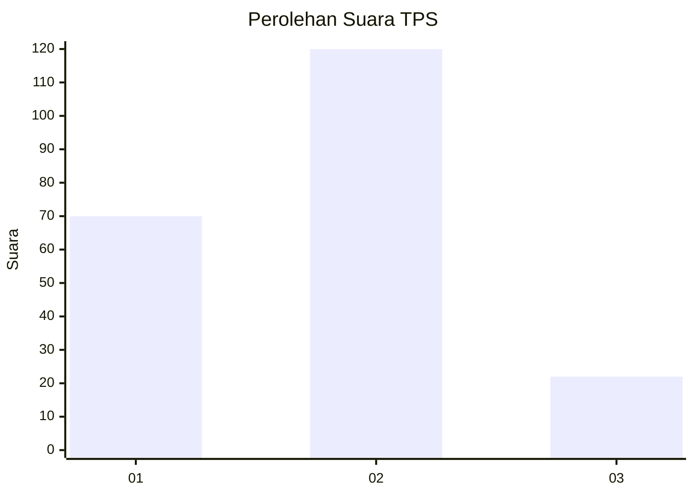
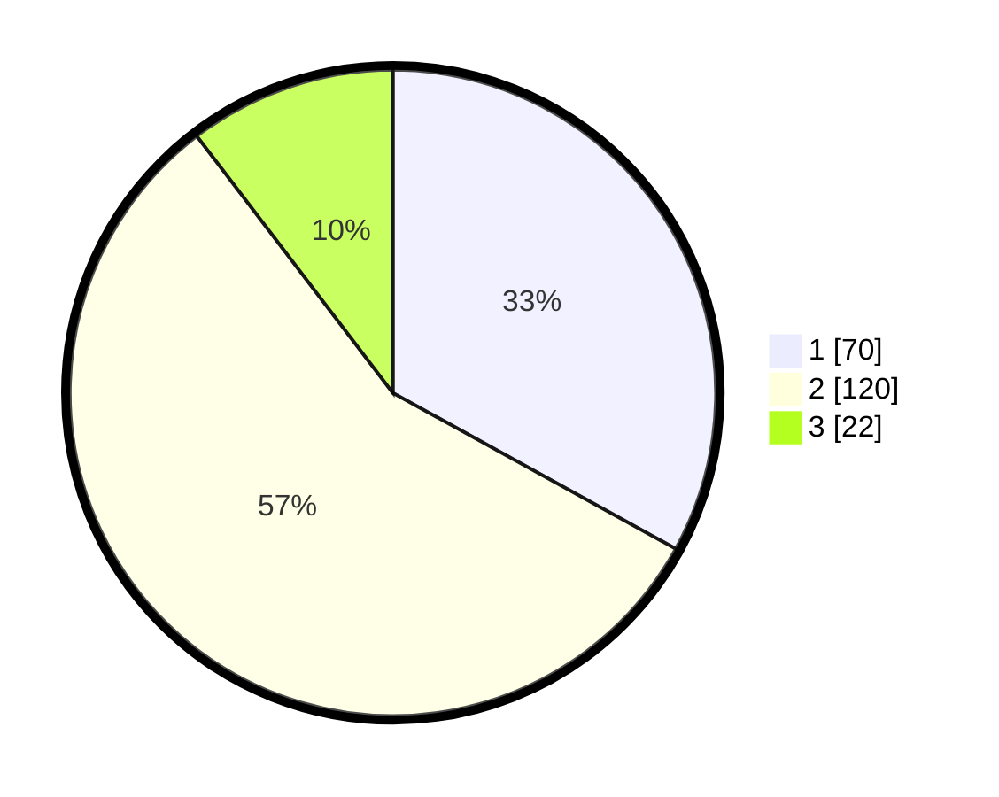

# Hasil

## Grafik

## Tabel

| No. | Nama Paslon    | Suara | Suara (raw) | Persentase |
|:--- |:-------------- | -----:| -----------:| ----------:|
| 1   | ANIES MUHAIMIN | 70    | [70][p-1]   | 33,02      |
| 2   | PRABOWO GIBRAN | 120   | [120][p-2]  | 56,60      |
| 3   | GANJAR MAHFUD  | 22    | [22][p-3]   | 10,38      |

[p-1]: https://github.com/gigit-pemilu/pemilu-2024/blob/main/pilpres/hitung-suara/sub/36-banten/sub/02-lebak/sub/19-cibeber/sub/2001-cibeber/sub/003-tps/sub/paslon-1.txt
[p-2]: https://github.com/gigit-pemilu/pemilu-2024/blob/main/pilpres/hitung-suara/sub/36-banten/sub/02-lebak/sub/19-cibeber/sub/2001-cibeber/sub/003-tps/sub/paslon-2.txt
[p-3]: https://github.com/gigit-pemilu/pemilu-2024/blob/main/pilpres/hitung-suara/sub/36-banten/sub/02-lebak/sub/19-cibeber/sub/2001-cibeber/sub/003-tps/sub/paslon-3.txt

## Foto C Plano

https://sirekap-obj-formc.kpu.go.id/522f/pemilu/ppwp/36/02/19/20/01/3602192001003-20240215-140424--f3dad34f-e4e8-4965-b050-a3a79c56d5b6.jpg

https://sirekap-obj-formc.kpu.go.id/522f/pemilu/ppwp/36/02/19/20/01/3602192001003-20240215-140658--7b788a1b-fc05-46c2-8f9c-11d4f6429973.jpg

https://sirekap-obj-formc.kpu.go.id/522f/pemilu/ppwp/36/02/19/20/01/3602192001003-20240215-140759--8007e0f1-4aa4-4340-a7ca-c1069955ac77.jpg

## Metadata

| Key        | Value               |
| ---------- | ------------------- |
| Time Stamp | 2024-02-15 20:00:44 |

