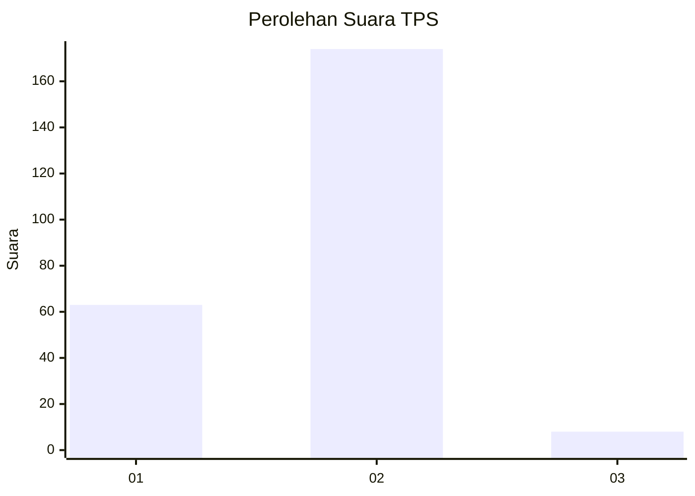
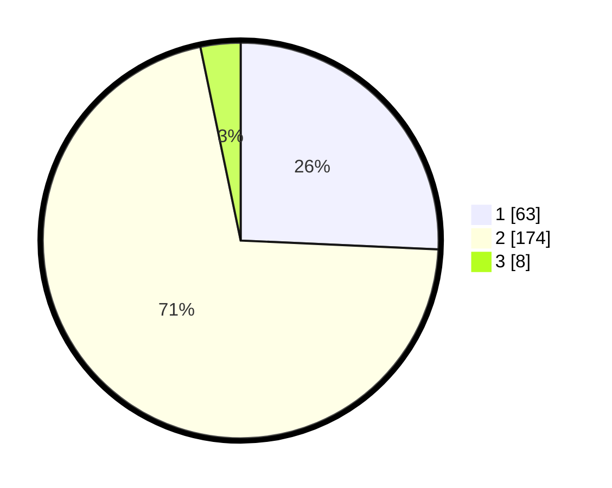

# Hasil

## Grafik

## Tabel

| No. | Nama Paslon    | Suara | Suara (raw) | Persentase |
|:--- |:-------------- | -----:| -----------:| ----------:|
| 1   | ANIES MUHAIMIN | 63    | [63][p-1]   | 25,71      |
| 2   | PRABOWO GIBRAN | 174   | [174][p-2]  | 71,02      |
| 3   | GANJAR MAHFUD  | 8     | [8][p-3]    | 3,27       |

[p-1]: https://github.com/gigit-pemilu/pemilu-2024-36-banten/blob/main/pilpres/hitung-suara/sub/36-banten/sub/02-lebak/sub/19-cibeber/sub/2001-cibeber/sub/005-tps/sub/paslon-1.txt
[p-2]: https://github.com/gigit-pemilu/pemilu-2024-36-banten/blob/main/pilpres/hitung-suara/sub/36-banten/sub/02-lebak/sub/19-cibeber/sub/2001-cibeber/sub/005-tps/sub/paslon-2.txt
[p-3]: https://github.com/gigit-pemilu/pemilu-2024-36-banten/blob/main/pilpres/hitung-suara/sub/36-banten/sub/02-lebak/sub/19-cibeber/sub/2001-cibeber/sub/005-tps/sub/paslon-3.txt

## Foto C Plano

https://sirekap-obj-formc.kpu.go.id/9268/pemilu/ppwp/36/02/19/20/01/3602192001005-20240215-142144--cd0ade74-af60-4d16-9ce2-2e55e1329acd.jpg

https://sirekap-obj-formc.kpu.go.id/9268/pemilu/ppwp/36/02/19/20/01/3602192001005-20240214-212624--36f4a3e4-4327-4132-a9e4-d8172db56029.jpg

https://sirekap-obj-formc.kpu.go.id/9268/pemilu/ppwp/36/02/19/20/01/3602192001005-20240214-212758--dc8ca607-982c-4ebd-9f8e-1680083fe543.jpg

## Metadata

| Key        | Value               |
| ---------- | ------------------- |
| Time Stamp | 2024-02-15 15:00:29 |

