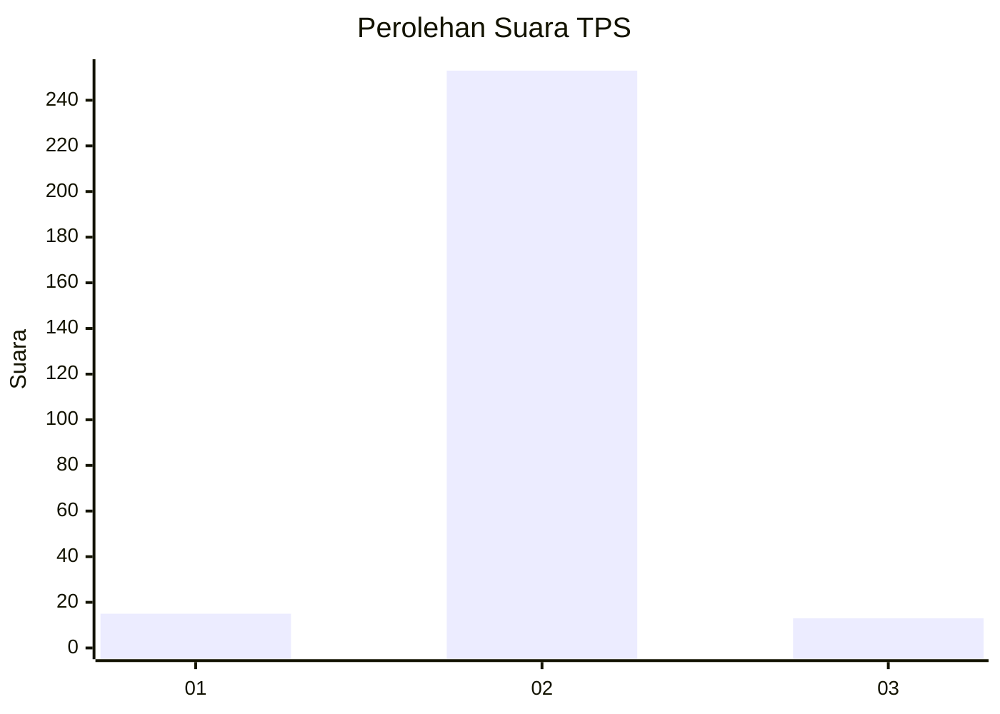
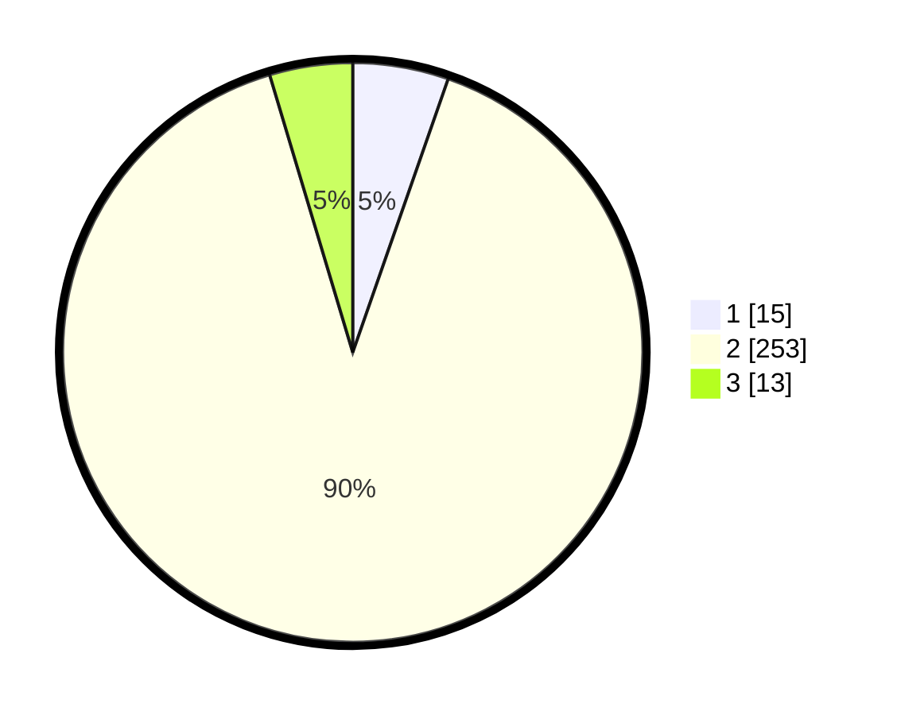

# Hasil

## Grafik

## Tabel

| No. | Nama Paslon    | Suara | Suara (raw) | Persentase |
|:--- |:-------------- | -----:| -----------:| ----------:|
| 1   | ANIES MUHAIMIN | 15    | [15][p-1]   | 5,34       |
| 2   | PRABOWO GIBRAN | 253   | [253][p-2]  | 90,04      |
| 3   | GANJAR MAHFUD  | 13    | [13][p-3]   | 4,63       |

[p-1]: https://github.com/gigit-pemilu/pemilu-2024/blob/main/pilpres/hitung-suara/sub/36-banten/sub/02-lebak/sub/19-cibeber/sub/2005-kujangsari/sub/004-tps/sub/paslon-1.txt
[p-2]: https://github.com/gigit-pemilu/pemilu-2024/blob/main/pilpres/hitung-suara/sub/36-banten/sub/02-lebak/sub/19-cibeber/sub/2005-kujangsari/sub/004-tps/sub/paslon-2.txt
[p-3]: https://github.com/gigit-pemilu/pemilu-2024/blob/main/pilpres/hitung-suara/sub/36-banten/sub/02-lebak/sub/19-cibeber/sub/2005-kujangsari/sub/004-tps/sub/paslon-3.txt

## Foto C Plano

https://sirekap-obj-formc.kpu.go.id/a94d/pemilu/ppwp/36/02/19/20/05/3602192005004-20240215-055235--0d7b18e8-0fbd-4a62-a5ed-5b085de71da0.jpg

https://sirekap-obj-formc.kpu.go.id/a94d/pemilu/ppwp/36/02/19/20/05/3602192005004-20240215-043158--28b819d4-8757-408b-b372-d1e9ae713f66.jpg

https://sirekap-obj-formc.kpu.go.id/a94d/pemilu/ppwp/36/02/19/20/05/3602192005004-20240216-085116--36116a77-f55c-4428-be69-1ad2b921b213.jpg

## Metadata

| Key        | Value               |
| ---------- | ------------------- |
| Time Stamp | 2024-02-17 13:37:34 |

