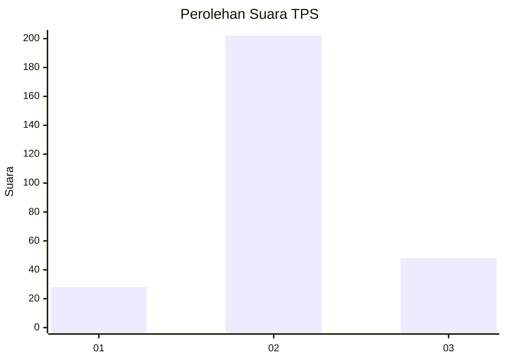
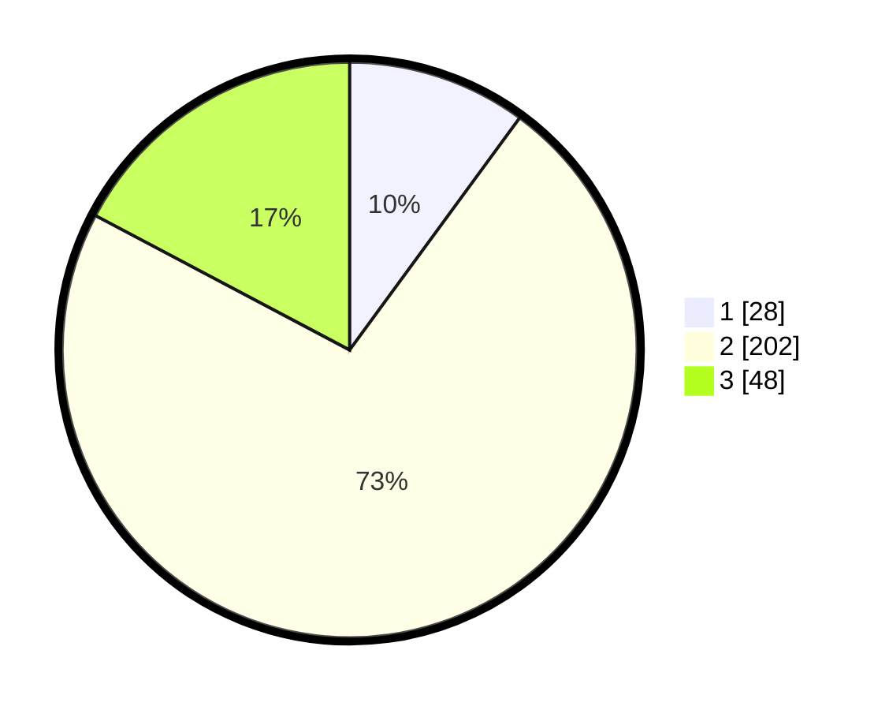

# Hasil

## Grafik

## Tabel

| No. | Nama Paslon    | Suara | Suara (raw) | Persentase |
|:--- |:-------------- | -----:| -----------:| ----------:|
| 1   | ANIES MUHAIMIN | 28    | [28][p-1]   | 10,07      |
| 2   | PRABOWO GIBRAN | 202   | [202][p-2]  | 72,66      |
| 3   | GANJAR MAHFUD  | 48    | [48][p-3]   | 17,27      |

[p-1]: https://github.com/gigit-pemilu/pemilu-2024/blob/main/pilpres/hitung-suara/sub/36-banten/sub/02-lebak/sub/19-cibeber/sub/2010-citorek-timur/sub/004-tps/sub/paslon-1.txt
[p-2]: https://github.com/gigit-pemilu/pemilu-2024/blob/main/pilpres/hitung-suara/sub/36-banten/sub/02-lebak/sub/19-cibeber/sub/2010-citorek-timur/sub/004-tps/sub/paslon-2.txt
[p-3]: https://github.com/gigit-pemilu/pemilu-2024/blob/main/pilpres/hitung-suara/sub/36-banten/sub/02-lebak/sub/19-cibeber/sub/2010-citorek-timur/sub/004-tps/sub/paslon-3.txt

## Foto C Plano

https://sirekap-obj-formc.kpu.go.id/66d7/pemilu/ppwp/36/02/19/20/10/3602192010004-20240215-133026--264b09bd-d844-4206-a685-3a95afca37c9.jpg

https://sirekap-obj-formc.kpu.go.id/66d7/pemilu/ppwp/36/02/19/20/10/3602192010004-20240215-133240--13341a4e-ab1f-4abb-aed7-1f1f1986b4e4.jpg

https://sirekap-obj-formc.kpu.go.id/66d7/pemilu/ppwp/36/02/19/20/10/3602192010004-20240215-133410--99bb563a-070a-47b9-8f33-088187444094.jpg

## Metadata

| Key        | Value               |
| ---------- | ------------------- |
| Time Stamp | 2024-02-19 06:16:00 |

