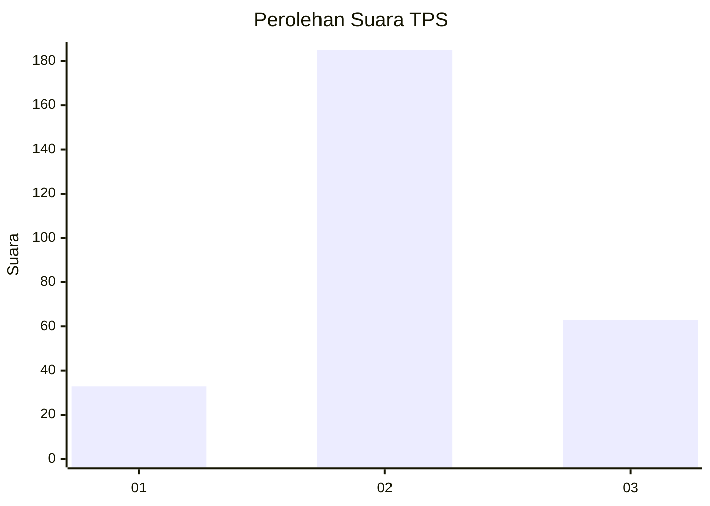
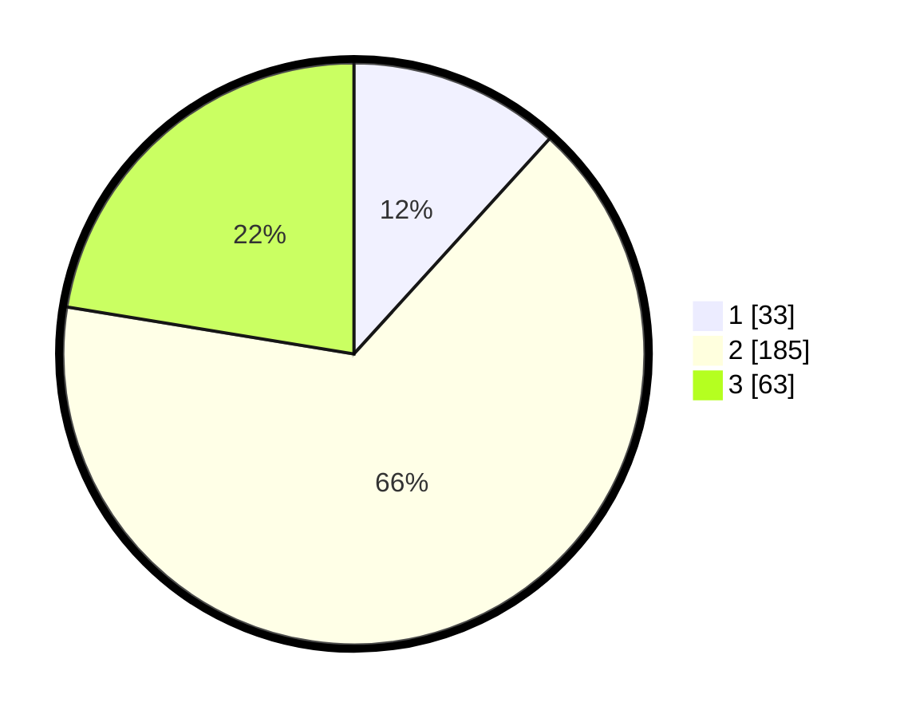

# Hasil

## Grafik

## Tabel

| No. | Nama Paslon    | Suara | Suara (raw) | Persentase |
|:--- |:-------------- | -----:| -----------:| ----------:|
| 1   | ANIES MUHAIMIN | 33    | [33][p-1]   | 11,74      |
| 2   | PRABOWO GIBRAN | 185   | [185][p-2]  | 65,84      |
| 3   | GANJAR MAHFUD  | 63    | [63][p-3]   | 22,42      |

[p-1]: https://github.com/gigit-pemilu/pemilu-2024-36-banten/blob/main/pilpres/hitung-suara/sub/36-banten/sub/02-lebak/sub/19-cibeber/sub/2010-citorek-timur/sub/005-tps/sub/paslon-1.txt
[p-2]: https://github.com/gigit-pemilu/pemilu-2024-36-banten/blob/main/pilpres/hitung-suara/sub/36-banten/sub/02-lebak/sub/19-cibeber/sub/2010-citorek-timur/sub/005-tps/sub/paslon-2.txt
[p-3]: https://github.com/gigit-pemilu/pemilu-2024-36-banten/blob/main/pilpres/hitung-suara/sub/36-banten/sub/02-lebak/sub/19-cibeber/sub/2010-citorek-timur/sub/005-tps/sub/paslon-3.txt

## Foto C Plano

https://sirekap-obj-formc.kpu.go.id/d0d4/pemilu/ppwp/36/02/19/20/10/3602192010005-20240214-203339--30086047-aca8-4f01-bb20-3536ce173f41.jpg

https://sirekap-obj-formc.kpu.go.id/d0d4/pemilu/ppwp/36/02/19/20/10/3602192010005-20240214-203416--a7cfa69e-a718-4015-a45e-edc28a9b203f.jpg

https://sirekap-obj-formc.kpu.go.id/d0d4/pemilu/ppwp/36/02/19/20/10/3602192010005-20240214-203437--972c3625-4d8b-4584-89dc-bfdb0750367a.jpg

## Metadata

| Key        | Value               |
| ---------- | ------------------- |
| Time Stamp | 2024-02-19 06:16:00 |

