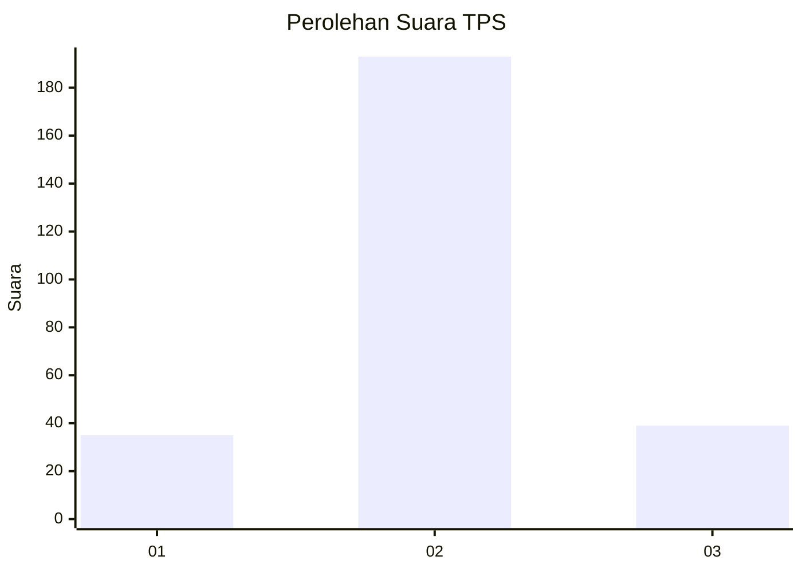
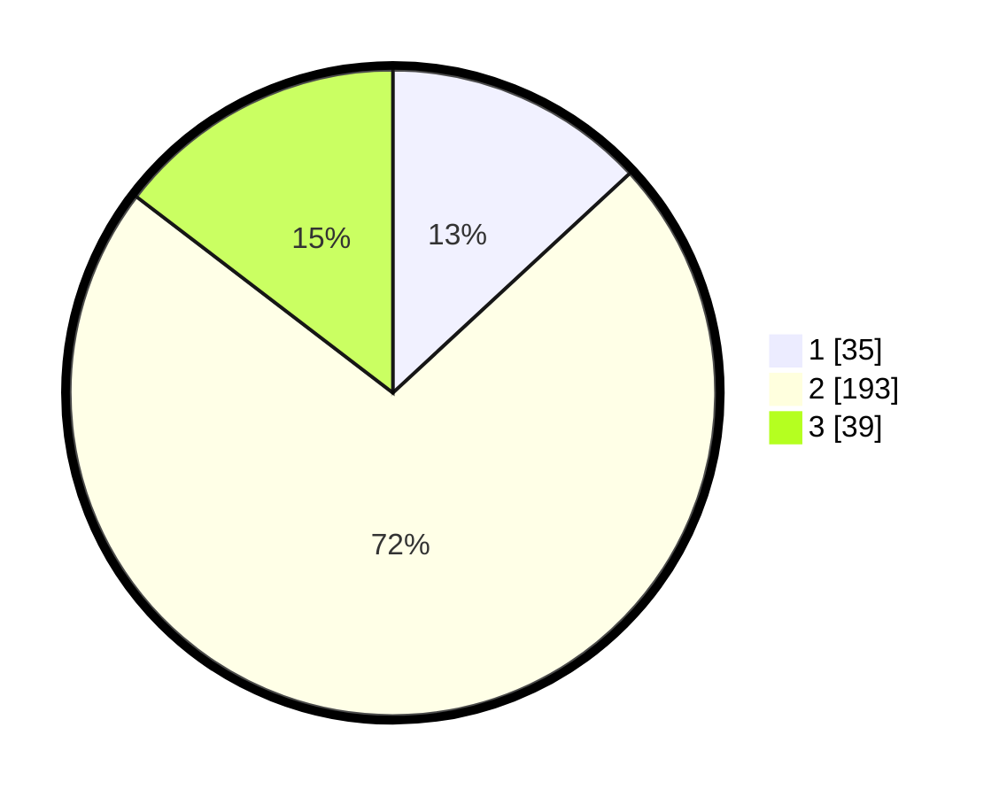

# Hasil

## Grafik

## Tabel

| No. | Nama Paslon    | Suara | Suara (raw) | Persentase |
|:--- |:-------------- | -----:| -----------:| ----------:|
| 1   | ANIES MUHAIMIN | 35    | [35][p-1]   | 13,11      |
| 2   | PRABOWO GIBRAN | 193   | [193][p-2]  | 72,28      |
| 3   | GANJAR MAHFUD  | 39    | [39][p-3]   | 14,61      |

[p-1]: https://github.com/gigit-pemilu/pemilu-2024-36-banten/blob/main/pilpres/hitung-suara/sub/36-banten/sub/02-lebak/sub/19-cibeber/sub/2010-citorek-timur/sub/006-tps/sub/paslon-1.txt
[p-2]: https://github.com/gigit-pemilu/pemilu-2024-36-banten/blob/main/pilpres/hitung-suara/sub/36-banten/sub/02-lebak/sub/19-cibeber/sub/2010-citorek-timur/sub/006-tps/sub/paslon-2.txt
[p-3]: https://github.com/gigit-pemilu/pemilu-2024-36-banten/blob/main/pilpres/hitung-suara/sub/36-banten/sub/02-lebak/sub/19-cibeber/sub/2010-citorek-timur/sub/006-tps/sub/paslon-3.txt

## Foto C Plano

https://sirekap-obj-formc.kpu.go.id/5793/pemilu/ppwp/36/02/19/20/10/3602192010006-20240215-105444--9f6e2b66-6df5-4b93-968f-095a915bd05f.jpg

https://sirekap-obj-formc.kpu.go.id/5793/pemilu/ppwp/36/02/19/20/10/3602192010006-20240215-110022--15389b8b-2516-49e0-88b7-78c8a1f271a1.jpg

https://sirekap-obj-formc.kpu.go.id/5793/pemilu/ppwp/36/02/19/20/10/3602192010006-20240215-110447--85369122-1312-4857-9c6d-2dbe2e250f72.jpg

## Metadata

| Key        | Value               |
| ---------- | ------------------- |
| Time Stamp | 2024-02-15 18:00:26 |

