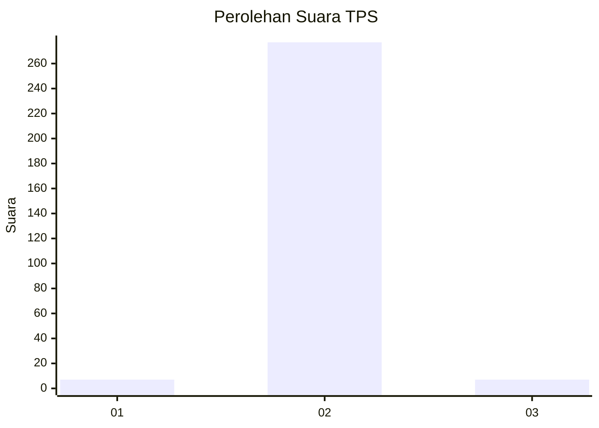
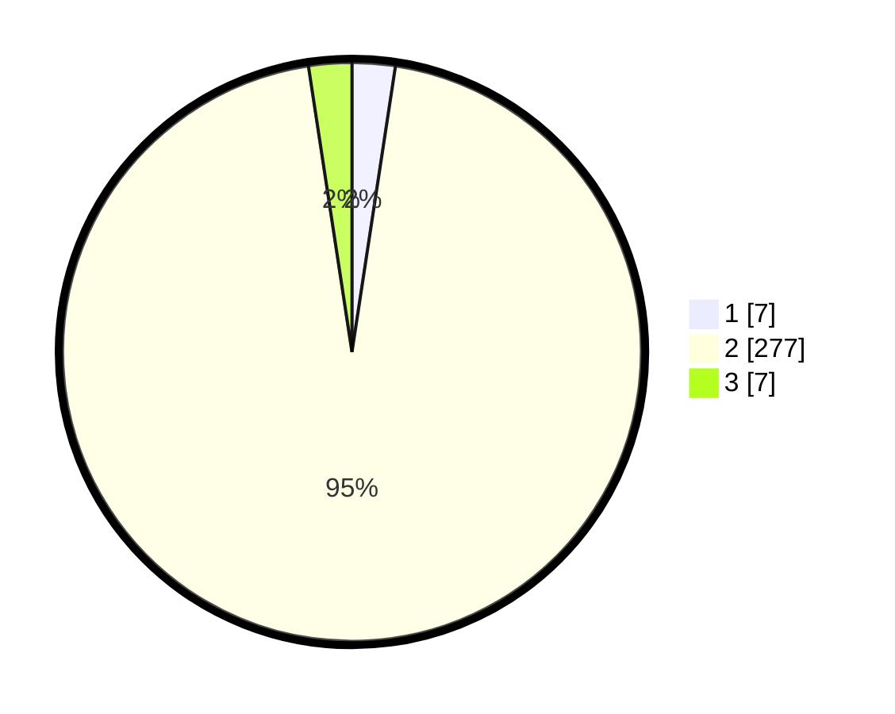

# Hasil

## Grafik

## Tabel

| No. | Nama Paslon    | Suara | Suara (raw) | Persentase |
|:--- |:-------------- | -----:| -----------:| ----------:|
| 1   | ANIES MUHAIMIN | 7     | [7][p-1]    | 2,41       |
| 2   | PRABOWO GIBRAN | 277   | [277][p-2]  | 95,19      |
| 3   | GANJAR MAHFUD  | 7     | [7][p-3]    | 2,41       |

[p-1]: https://github.com/gigit-pemilu/pemilu-2024/blob/main/pilpres/hitung-suara/sub/36-banten/sub/02-lebak/sub/19-cibeber/sub/2017-sirnagalih/sub/002-tps/sub/paslon-1.txt
[p-2]: https://github.com/gigit-pemilu/pemilu-2024/blob/main/pilpres/hitung-suara/sub/36-banten/sub/02-lebak/sub/19-cibeber/sub/2017-sirnagalih/sub/002-tps/sub/paslon-2.txt
[p-3]: https://github.com/gigit-pemilu/pemilu-2024/blob/main/pilpres/hitung-suara/sub/36-banten/sub/02-lebak/sub/19-cibeber/sub/2017-sirnagalih/sub/002-tps/sub/paslon-3.txt

## Foto C Plano

https://sirekap-obj-formc.kpu.go.id/8eac/pemilu/ppwp/36/02/19/20/17/3602192017002-20240215-015852--f3571fd9-f1c3-43ef-b088-0fdfe456e06f.jpg

https://sirekap-obj-formc.kpu.go.id/8eac/pemilu/ppwp/36/02/19/20/17/3602192017002-20240215-020048--6a4f7c62-cfd0-4f18-8b52-390cb7526ffc.jpg

https://sirekap-obj-formc.kpu.go.id/8eac/pemilu/ppwp/36/02/19/20/17/3602192017002-20240215-104811--42c6d883-629a-4939-abcb-b88f4f10322a.jpg

## Metadata

| Key        | Value               |
| ---------- | ------------------- |
| Time Stamp | 2024-02-15 15:00:29 |

