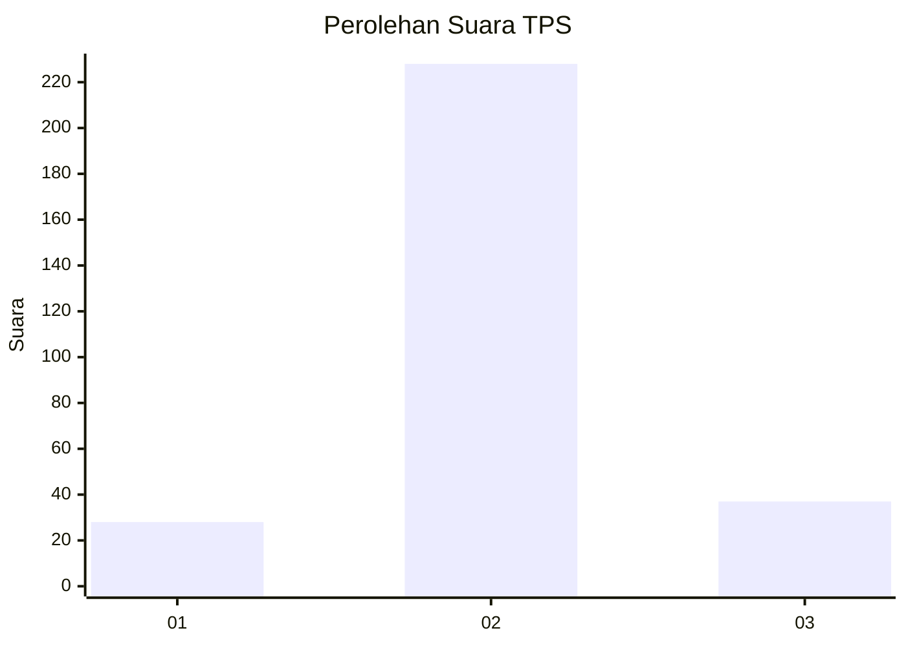
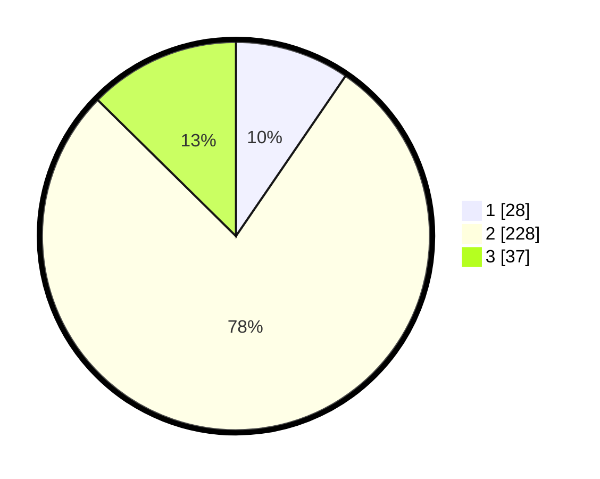

# Hasil

## Grafik

## Tabel

| No. | Nama Paslon    | Suara | Suara (raw) | Persentase |
|:--- |:-------------- | -----:| -----------:| ----------:|
| 1   | ANIES MUHAIMIN | 28    | [28][p-1]   | 9,56       |
| 2   | PRABOWO GIBRAN | 228   | [228][p-2]  | 77,82      |
| 3   | GANJAR MAHFUD  | 37    | [37][p-3]   | 12,63      |

[p-1]: https://github.com/gigit-pemilu/pemilu-2024-36-banten/blob/main/pilpres/hitung-suara/sub/36-banten/sub/02-lebak/sub/19-cibeber/sub/2017-sirnagalih/sub/004-tps/sub/paslon-1.txt
[p-2]: https://github.com/gigit-pemilu/pemilu-2024-36-banten/blob/main/pilpres/hitung-suara/sub/36-banten/sub/02-lebak/sub/19-cibeber/sub/2017-sirnagalih/sub/004-tps/sub/paslon-2.txt
[p-3]: https://github.com/gigit-pemilu/pemilu-2024-36-banten/blob/main/pilpres/hitung-suara/sub/36-banten/sub/02-lebak/sub/19-cibeber/sub/2017-sirnagalih/sub/004-tps/sub/paslon-3.txt

## Foto C Plano

https://sirekap-obj-formc.kpu.go.id/331f/pemilu/ppwp/36/02/19/20/17/3602192017004-20240215-095826--8c454daf-f6c5-4b8e-9497-7f0f5b891db3.jpg

https://sirekap-obj-formc.kpu.go.id/331f/pemilu/ppwp/36/02/19/20/17/3602192017004-20240215-100716--9ba2236a-ad8f-4e74-8c32-f2c8b0f5700e.jpg

https://sirekap-obj-formc.kpu.go.id/331f/pemilu/ppwp/36/02/19/20/17/3602192017004-20240215-090551--0e4807bb-fa67-4100-926f-7457a1f0d439.jpg

## Metadata

| Key        | Value               |
| ---------- | ------------------- |
| Time Stamp | 2024-02-19 06:16:00 |

